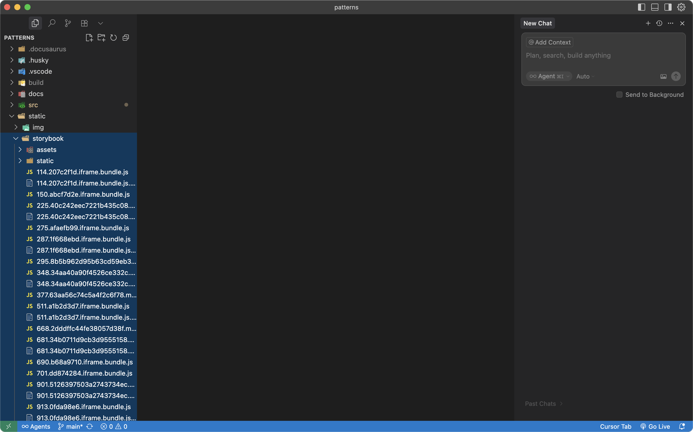

# Как присоединиться к команде паттернов

1. Завести аккаунт [на Гитхаб](https://github.com/)
2. Скачать и установить [VS Code](https://code.visualstudio.com/)
3. Скачать и установить [Node](https://nodejs.org/en/download/prebuilt-installer)
4. Скачать и установить git:
   - если вы [на MacOS](https://developer.apple.com/xcode/), то git встроен в Xcode
   - если вы [на Windows](https://git-scm.com/downloads/win)
5. Открыть VS Code и клонировать проект на свой компьютер: ```git clone https://github.com/metz-hei/patterns.git```
6. Изменить директорию терминала на patterns: ```cd patterns```
7. Установить зависимости: ```npm i```
8. Запустить проект: ```npm start```

## Проект не запускается

Если у вас уже был развёрнут проект и он перестал запускаться после очередного обновления, то попробуйте почистить кэш:

- выполнить команду `npm cache clean --force`,
- удалить папку node_modules,
- удалить файл package-lock.json,
- установить зависимости `npm i`,
- запустить проект `npm start`.

## Как добавить к документации сборку Storybook или обновить ее

1. Скачать последний билд из канала WEB Storybooks в Element
2. Создать в папке static папку storybook и перенести в нее содержимое билда:
   
3. Теперь можно сделать билд документации `npm run build` и Storybook скопируется туда автоматически
4. Запустить проект `npm run serve`

## Как создать сборку для локального запуска

1. Сделать свежий билд

   ```bash
   npm run build
   ```

2. Билд мы отправляем в Элемент, но он пропускает файлы до 10 Мб, поэтому нужно разбить билд на архивы. Логично бить не проект целиком, а самые тяжелые его части, а это картинки, которые хранятся `build/assets/images`:

   ```bash
   cd /Users/michaelshamin/patterns && rm -f images_*.zip; LIMIT=$((9*1024*1024)); idx=1; sum=0; files=(); mkdir -p split_zip_tmp >/dev/null 2>&1; rm -f split_zip_tmp/filelist.txt; for f in build/assets/images/*; do [ -f "$f" ] || continue; sz=$(stat -f %z "$f"); if [ $sum -gt 0 ] && [ $((sum + sz)) -gt $LIMIT ]; then printf "%s\n" "${files[@]}" > split_zip_tmp/filelist.txt; printf -v zipname "images_%03d.zip" "$idx"; zip -9 -q -j -@ "$zipname" < split_zip_tmp/filelist.txt; idx=$((idx+1)); sum=0; files=(); fi; files+=("$f"); sum=$((sum + sz)); done; if [ ${#files[@]} -gt 0 ]; then printf "%s\n" "${files[@]}" > split_zip_tmp/filelist.txt; printf -v zipname "images_%03d.zip" "$idx"; zip -9 -q -j -@ "$zipname" < split_zip_tmp/filelist.txt; fi; rm -rf split_zip_tmp; ls -lh images_*.zip | cat
   ```

3. Система создаст несколько архивов с картинками и положит их в корень проекта.
4. Вынести архивы их корня на рабочий стол. Это первая часть файлов, которые мы отправим в Элемент.
5. Удалить содержимое папки `build/assets/images`.
6. Сделать архив со всем остальным
   
   ```bash
   zip -r build.zip build/
   ```
7. Отправить все архивы в канал паттернов в Элементе.


## Как запустить документацию локально

1. Скачать все архивы из Элемента
2. Разархивировать build.zip
3. Открыть разархивированную папку и перейти `assets/images`
4. Разархивировать в эту папку архивы с картинками
5. Если у вас MacOS, то запустить терминал по адресу папки и выполнить запрос

   ```bash
   python3 -m http.server 9000 & sleep 2 && echo "Server started on port 9000" && open http://localhost:9000
   ```

   Если возникла ошибка при повторном запуске сервера, то выполните команду:

   ```bash
   kill $(lsof -t -i:9000)
   ```

6. Если у вас Windows:

   ```cmd
   start "" /b python3 -m http.server 9000 & timeout /t 2 >nul & echo Server started on port 9000 & start "" http://localhost:9000
   ```
