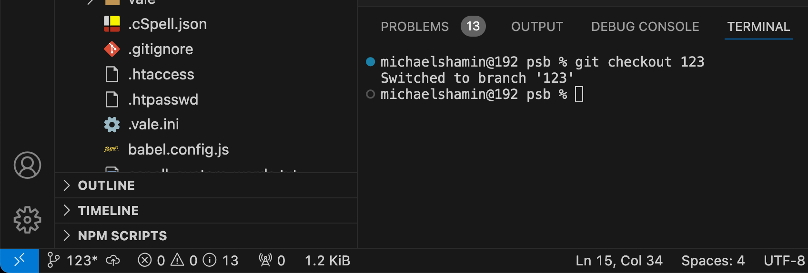
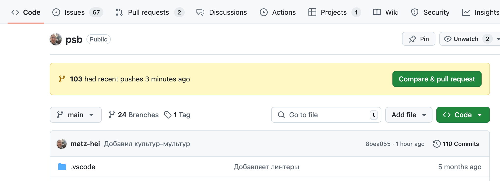
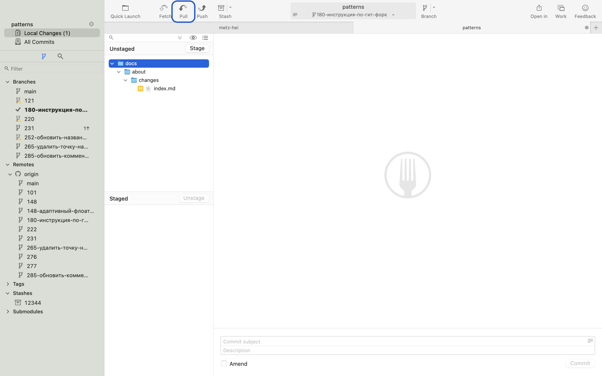
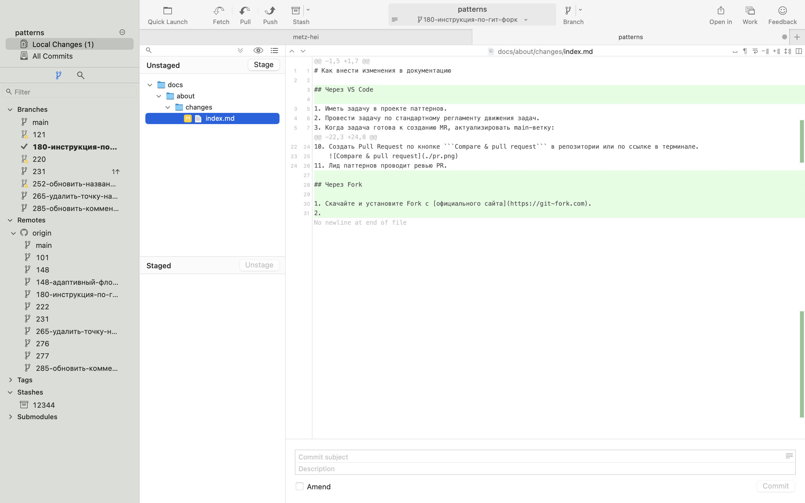
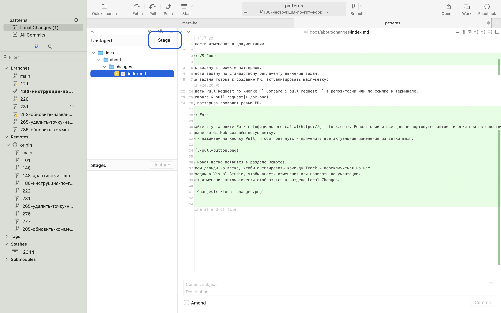
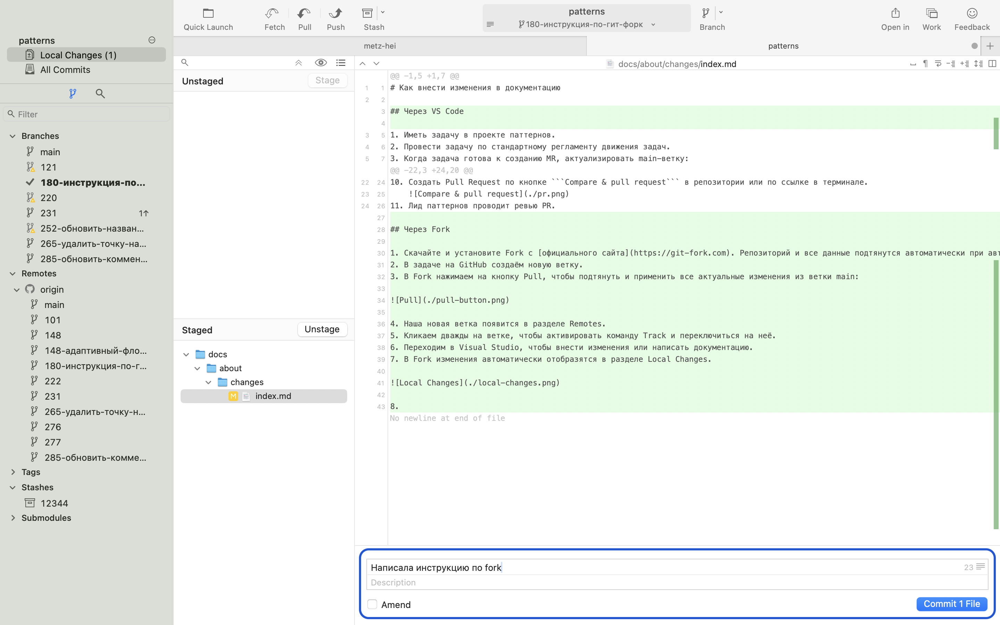
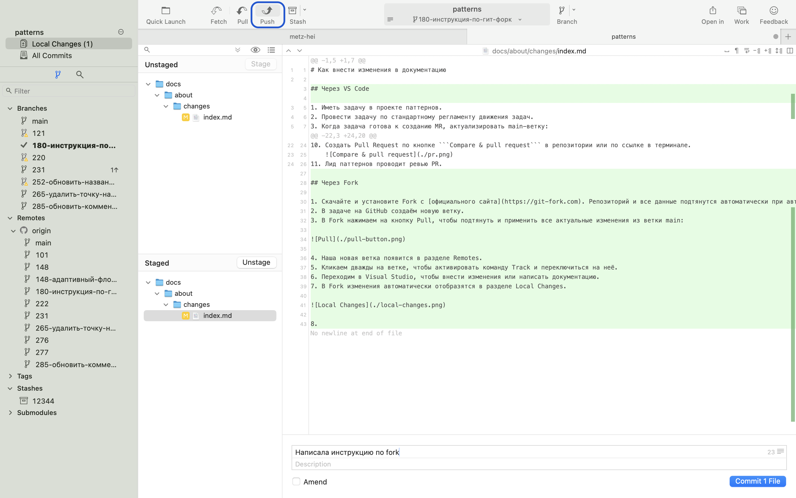

# Как внести изменения в документацию

## Через VS Code

1. Иметь задачу в проекте паттернов.
2. Провести задачу по стандартному регламенту движения задач.
3. Когда задача готова к созданию MR, актуализировать main-ветку:
   - Убедиться, что ветка main активна: ```git checkout main```:
     - система переключит вас на main,
     - либо выдаст сообщение: Already on 'main'.
   - Подтянуть все изменения из main-ветки: ```git pull```:
     - система обновит содержимое ветки,
     - либо выдаст сообщение: Already up to date.
4. Создать новую ветку от мастера ```git branch 123```, где 123 это номер задачи.
5. Переключиться на созданную ветку: ```git checkout 123```. Система выдаст сообщение: Switched to branch 'new-branch' 
6. Внести соответствующие изменения в документацию patterns → docs → patterns:
   - создать папку с файлом index.md,
   - перенести в папку все изображения, видео и прилагаемые документы,
   - убедиться, что все наименования папок и файлов заданы в английском формате записанные способом kebab-case.
   - убедиться, что все изображения экспортированы в формате @2х, для поддержки ретины.
7. Подготовить файлы к внесению изменений в ветку: ```git add .```.
8. Внести изменения в ветку и оставить комментарий к изменениям: ```git commit -m "Комментарий на русском языке"```
9. Отправить все изменений в репозиторий: ```git push -u origin 123```, где 123 это ветка задачи.
10. Создать Pull Request по кнопке ```Compare & pull request``` в репозитории или по ссылке в терминале.
    
11. Лид паттернов проводит ревью PR.

## Через Fork

1. Скачайте и установите Fork [с официального сайта](https://git-fork.com). Репозиторий и все данные подтянутся автоматически при авторизации.
2. В задаче создаём новую ветку.
3. В Fork нажимаем на кнопку Pull, чтобы подтянуть и применить все актуальные изменения из ветки main:
   
4. Наша новая ветка появится в разделе Remotes.
5. Кликаем дважды на ветке, чтобы активировать команду Track и переключиться на неё.
6. Переходим в Visual Studio Code, чтобы внести изменения или написать документацию.
7. В Fork изменения автоматически отобразятся в разделе Local Changes.
    
8. С помощью Stage выбираем, какие изменения добавлять в коммит:
    
9. Пишем commit message и нажимаем Commit:
    
10. Нажимаем Push. Теперь изменения вашей ветки доступны в гите.
    
11. Создаём pull request и ждём approve от лида паттернов.
