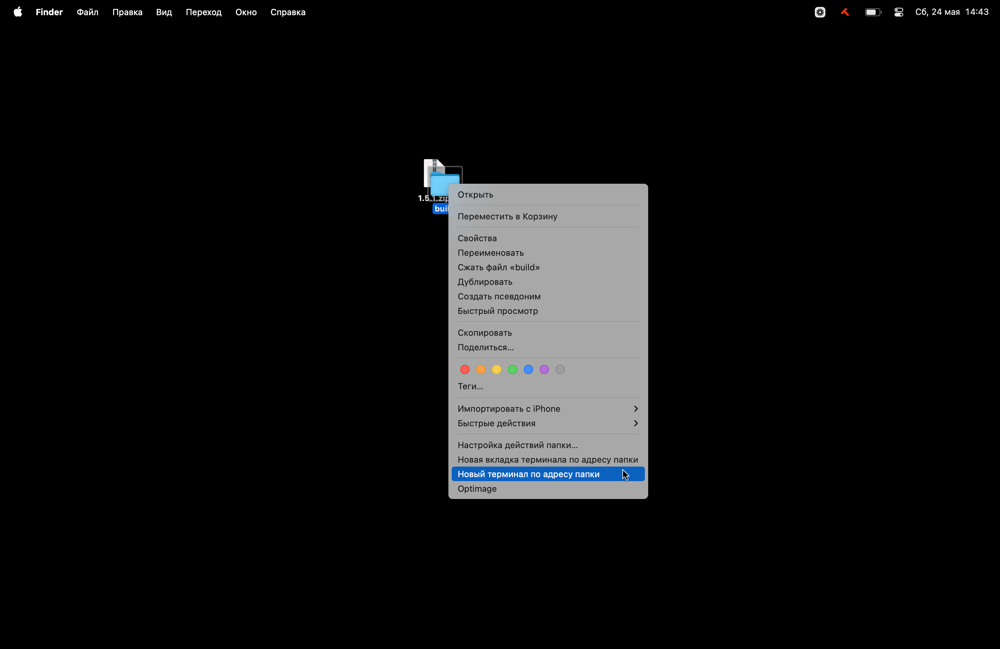

# Как запустить проект

## Mac OS

1. Установить [Python](https://www.python.org/downloads/).
2. Скачать zip-архив сборки из Элемента.
3. Разархивировать.
4. Запустить терминал по адресу папки:
   
5. Скопировать команду в терминал и выполнить по клавише `Enter`:
   
   ```bash
   python3 -m http.server 8000 & sleep 1 && curl -s http://localhost:8000 > /dev/null && open http://localhost:8000
   ```

   

6. Успех! Система запустила проект паттерны локально
   

:::warning[Поддержание работоспособности]
Когда вы закрываете терминал или выключаете компьютер, то сервер, запускающий сборку, останавливается. Чтобы снова запустить документацию, повторите шаги 4 и 5.
:::

## Windows

1. Установить [Python](https://www.python.org/downloads/).
2. Скачать zip-архив сборки из канала Паттерны в Элементе.
3. Разархивировать.
4. Открыть разархивированную папку.
5. Кликнуть в адресной строке папки.
6. Удалить текущий адрес, написать `cmd` и нажать `Enter`.
7. Система запустит окно командной строки по адресу папки
8. Скопировать команду в окно командной строки и выполнить по клавише `Enter`:

   ```cmd
   start /b py -m http.server 8000 && timeout /t 1 && start http://localhost:8000
   ```

9. Успех! Система запустила проект паттерны локально

:::warning[Поддержание работоспособности]
Когда вы закрываете терминал или выключаете компьютер, то сервер, запускающий сборку, останавливается. Чтобы снова запустить документацию, повторите шаги 4—8.
:::

## Актуальность сборки

Чтобы у вас была актуальная сборка документации необходимо каждый раз скачивать новую версию [из канала паттернов](https://matrix.to/#/#patterns:code2.ru) в Элементе.

## Отправить инструкцию другу

Если у вашего друга возникли проблемы с запуском документации, то посоветуйте ему обратиться к команде паттернов или отправьте ссылку на инструкцию: [для Mac OS](https://docs.google.com/document/d/1mqGqAtWIbLFRRcxI78RVyOOIKHIwi3szie1J-mW6QbI/edit?tab=t.0) и [для Windows](https://docs.google.com/document/d/1mqGqAtWIbLFRRcxI78RVyOOIKHIwi3szie1J-mW6QbI/edit?tab=t.intuj7m7elj7).
