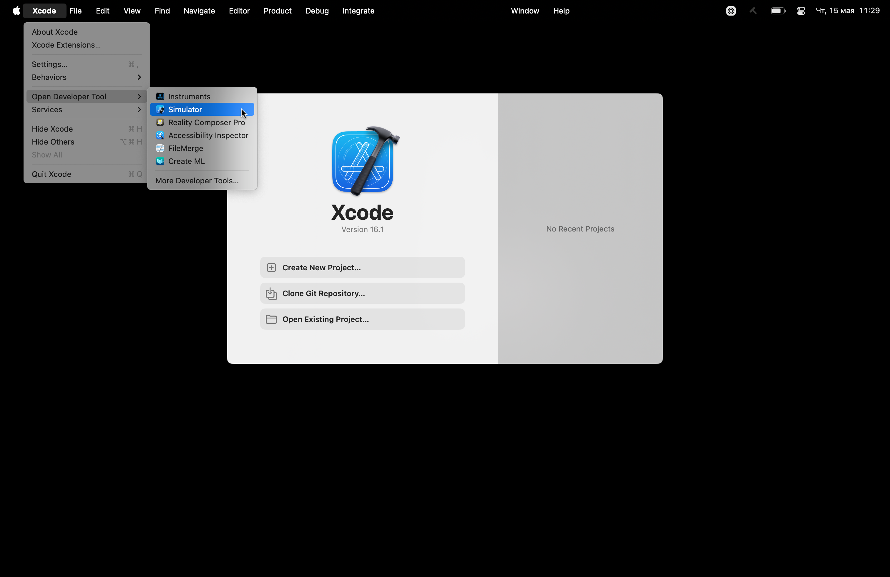
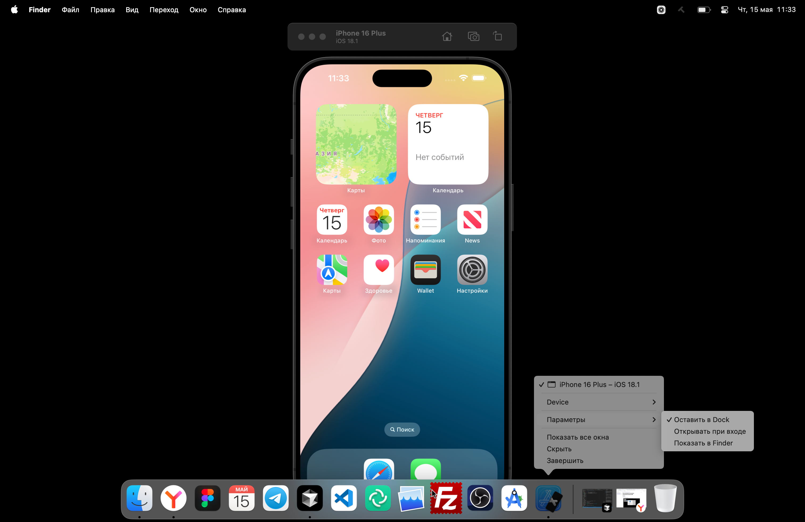
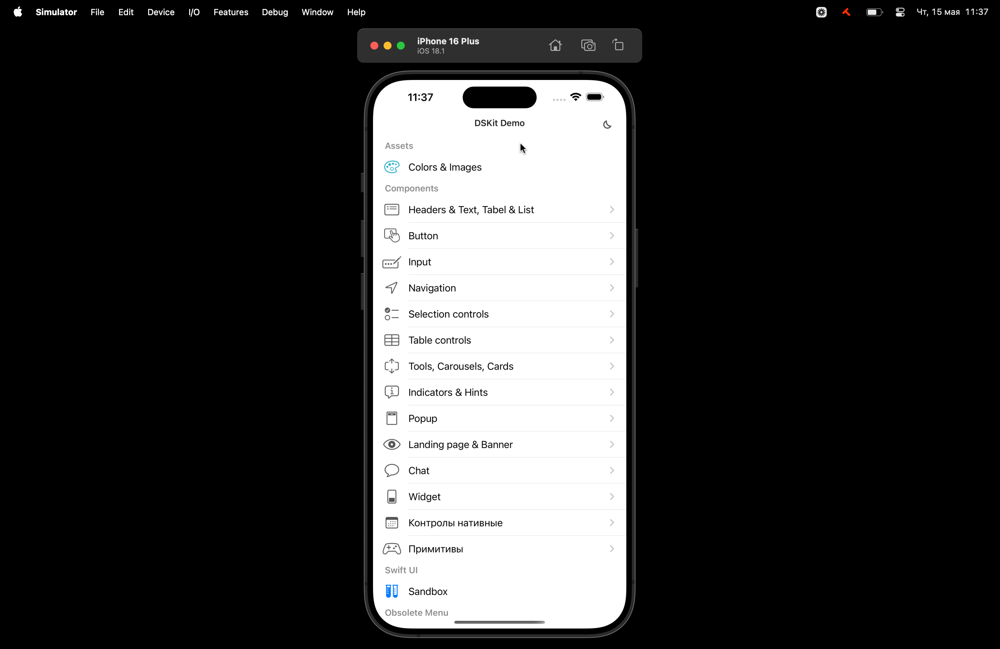

# Как развернуть витрину компонентов iOS СМБ

## Mac OS

1. Скачать [Xcode](https://developer.apple.com/xcode/).
2. Скачать приложение DSKitDemo.
3. Открыть Xcode и перейти XCode → Open developer tool → Simulator:
   
4. Кликаем ПКМ на иконке открытого симулятора и выбираем `Оставить в Dock`. Теперь можно запускать только симулятор:
   
5. В окно симулятора перетаскиваем приложение DSKitDemo:
   

## Windows

Нет технической возможности. Ищем варианты.
