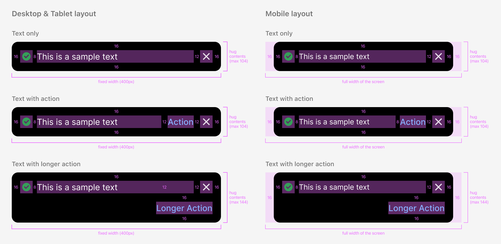
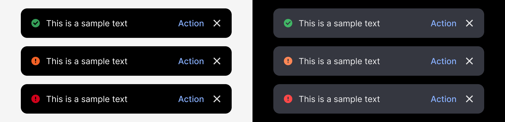
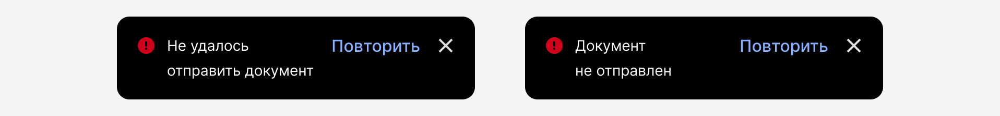
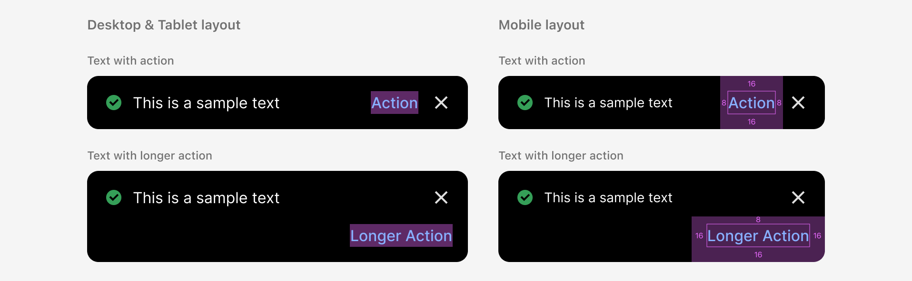
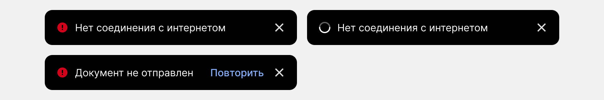

# Toast

## 1. Обзор

### 1.1. Что такое тост

Toast — это краткое всплывающее сообщение в верхней части экрана, которое информирует пользователя о результате его действий или о фоновых процессах системы. Оно не прерывает работу и автоматически исчезает через несколько секунд или остаётся на экране до закрытия пользователем.

### 1.2. Ресурсы

[Компонент в Figma](https://www.figma.com/design/bYUKHrjBAhYPLdug8qfzFc/09-%E2%9C%85-Popup?node-id=5027-132985&t=68B8VeEYbcWxbh59-4)
[Storybook](http://localhost:3000/storybook/?path=/docs/components-toast--content)

### 1.3. Обновления

Сентябрь 2025:

- Обновлённая анатомия компонента.
- Увеличенный шрифт.
- Новый цветовой токен для кнопки действия.
- Утверждённый набор иконок-статусов.
- Охранное поле 16 px для мобильного адаптива, чтобы зафиксировать отступы.
- Фиксированный размер для десктопа и планшета.
- Расположение в верхней части экрана.

[Предыдущая версия в Figma](https://www.figma.com/design/bYUKHrjBAhYPLdug8qfzFc/09-%E2%9C%85-Popup?node-id=27445-81645&t=68B8VeEYbcWxbh59-4)

## 2. Спецификация

### 2.1. Конфигурации

### 2.2. Цвета

Дизайн-токены, которые используются в светлой и тёмной теме:

1. Elements/colorBackgroundToast
2. Status/colorStatusSuccess /colorStatusError /colorStatusCriticalError
3. Elements/colorOnPrimary
4. Button/colorButtonOnDarkNormal
5. Elements/colorOnPrimarySecond

### 2.3. Построение

### 2.4. Анатомия

1. Контейнер
2. Иконка статуса
3. Текст
4. Кнопка действия (опционально)
5. Кнопка «Закрыть»
6. Охранное поле для мобильного лейаута (только для дизайнеров)

#### 2.4.1. Контейнер

Desktop & Tablet layout:

- Ширина фиксированная 400 px.
- Высота подстраивается под контент, максимум 104 px для тоста без кнопки действия или с короткой кнопкой и 144 px для тоста с длинной кнопкой.

Mobile layout:

- Ширина 100% экрана + боковые отступы 16 px.
- Высота подстраивается под контент, максимум 104 px для тоста без кнопки действия или с короткой кнопкой и 144 px для тоста с длинной кнопкой.

#### 2.4.2. Иконка статуса

Всегда используется одна из трёх цветных иконок из сета Service или прелоадер:

Иконки выравниваются относительно текста по верхнему краю:

Иконки по умолчанию бесцветные. Цвет прописывается токеном, который меняется в тёмной теме:

#### 2.4.3. Текст

Разрешено не более трёх строк, далее текст обрезается многоточием:

В работе с текстом необходимо действовать в рамках редполитики и использовать как можно более короткий текст, чтобы человек успел прочесть. Важно учитывать, что ширина букв влияет на переносы:

Нельзя менять стиль и цвет текста, использовать ссылку в тексте.

#### 2.4.4. Кнопка действия (опционально)

Может содержать не более двух-трёх слов. Для короткого текста используй облик с кнопкой справа, для длинного — с кнопкой снизу.

Кнопка справа выравнивается по верхнему краю:

Увеличена область нажатия (tap area) для мобильного адаптива:

#### 2.4.5. Кнопка «Закрыть»

Закрывает тост до истечения таймера. Выравнивается по верхнему краю:

Увеличена область нажатия (tap area) для мобильного адаптива:

#### 2.4.6. Охранное поле для мобильного лейаута (только для дизайнеров)

Отступы нельзя менять: боковые 16px, сверху 16px, снизу 0. Только для удобства дизайнеров, в разработке отступов нет.

### 2.5. Позиционирование

Располагается в верхней части интерфейса и не перекрывает важные элементы в нижней части: закреплённые кнопки, панели инструментов, навигация, клавиатура и прочее:

Desktop & Tablet layout:

- По горизонтали расположен по центру.
- По вертикали отступ сверху 20 px. Допустимо менять отступ в приложениях при необходимости. Например, в розничном интернет-банке из-за чёрной панели сверху отступ должен быть увеличен до 40px.

Mobile layout:

- По горизонтали расположен по ширине экрана, включая боковые отступы 16 px.
- По вертикали отступ сверху 16 px.

### 2.6. Анимация

:::warning[Раздел в разработке]
:::

## 3. Гайдлайн

### 3.1. Когда использовать тост

#### 3.1.1. Сообщение об успешном действии

Используйте тост, если нельзя показать обратную связь в месте действия. Например, пользователь отправил документ из модального окна, окно закрылось и появился тост «Документ отправлен»:

Если действие обратимо, добавьте кнопку «Отменить»:

#### 3.1.2. Незначительные ошибки и предупреждения

Если успешное действие подтверждается тостом, то ошибки в этом же действии также должны отображаться в тосте:

Также тост подходит для ошибок и предупреждений, которые не требуют срочного внимания и не являются критичными:

Если ошибки можно быстро исправить, добавьте кнопку действия:

Если после нескольких попыток исправить не удаётся, покажите сообщение без кнопки:

#### 3.1.3. Процесс

В тосте может отображаться процесс, который завершается успехом или ошибкой. Например, пользователь нажал на кнопку «Отправить документы». Появился тост с прелоадером «Отправка документов». После завершения отправки в тосте мгновенно меняется контент на «Документы отправлены».

Пользователь может закрыть тост с процессом, нажав на крестик или перейдя на другой экран. Останавливать при этом процесс или нет, решает команда. Если процесс не прерывается, по завершении система отображает тост с результатом.

Если во время процесса важно оставаться на текущем экране, используйте прелоадер с затемнением на весь экран.

#### 3.1.4. Важные правила

Не злоупотребляйте тостами — они не должны появляться слишком часто.

Чтобы избежать закрытия тоста при переходе на другой экран или повторный вызов, используйте прелоадер с затемнением на весь экран:

Тост не заменяет валидацию. Если ошибка требует немедленного исправления, лучше показать её рядом с полем ввода, а не в тосте:

### 3.2. Как работает тост

- Появляется автоматически, реагируя на действия пользователя или внутренние процессы системы.
- Исчезает через несколько секунд или остаётся на экране до тех пор, пока пользователь не закроет тост по кнопке или устаревший тост не сменится на новый.

#### 3.2.1. Закрытие тоста

Автоматическое:

- Через 3 или 9 секунд (зависит от типа сообщения).
- При переходе на другой экран.

По кнопке:

- Нажатие на кнопку закрытия (крестик).
- Нажатие на кнопку действия — закроет сообщение, и выполнит указанное действие. Например, в тосте «Файл удалён» при нажатии на кнопку «Отменить» файл восстанавливается, а тост закрывается.

#### 3.2.2. Длительность отображения

Время показа зависит от типа сообщения.

3 секунды — сообщение об успехе без кнопки действия:

9 секунд — сообщение об успехе с кнопкой действия, ошибки и предупреждения, длинные тексты:

Без таймера — сообщение о потере интернет-соединения, ошибки и предупреждения с кнопкой, тост с прелоадером. Остаются на экране до закрытия по кнопке или до замены устаревшего тоста на новый.

### 3.3. Управление очередью тостов

На экране одновременно может отображаться только один тост. Если возникает несколько сообщений, необходимо управлять очередью тостов.

#### 3.3.1. Одинаковые события (обновление таймера)

При повторении одного и того же действия новые тосты не создаются — дубли игнорируются, таймер первого тоста обновляется.

Например, пользователь нажал на кнопку «Копировать карту» и появился тост «Номер карты скопирован». Повторное нажатие на кнопку обновляет таймер первого тоста.

#### 3.3.2. Разные события (формирование стопки)

Если новый тост появляется до исчезновения предыдущего, то он «наезжает» сверху, формируя стопку. Предыдущие сообщения остаются видимыми под ним. Могут быть видимыми три тоста максимум.

При автоматическом закрытии все тосты исчезают после завершения таймера последнего в очереди. При закрытии по кнопке закрывается только верхний (последний) тост, затем следующий и т.д.

Например, открыт тост «Номер карты скопирован». До его исчезновения появляется «CVC-код скопирован». Оба отображаются стопкой, закрываются по отдельности (вручную) или вместе (по таймеру нового).

#### 3.3.3. Замена устаревшего тоста

Если тост устаревает до закрытия, он автоматически заменяется новым. Когда важно визуально выделить смену состояния — например, изменился статус или текст — сначала скрывается предыдущий тост, затем отображается новый.

При замене тоста с прелоадером на результирующий контент обновляется мгновенно, без анимации. Например, после восстановления интернет-соединения тост с прелоадером сменяется на успешное состояние. Запускается таймер обратного отсчёта для успешного тоста — 3 сек. до автоматического закрытия.

