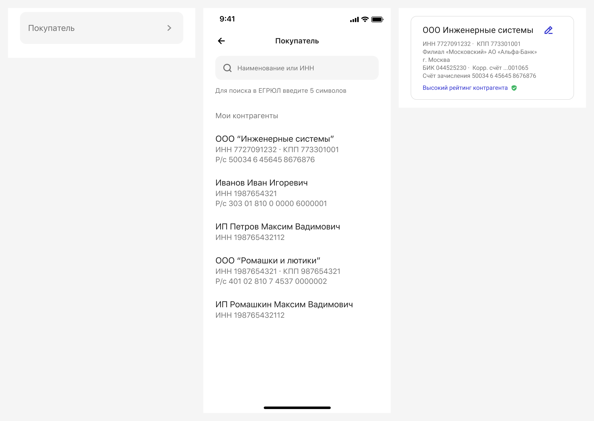
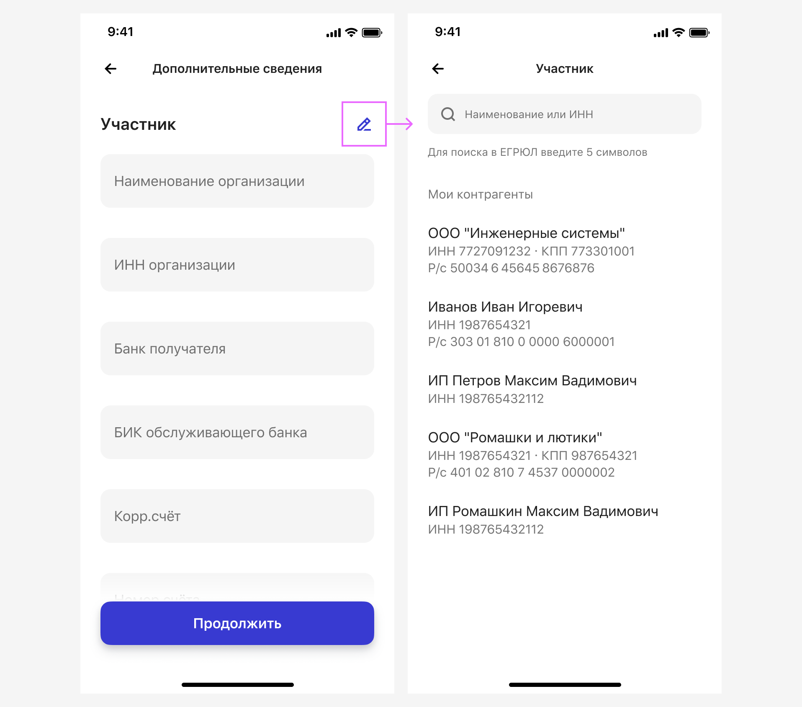
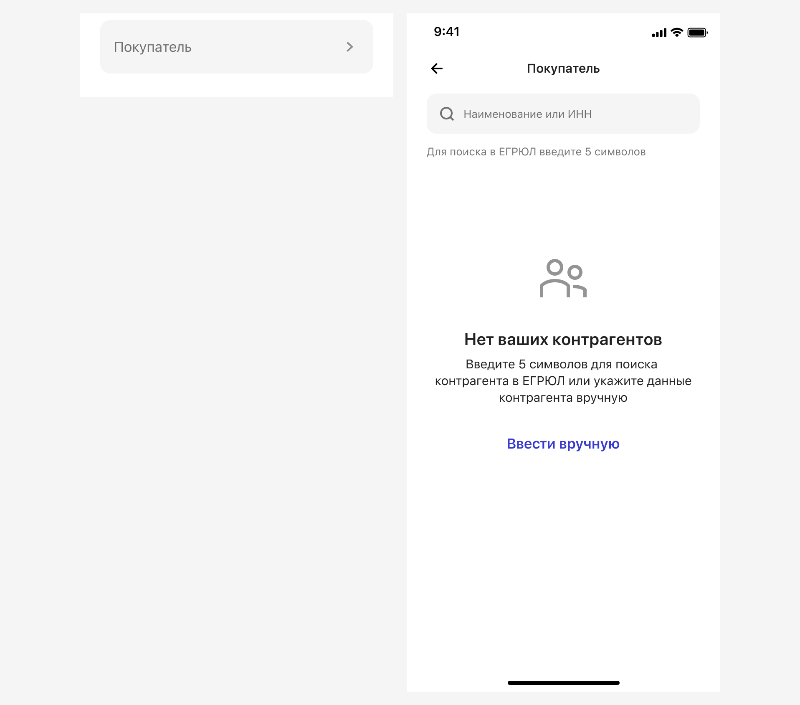
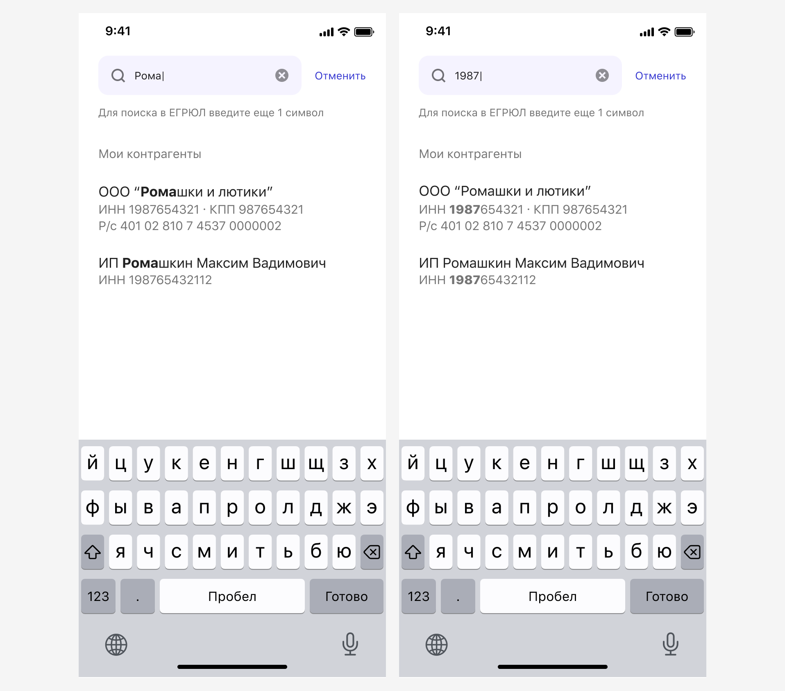

# Организации
[Фигма](https://www.figma.com/design/vcJnk1pjqywou7To3O52Rq/%D0%A1%D0%BF%D1%80%D0%B0%D0%B2%D0%BE%D1%87%D0%BD%D0%B8%D0%BA%D0%B8?node-id=1181-10598&t=uP4YBhjKwKHJyovE-1) 

## Как использовать

Справочник «Организации» состоит из двух справочников:
1. ЕГРЮЛ/ЕГРИП — это государственный справочник юрлиц и ИП, в нем нет физлиц.
2. «Контрагенты» — это справочник ПСБ. В нем хранятся данные контрагентов, с которыми пользователь  уже взаимодействовал или которых указал вручную сам. Здесь могут быть данные физлиц.

Справочник вызывается согласно [Общим принципам справочников](/patterns/classified/).

Справочник помогает автоматически заполнять данные в форме заявки:

Иконка карандашика возвращает пользователя в справочник.

Если форма заявки предполагает, что пользователь должен ввести только юридическое лицо, то физлица и ИП в списке Мои контрагенты не выводим.

Если в заявке надо ввести данные юрлица, физлица или ИП, то при ручном заполнении поля у контрагентов разные:

Кейс, когда требуется указать только юридическое лицо:

Если пользователь никогда не указывал контрагента, то справочник покажет [пустое состояние](/patterns/empty-state/):

## Поиск

В поиске указывается наименование или ИНН. При вводе символов появляется список подсказок (совпадения) из справочника Мои контрагенты:

После ввода 5 символа появляются совпадения из справочника ЕГРЮЛ/ЕГРИП и кнопка Введите вручную:

В справочнике мы намерено не ставим кавычки у наименований организаций и двоеточие у ИНН, КПП, р/с. Это помогает избавиться от визуального шума.

У наименования организаций и предпринимателей для отображения организационно-правовой формы используются сокращения (ООО, ОАО, ИП):

Если организации нет в списке, то пользователь может ввести данные вручную:

## Организация не найдена

Если в подсказках нет нужного варианта, появляется [пустое состояние](/patterns/empty-state/):

## Валидация

Ошибки значения данных контрагента быть не может.

Может появиться ошибка запроса с бэка. Мы предлагаем пользователю ввести данные вручную:

