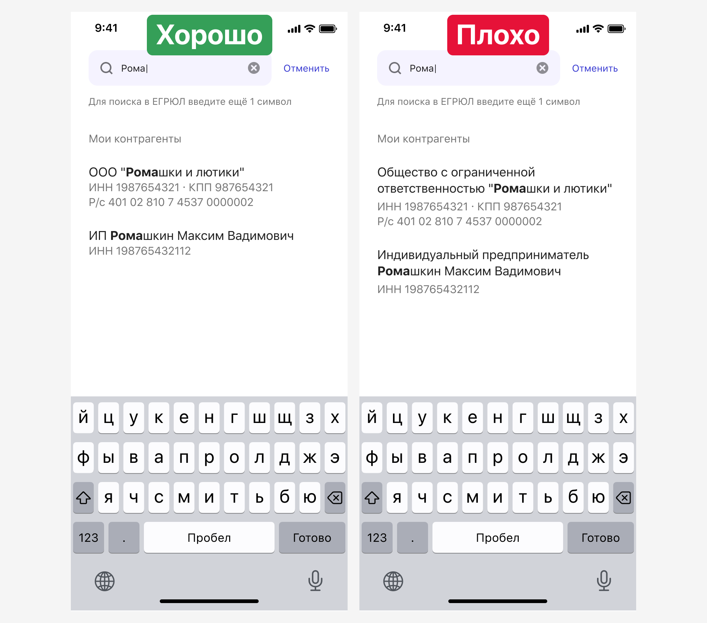

# Организации

[Фигма](https://www.figma.com/design/vcJnk1pjqywou7To3O52Rq/%D0%A1%D0%BF%D1%80%D0%B0%D0%B2%D0%BE%D1%87%D0%BD%D0%B8%D0%BA%D0%B8?node-id=1181-10598&t=uP4YBhjKwKHJyovE-1)

## Как использовать

Справочник «Организации» состоит из двух справочников:

1. ЕГРЮЛ/ЕГРИП — это государственный справочник юрлиц и ИП, в нем нет физлиц.
2. «Мои контрагенты» — это справочник ПСБ. В нем хранятся данные контрагентов, с которыми пользователь уже взаимодействовал или которых указал вручную сам. Здесь могут быть данные физлиц.

Справочник вызывается согласно [общим принципам справочников](/patterns/classified/). При нажатии на контрагента из справочника, данные автоматически подтягиваются в форму заявки в виде карточки:

Если форма заявки предполагает, что пользователь должен ввести только юридическое лицо, то физлица и ИП в списке «Мои контрагенты» не выводим.

## Поиск

В поиске указывается наименование или ИНН. При вводе символов появляется список подсказок (совпадений) из справочника «Мои контрагенты»:

В справочнике мы намерено не ставим двоеточие у ИНН, КПП, р/с. Это помогает избавиться от визуального шума.

В наименованиях организаций и ИП используются стандартные сокращения организационно-правовых форм:

После ввода 5 символа появляются совпадения из справочника ЕГРЮЛ/ЕГРИП и кнопка «Введите вручную»:

Если организации нет в списке, то пользователь может ввести данные вручную.

Если в заявке нужно ввести данные юридического лица, физического лица или индивидуального предпринимателя, то при ручном заполнении поля у контрагентов различаются. В поля Наименование организации или ИНН автоматически подтягивается то, что пользователь ввел в справочнике:

Если в заявке надо указать только организацию, то в форме не будет разделения на юрлицо и физлицо/ИП. При нажатии на карандаш пользователь вернется в справочник:

## Пустые состояния

Если в справочнике «Мои контрагенты» нет контрагентов, то справочник покажет [пустое состояние](/patterns/empty-state/):

Если при поиске организации в ЕГРЮЛ нет совпадений, справочник сообщает об этом. Если совпадений нет ни среди «моих контрагентов», ни в ЕГРЮЛ, то отображается пустое состояние:

## Валидация и ошибки

В поле поиска наименования или ИНН можно ввести любые символы — система не проверяет их на корректность.

Могут возникать ошибки запроса с бэка при загрузке данных из справочников:

