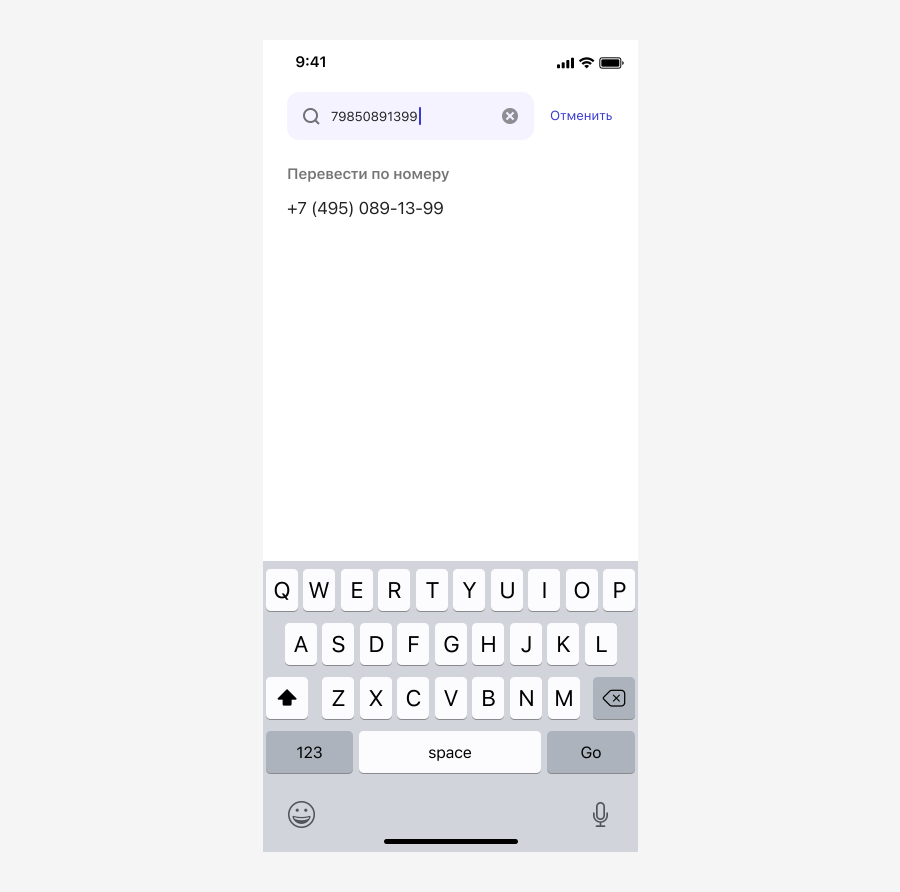

# Телефонная книга

[Фигма](https://www.figma.com/design/vcJnk1pjqywou7To3O52Rq/%D0%A1%D0%BF%D1%80%D0%B0%D0%B2%D0%BE%D1%87%D0%BD%D0%B8%D0%BA%D0%B8?node-id=1581-2485&t=BYnoh0lNmVGz5bIC-1)

## Вызов справочника

Инициация сценария осуществляться несколькими способами.

По любой кнопке, например такой:

По полю `Input Phone` с иконкой `ui / People`. Поле имеет единую кликабельную зону, т. е. нельзя отдельно вызвать числовую клавиатуру и окно со справочником контактов:

## Загрузка экрана

При переходе на экран потребуется проверить пермишены, построить список популярных значений или применить сортировку к списку, поэтому добавляем экран с прелоадером:

На время загрузки экрана блокируем поисковую строку `Имя или телефон`.

## Permissions

При первом открытии справочника надо запросить пермишены. Делаем это ненавязчиво. А для тех, у кого уже были какие-то переводы, можем показать список популярных, построенных на PAM-фразе:

## Отображение справочника

Когда пермишены получены, мы даем дизайнерам два варианта на построение списка: по алфавиту и по популярности.

В варианте «по алфавиту» осуществляется группировка контактов по первому символу слова и имеет символьную сортировку:

- цифры,
- русские буквы,
- англ буквы,
- спецсимволы.

Группировка нечувствительна к регистру, т. е., значения Михаил и михаил попадут в одну группу.

Для группировки цифровых значений предусмотрен знак решетки `#`, а для спецсимвольных — амперсанд `&`:

Популярность телефонов предложили ранжировать на основании истории переводов за последние 90 дней.

На ранжирование влияет несколько параметров:

- давность перевода,
- количество переводов.

Чем раньше, относительно текущей даты, был сделан перевод, тем выше значение в справочнике. После сравнения давности перевода, выполнять проверку количества переводов, чем их больше, тем выше значение в справочнике.

## Группировка контакта

Если у контакта несколько подходящих телефонных номеров, то рядом с телефоном выводить счетчик номеров. Склонять слово «номер» в соответствии со счетчиком:

Тап по такому элементу вызывает `Action Sheet` со списком номеров:

Если у пользователя 2 контакта с одинаковыми именами заведены отдельно, то в справочнике они тоже отображаются отдельно:

## Контакты без имени

Иногда встречаются контакты без имени, в этом случае первый пришедший телефон становится крупнее, а сами контакты попадают в группу «цифры»:

## Выбор значения

Значения в телефонной книге кликабельны.

Если экран был вызван из поля `Input Phone`, то по тапу, окно телефонной книги закрывается, а выбранное значение заполняется в поле «Телефон получателя».

Если значение было в телефонной книге, то поле получает новое название. Теперь оно соответствует названию выбранного значения, а если не было в списке, то название поля не меняется:

## Поиск

Алгоритм поиска типовой и подходит ко всем справочникам сразу, поэтому он был вынесен [в отдельный паттерн](../search/index.md).

Если у пользователя есть доступ к телефонной книге, то при переходе в справочник мы по умолчанию ставим фокус в поле.

Снятие фокус можно несколькими способами:

- если тапнуть по неактивному месту,
- если проскроллить листинг значений,
- нажать на кнопку «Отменить».

Если в процессе поиска не нашлось совпадения и значение в поле поиска не похоже на телефон, то выводить сообщение «Получатель не найден»:

Если в процессе поиска не нашлось совпадения, но значение в поле поиска похоже на телефон, то форматировать такое значение по маске и предлагать его к выбору.

Какие значения считать похожими на российский номер телефона?

- Любая комбинация из 10 цифр, если она начинается не на 7.
- Любая комбинация из 11 цифр начинающаяся с 7 или 8.

Если пользователь использует при наборе символы и знаки препинания, то позволять их вводить, но игнорировать при определении номера. Так мы сможем распознать все многообразие значений, которое может к нам прийти через копипасту:

Если значение в поле поиска похоже на телефон, но полностью не удовлетворяет принципам похожести и похожее значение не было найдено в справочнике, то оставлять зону результатов поиска пустой:

