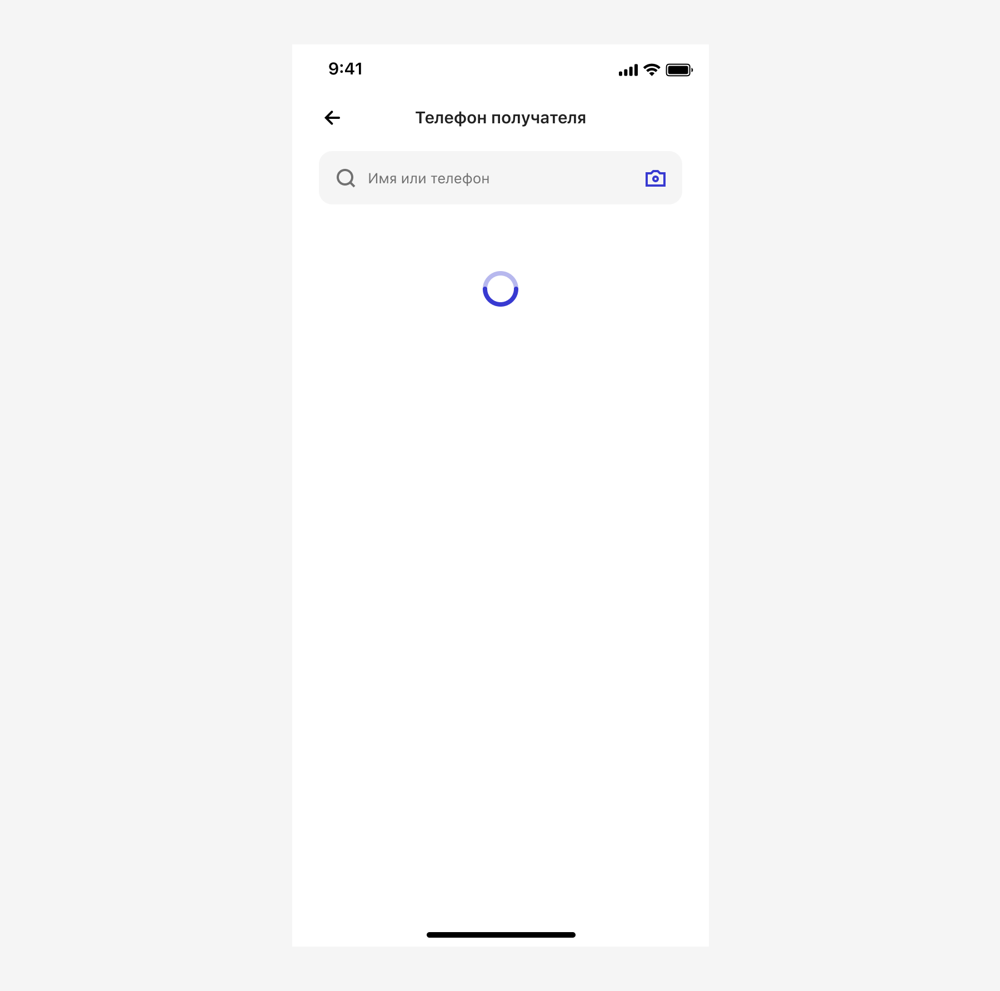

# Телефонная книга

[Фигма](https://www.figma.com/design/vcJnk1pjqywou7To3O52Rq/%D0%A1%D0%BF%D1%80%D0%B0%D0%B2%D0%BE%D1%87%D0%BD%D0%B8%D0%BA%D0%B8?node-id=1581-2485&t=BYnoh0lNmVGz5bIC-1)

## Вызов справочника

Инициация сценария осуществляться несколькими способами.

По любой кнопке, например такой:

По полю `Input Phone` с иконкой `ui / People`. Поле имеет единую кликабельную зону, т. е. нельзя отдельно вызвать числовую клавиатуру и окно со справочником контактов:

## Загрузка экрана

При переходе на экран потребуется проверить пермишены, построить список популярных значений или применить сортировку к списку, поэтому добавляем экран с прелоадером:

На время загрузки экрана блокируем поисковую строку `Имя или телефон`.

## Permissions

При первом открытии справочника надо запросить пермишены. Делаем это ненавязчиво. А для тех, у кого уже были какие-то переводы, можем показать список популярных, построенных на PAM-фразе:

