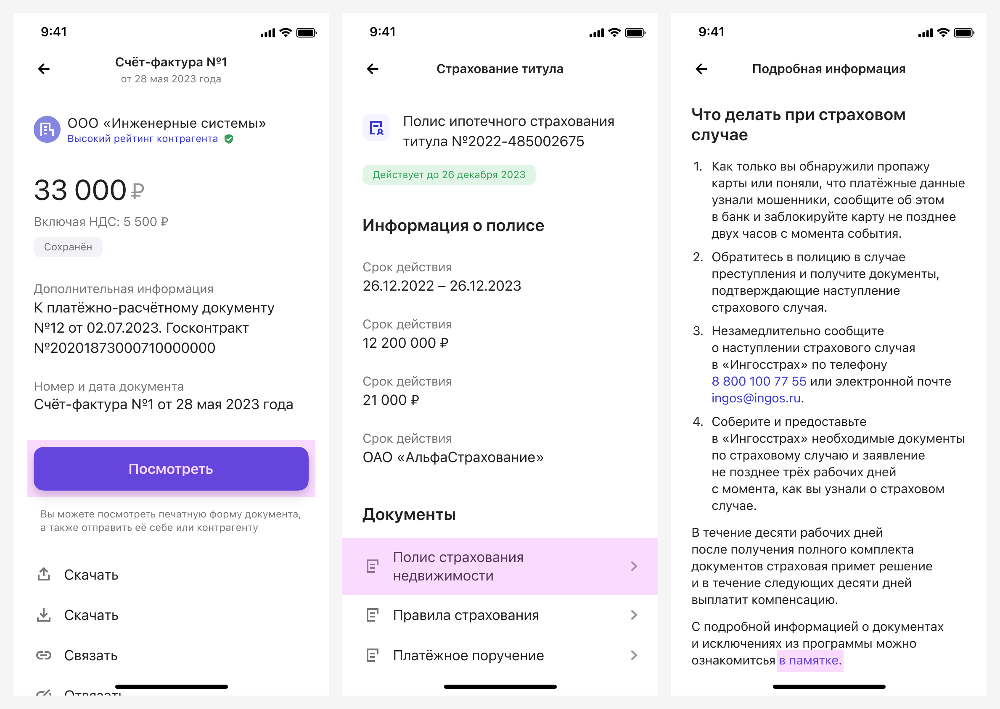
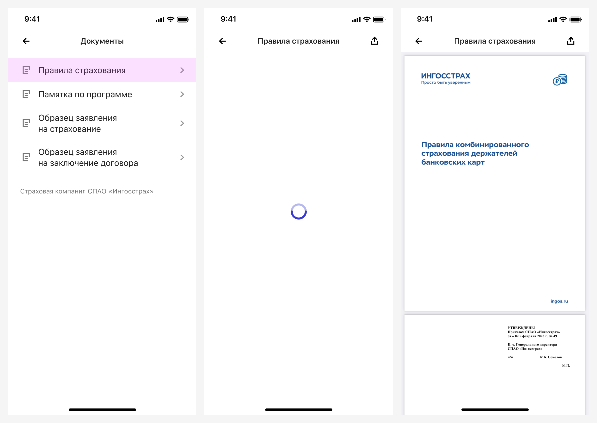
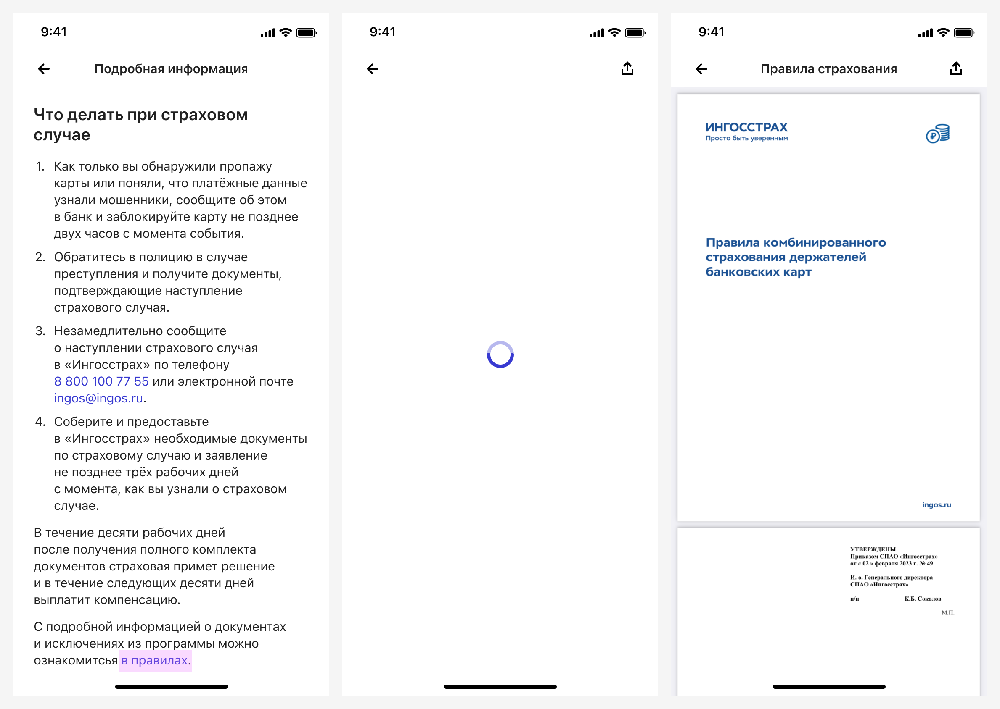
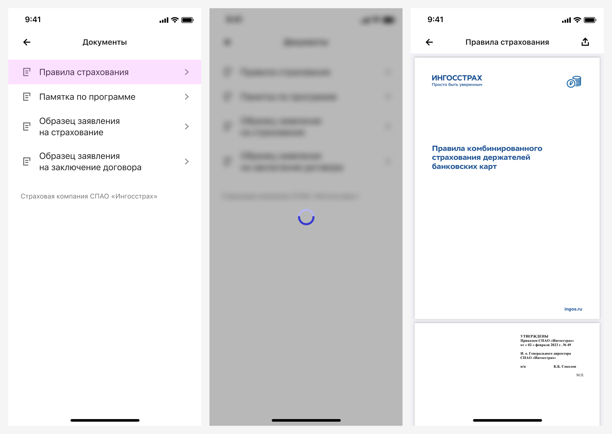
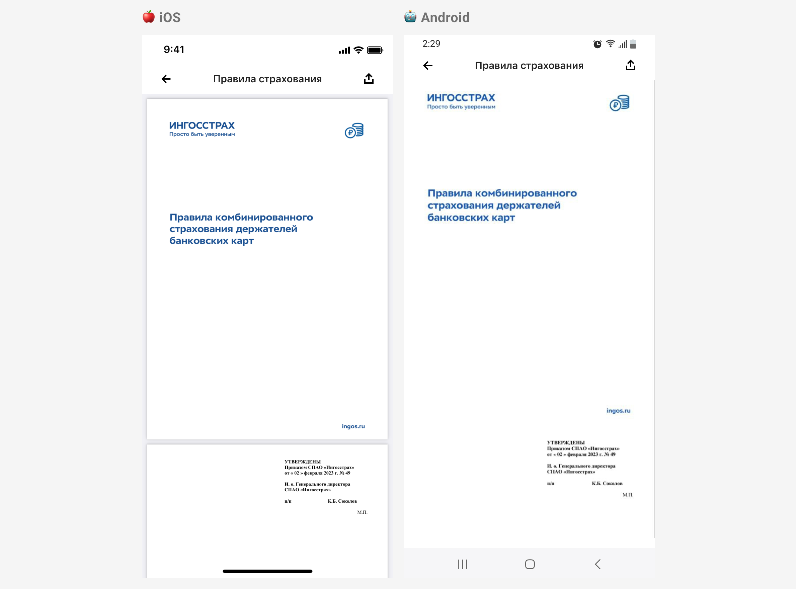
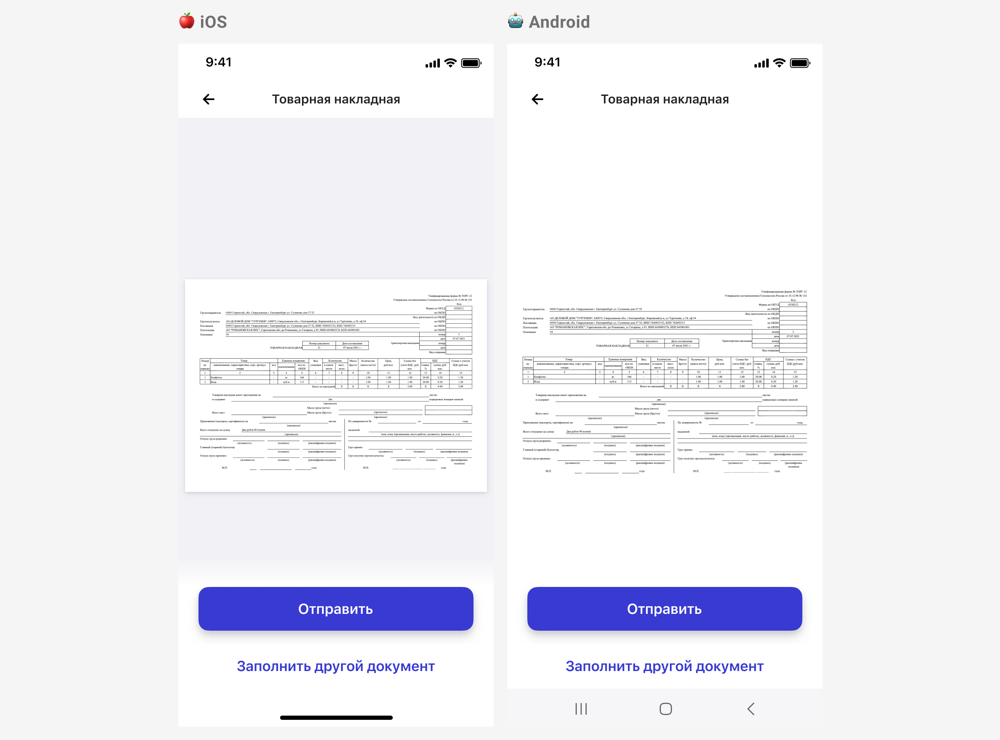
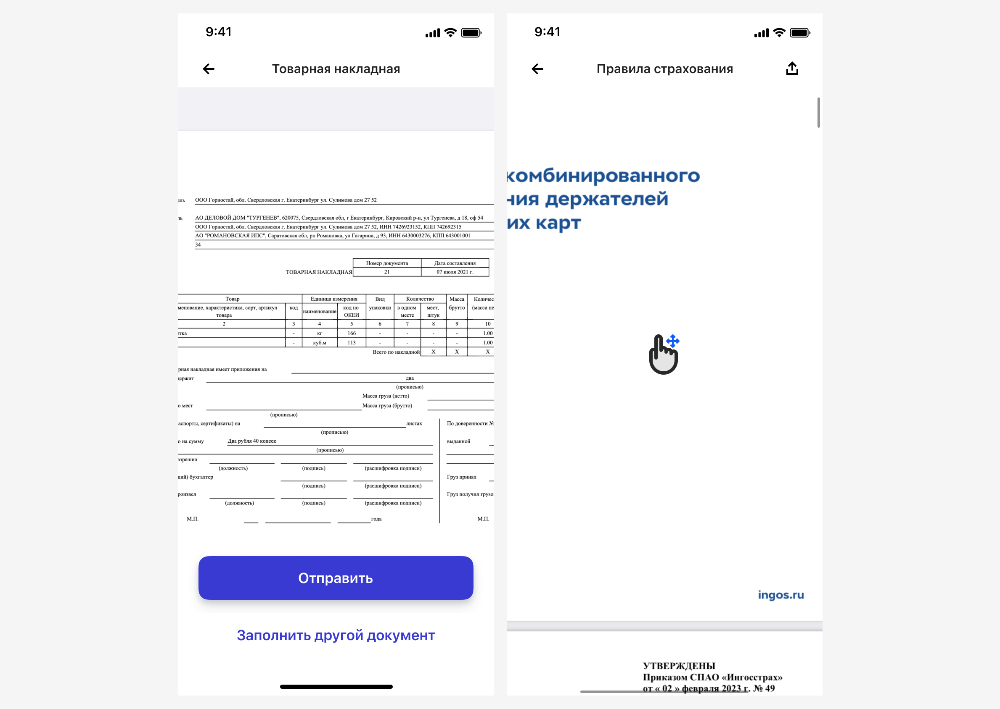
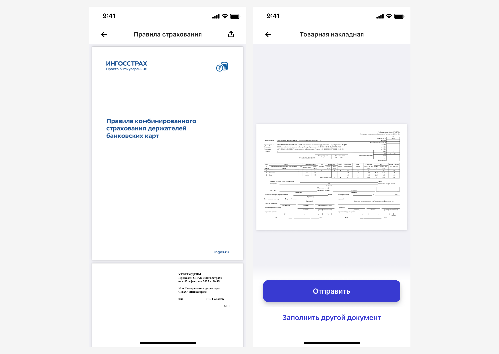
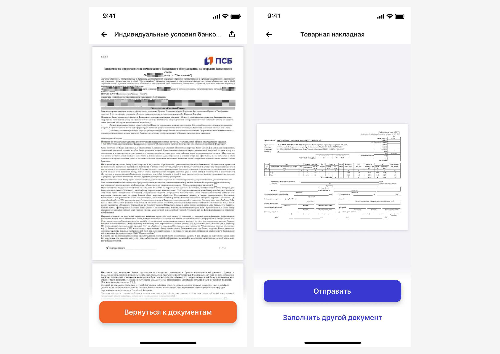
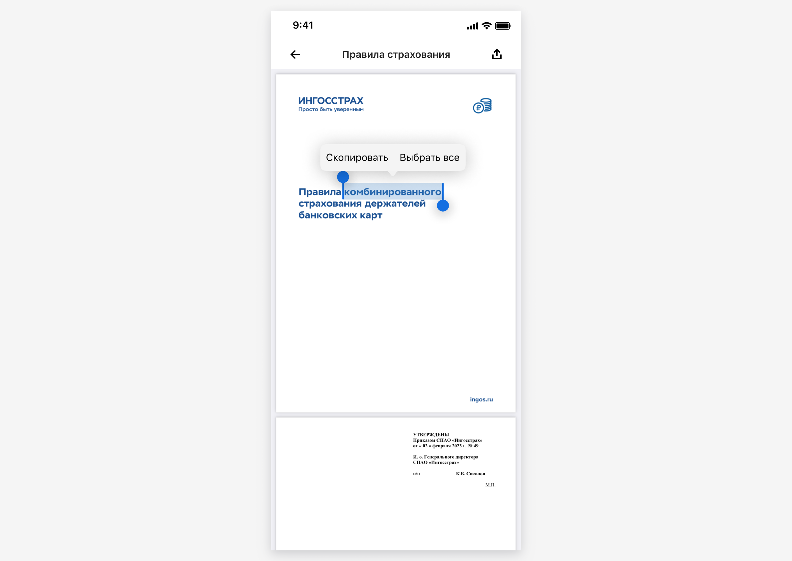

# Просмотр PDF-документов

В рамках задачи мы разобрались в текущей реализации просмотра PDF-документов, унифицировали её и подробно описали.

## Точки входа в сценарий

Переход на страницу с просмотром документа не регламентирован. Например, переход может быть по нажатию на кнопку, Control List Forward или ссылку в тексте.

Для отображения списка документов в розничном приложении рекомендуется использовать [Control List Forward](https://www.figma.com/design/G4Y5zzmntFmcu9DQ0XbyGa/06-%E2%9C%85-Table-Controls?node-id=301-6676&t=FRElTxVYt1jyFmug-4).

## Загрузка страницы

Документ начинает загружаться при нажатии на контрол. Загрузка происходит на экране просмотра документа. По центру экрана отображается [индикатор](https://www.figma.com/design/DZMCFTk6pitWL3tY3wj2Y0/08-%E2%9C%85-Indicators-%26-Hints?node-id=730-95916&t=KGkCQj571fxiJVny-4) из дизайн-системы.

В некоторых кейсах может потребоваться загружать документы заранее вместе со страницей, с которой происходит переход на документ. В таком случае нет экрана загрузки.

В состоянии загрузки может не быть заголовка в Navbar / Toolbar, если неизвестно имя документа,  который открывается по ссылке. Это исключение, не рекомендуется загрузка без заголовка.

### iOS. Особенности

На айосе возможна реализация загрузки на предыдущем экране. Во время загрузки отображается [Popup Overlay](https://www.figma.com/design/bYUKHrjBAhYPLdug8qfzFc/09-%E2%9C%85-Popup?node-id=502-5931&t=8M0pxIoteg55w9Mm-4) + [индикатор загрузки](https://www.figma.com/design/DZMCFTk6pitWL3tY3wj2Y0/08-%E2%9C%85-Indicators-%26-Hints?node-id=730-96207&t=ThU2ajWMApgsEQvT-4). Это технические особенности, по умолчанию используйте загрузку на экране просмотра.

## Отображение страницы с документом

Документ открывается внутри приложения в стандартном инструменте платформы. На андроиде это [AndroidPdfViewer](https://github.com/DImuthuUpe/AndroidPdfViewer?tab=readme-ov-file) в РБ / [PhotoView](https://github.com/Baseflow/PhotoView) в СМБ, на айосе – [WKWebView](https://developer.apple.com/documentation/webkit/wkwebview). Внешний вид отображения PDF-документа заложен в инструменте платформы.

Название документа отображается в Navbar / Toolbar и настраивается вручную. Оно должно быть согласовано с точкой входа.

Страницы растягиваются по ширине экрана. Многостраничные документы расположены сверху экрана. При скроле появляется вертикальный индикатор прокрутки.

Одностраничные документы расположены по центру экрана.

## Открытие документов вне приложения

Существует реализация, когда документы открываются вне приложения. Например, на айосе PDF-документ открывается во внешнем браузере, на андроиде автоматически скачивается на устройство.

Избегайте такого сценария, чтобы пользователь не покидал приложение!

## Какие действия доступны

### Масштабирование

Можно увеличивать изображение и возвращать к исходному состоянию при помощи жестов: двойное нажатие (double tap) или стягивание (pinch) / растягивание (spread).

В увеличенном масштабе при перемещении страницы появляются вертикальный и горизонтальный индикаторы прокрутки.

### Поделиться документом

Для отправки документа используется иконка [Send](https://www.figma.com/design/QQPmkY46t5KL7meRyJh6bc/%E2%9C%85%F0%9F%93%9A%E2%80%93-%F0%9F%99%8FIcons?node-id=1902-491&t=OTZfWVmuwEhxxbg8-4) в Navbar / Toolbar. По нажатию открывается нативный для устройства экран шаринга. Подробнее в паттерне [Share Screen](https://docs.google.com/document/d/1RFbK8hPBuakPvfwoY8xAdr8cMICy2YA6jxtey9xdGa4/edit?tab=t.0). Кнопку можно отключать.

Также можно поделиться документом с помощью [Button Group](https://www.figma.com/design/tegDXkYwwbpSTeiWIPhRGn/02-%E2%9C%85-Button-%26-Link?node-id=127-66020&t=Yz6UvMI23DNMoY3S-4) в состоянии Footer fix. Такой вариант не рекомендован для многостраничных документов.

### Дополнительные действия

Можно добавлять другие действия с документом с помощью компонента Button Group   состоянии [Footer fix](https://www.figma.com/design/tegDXkYwwbpSTeiWIPhRGn/02-%E2%9C%85-Button-%26-Link?node-id=127-66020&t=Yz6UvMI23DNMoY3S-4). Компонент опциональный, доступны одна или две кнопки.

### iOS. Копирование текста

Только в iOS можно скопировать текст в PDF-документе по лонгтапу, если текст доступен для выделения.

## Ошибки

Сейчас ошибки выводятся на усмотрение дизайнера, всеми доступными средствами из дизайн-системы.

## Источники

- [PDF: Still Unfit for Human Consumption, 20 Years Later](https://www.nngroup.com/articles/pdf-unfit-for-human-consumption/)
- [Avoid PDF for On-Screen Reading](https://www.nngroup.com/articles/avoid-pdf-for-on-screen-reading/#toc-guidelines-for-using-pdfs-3)
