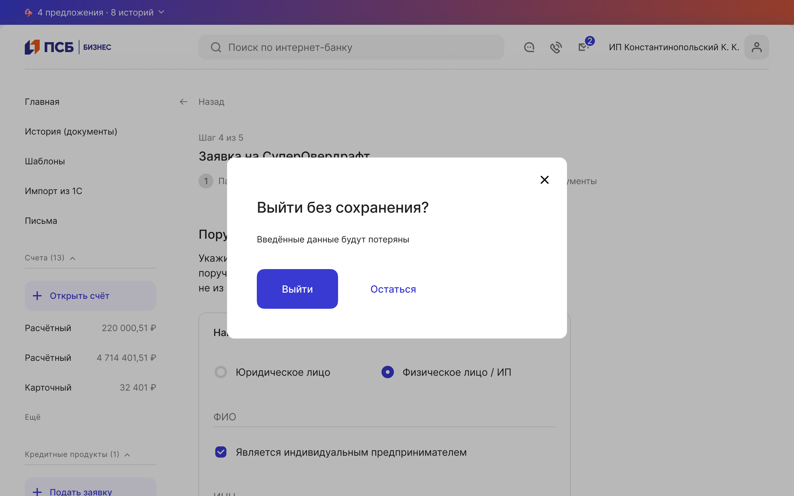
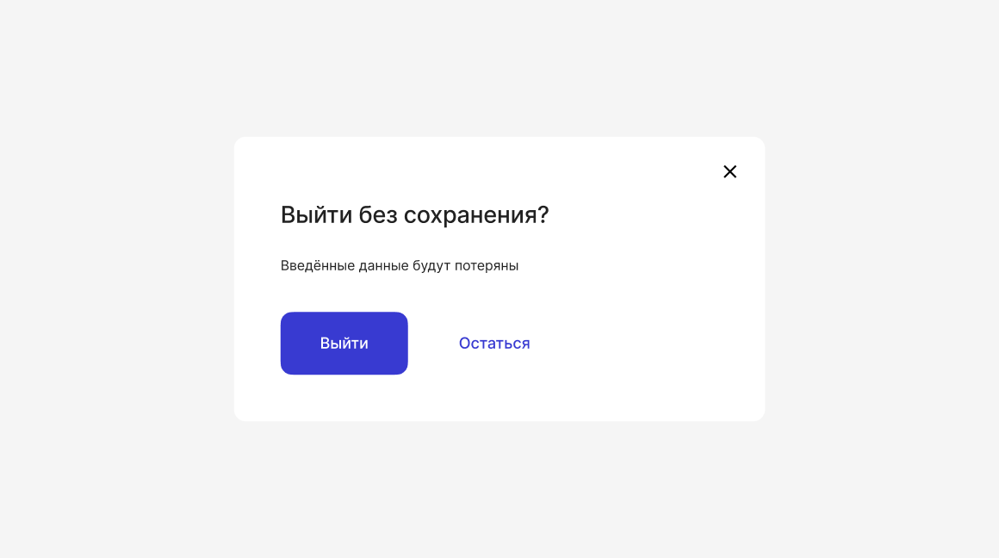
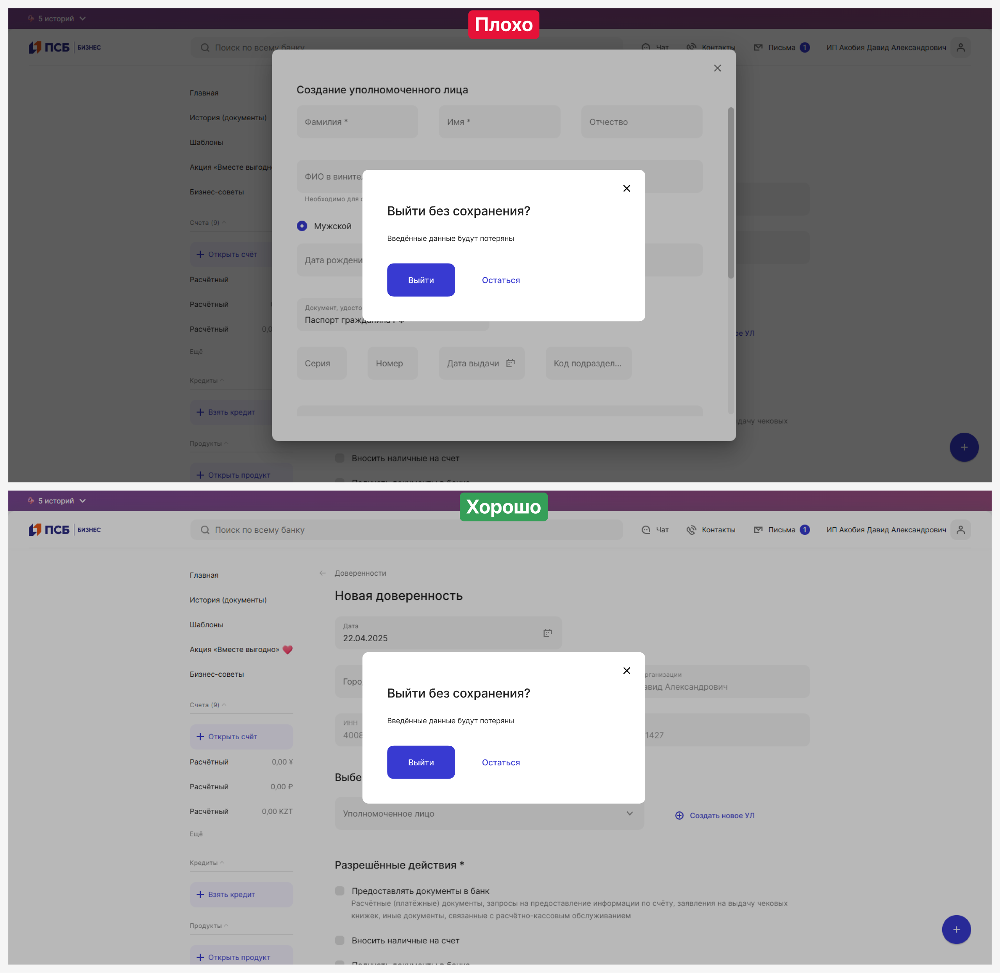
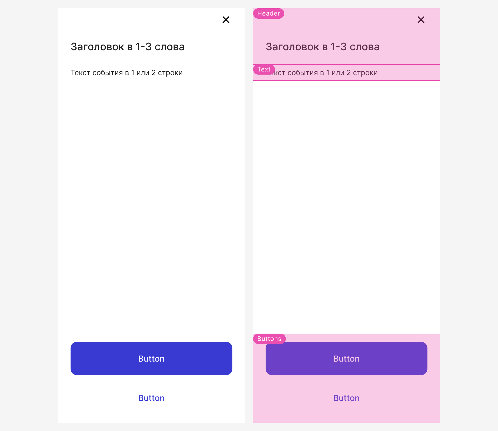

# Сохранение введённых данных

[Фигма](https://www.figma.com/design/HSjMOenEZX6RgyVXBfcDyw/%D0%9A%D0%BE%D0%B3%D0%B4%D0%B0-%D0%BC%D1%8B-%D0%BF%D0%BE%D0%BA%D0%B8%D0%B4%D0%B0%D0%B5%D0%BC-%D0%BB%D1%8E%D0%B1%D1%83%D1%8E-%D1%84%D0%BE%D1%80%D0%BC%D1%83-%D1%80%D0%B5%D0%B4%D0%B0%D0%BA%D1%82%D0%B8%D1%80%D0%BE%D0%B2%D0%B0%D0%BD%D0%B8%D1%8F?node-id=52-3354&t=HY9kkumcJBb2Y2uE-1)

## Когда использовать

Когда клиент покидает форму редактирования. В попапе говорим клиенту, что при закрытии формы внесённые данные не сохранятся.

## Use кейсы

### Нет изменений или внесены некритические изменения

Нельзя выводить попап, если клиент не внёс изменения в форму редактирования.

Также не рекомендуем выводить попап, если клиент внёс некритические изменения.

К некритическим изменениям относятся данные, которые легко вносятся пользователем. Это изменения с использованием радиобаттонов, степпер баттонов, чекбоксов, свитчеров, чипсов, селектов.

### Внесены критические изменения

В этом кейсе обязательно выводим попап.

К критическим изменениям относятся данные, заполнение которых требует от пользователя значительного труда. Это данные с использованием инпутов, где надо ввести дату, контакты, сумму, номер счёта, ИНН и т.д.

### Автоматическое сохранение

Если форма редактирования большая или клиент вводит много критических данных, то используйте автосохранение с помощью [Cookie](https://browser.yandex.ru/help/personal-data-protection/cookies.html), [LocalStorage](https://doka.guide/js/local-storage/).

Если в кейсе используется автоматическое сохранение и данные сохранились, закрываем форму редактирования без подтверждения.

Если сессия сеанса истекла, то введённые данные можно кешировать в браузере.

## Универсальная форма

Мы рекомендуем использовать [готовый попап](https://www.figma.com/design/HSjMOenEZX6RgyVXBfcDyw/%D0%9A%D0%BE%D0%B3%D0%B4%D0%B0-%D0%BC%D1%8B-%D0%BF%D0%BE%D0%BA%D0%B8%D0%B4%D0%B0%D0%B5%D0%BC-%D0%BB%D1%8E%D0%B1%D1%83%D1%8E-%D1%84%D0%BE%D1%80%D0%BC%D1%83-%D1%80%D0%B5%D0%B4%D0%B0%D0%BA%D1%82%D0%B8%D1%80%D0%BE%D0%B2%D0%B0%D0%BD%D0%B8%D1%8F?node-id=52-3354&t=FM7Jw9CDSZUlS0SH-1). Он подходит для заявок и форм в сайдбарах:

### Поведение

Попап появляется поверх страницы, затемняя её с помощью [Overlay](https://www.figma.com/design/bYUKHrjBAhYPLdug8qfzFc/09-%E2%9C%85-Popup?node-id=878-66786&t=b4bvBHOicfvjpO0t-1).
И закрывается по нажатию на крестик или при клике за пределами окна.

Обязательно должны быть кнопки действия:

1. Primary button — подтверждает уход с формы редактирования.
2. Text button  — закрывает попап.

### Как использовать нельзя

Нельзя накладывать одно модальное окно на другое. При внесении критических изменений попап заменяет форму редактирования.

## Рекомендации

Если дизайнеру не подходит универсальная форма попапа, он может создать свои тексты заголовка и описания.

### Заголовок

Заголовок должен быть кратким вопросом (1-3 слова).

### Текст события

Текст должен поместиться в одну или две строки. Он кратко объясняет клиенту, что данные не сохранятся и их надо будет вводить снова.

### Кнопки

Текст кнопок призывает выполнить действие. Одно или два слова, без двойного смысла. Должно быть понятно, что произойдет по нажатию на кнопку. Не использовать слова «Закрыть» и «Отмена».

## Структура

У попапа всегда есть:

- заголовок и крестик
- текст события
- кнопки (Primary и Text)

В адаптиве попап открывается на весь экран, кнопки всегда прибиты к нижнему краю.

