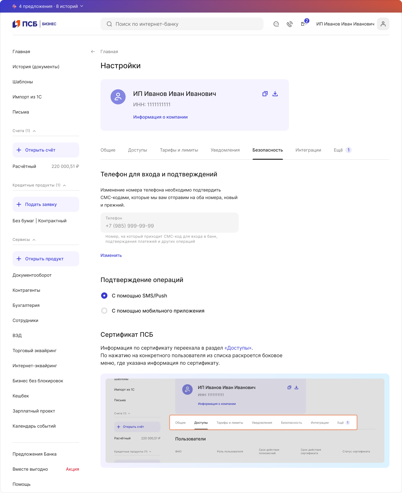
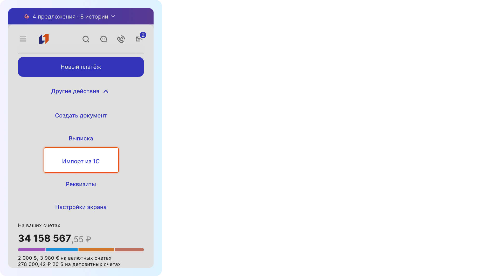
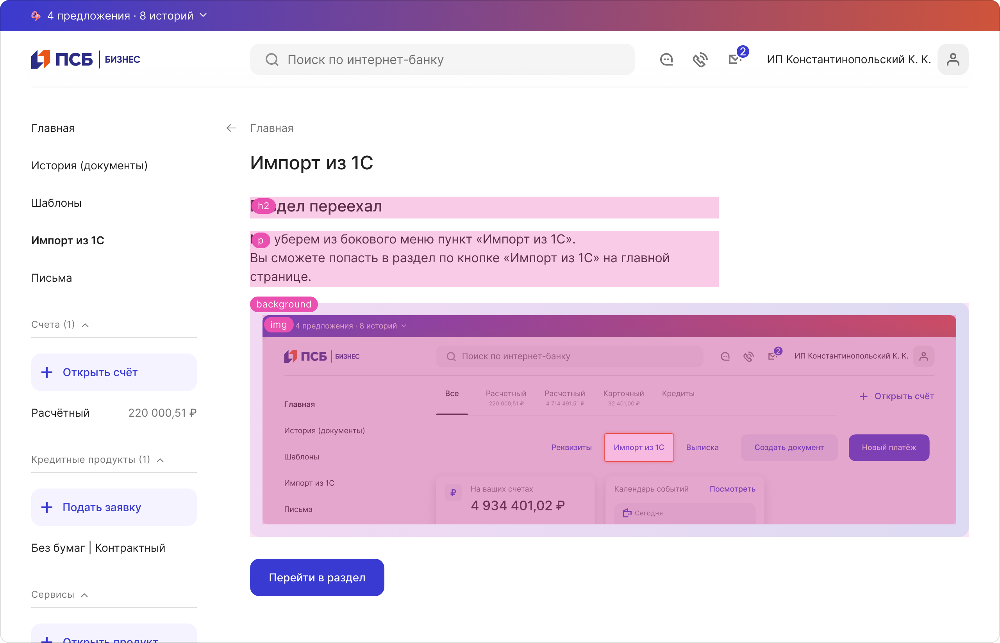

# Раздел переехал
[Фигма](https://www.figma.com/design/DYlVm81MWPnxu6wiDXtsfL/%D0%A0%D0%B0%D0%B7%D0%B4%D0%B5%D0%BB-%D0%BF%D0%B5%D1%80%D0%B5%D0%B5%D1%85%D0%B0%D0%BB?node-id=0-1&t=cK6Js6K21kAWzUZZ-1) 

Используйте при изменении структуры сайта, если функциональность поменяла расположение или удалилась. 

Информация о переезде раздела может располагаться внутри раздела и внутри содержимого страницы.

Внутри содержимого страницы:

Внутри раздела:

## Синтаксис элементов

|                             | Заголовок       | Описание                                                    | Кнопка                                                               |
| --------------------------- | --------------- | ----------------------------------------------------------- | -------------------------------------------------------------------- |
| Внутри содержимого страницы | Не меняется     | Если знаем URL нового раздела, то встраиваем ее в описание. | Кнопки нет                                                           |
| Внутри раздела              | Раздел переехал | Ссылки нет | Если знаем URL нового раздела, то добавляем кнопку: Перейти в раздел |

## Изображение

Задача изображения — объяснить клиенту, как попасть в новый раздел. 

По смыслу изображение должно быть связано с описанием.

Если знаете URL нового раздела, то картинку можно сделать кликабельной.

Старайтесь располагать выделяемый элемент ближе к центру изображения.

Компонент адаптивный, это значит, что вы можете подготовить 2 версии изображения: для десктопа и для мобильной версии. Так пользователь увидит картинку в подходящем для него окружении. 

**Десктоп** 

**Мобила**

Для каждого адаптива мы берем изображение актуального макета, то есть для мобилы — изображение, как выглядит интернет-банк в мобильной версии, для десктопной — в десктопной версии.

## Как создать

1. Берём компонент [Image](https://www.figma.com/design/xbcxFGQyBdi1r11H25vCfg/10-%E2%9C%85-Landing-page-%26-Banner?node-id=17627-9057&t=pAt6Qa4sAQIklsnZ-1), подгоняем его под нужный размер.
2. Масштабируем макет, который хотим показать в инструкции, с помощью горячей клавиши `k` до размера слоя img в компоненте.
3. Подгоняем слой `Overlay` и выделяем нужную функциональность с помощью слоя `Select`.
4. Экспортируем этот макет в формате .png в 1х, 2х для передачи в разработку (не забываем оптимизировать).
5. Вставляем уменьшенный макет в формате .png в 2х в компонент слой `img` через заливку.

## Как передать разработчику

Экспортируем слой Макет в формате .png в 1х, 2х. Перед передачей изображения в разработку, не забудьте его оптимизировать. Более подробно можно почитать в паттерне [Передача изображений в разработку](../transfer-images-to-development/index.md).

## Структура и размеры

У страницы есть:
- h2
- p
- img
- background
- button (только внутри раздела)

 

Отступы на странице статичны:

 

## Как долго клиент видит инструкцию о переезде раздела?

Команда определяет, как долго будет отображаться информция о переносе раздела. Но важно, чтобы эта информация не висела постоянно, поэтому срок её показа должен быть заранее установлен и контролироваться.