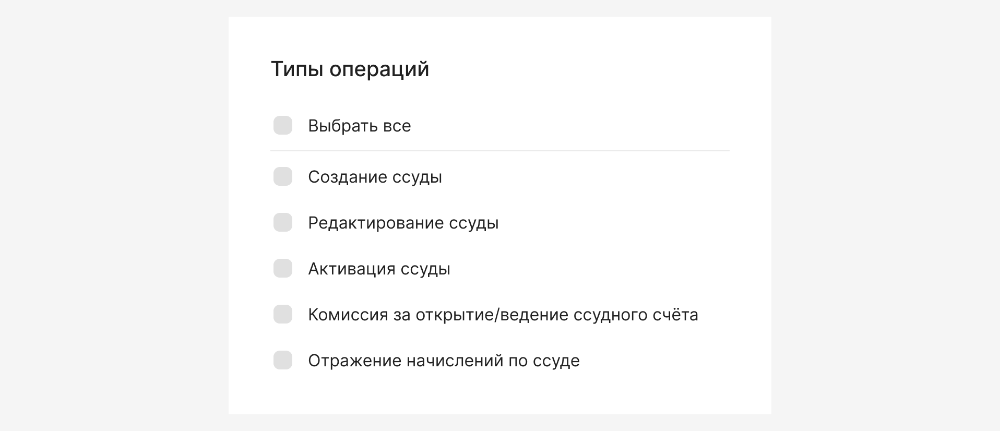
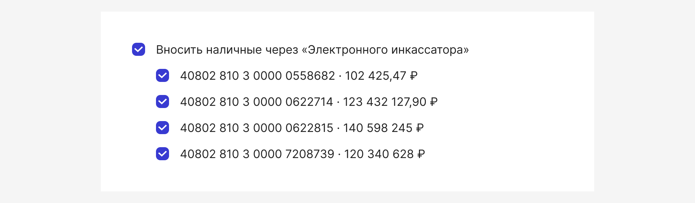

# Выбрать все

[Фигма](https://www.figma.com/design/2ru67X0kDRN4ZkJTKqcSzw/%D0%92%D1%8B%D0%B1%D1%80%D0%B0%D1%82%D1%8C-%D0%B2%D1%81%D0%B5?node-id=410-43365)

## Где используется

В интерфейсах, где применяется множественный выбор посредством чекбоксов.
Например:

* Лента операций – для массового выбора транзакций,
* Таблицы – для выбора элементов при фильтрации или управлении,
* Списки счетов – для выбора счетов при переводе средств.

И другие сценарии с длинными списками опций.

## Состояние

Ни один элемент не выбран:

Частично выбран:

Выбраны все элементы:

## Управление

При нажатии на чекбокс в активных состояниях «Частично выбран» и «Выбран» выделение дочерних элементов снимается:

## Каунтер

### Общее количество элементов

* Если, список большой (больше ≈10 элементов) и пользователь может захотеть выбрать весь набор.
* Нужно видеть масштаб перед массовым действием и убедиться в корректности выбора (например, перенос или удаление всех элементов).
* Список всех элементов находится вне видимой зоны пользователя.
* Есть рискованные или массовые операции, где точное число затронутых элементов важно.

### Количество выбранных элементов

Если использовали каунтер с общим количеством элементов, то рекомендуем также показывать количество выбранных элементов:

## Группа чекбоксов

Функцию «Выбрать все» может унаследовать родительский элемент в группе чекбоксов:

## Примеры использования

### Списки

### Таблица с пагинацией

* При фильтрации выбираются только видимые элементы.
* При большом количестве элементов используйте пагинацию и предлагайте пользователю возможность выбрать все элементы на всех страницах, а не только на текущей.

## Floating action bar

* Количество выбранных элементов в этом кейсе может быть указано в компоненте Floating action bar.
* Клик на крестик в компоненте Control Floating-action-bar при множественном выборе равносилен снятию выделения выбранных элементов

## Ссылки

[Исследование](https://plump-argument-8c8.notion.site/Pattern-18ae41d2e83180d69cd7ef689288cbb2)
