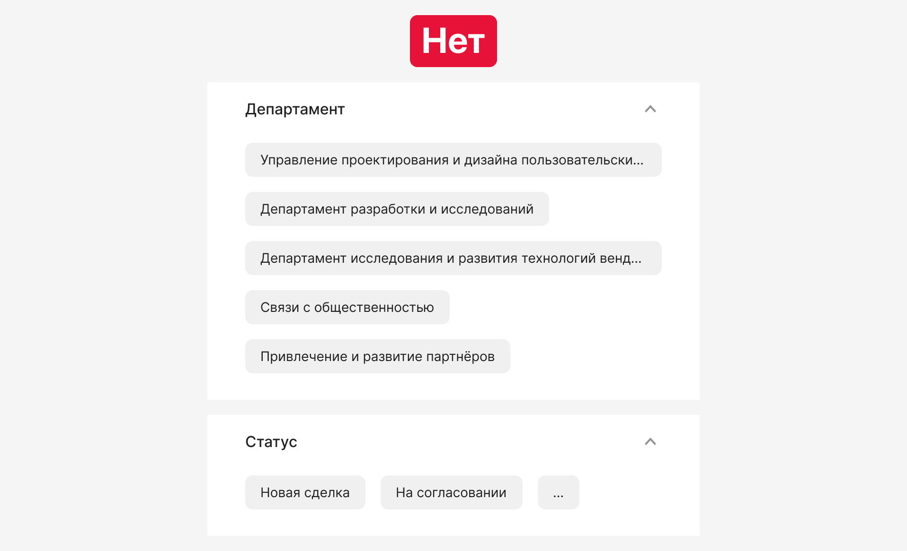
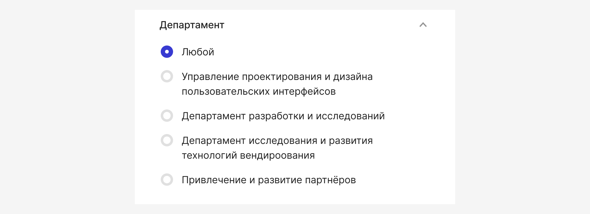
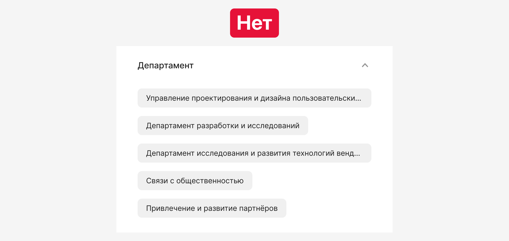
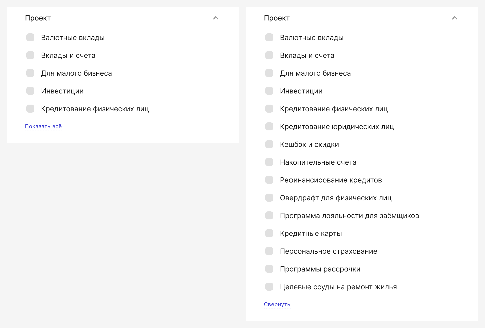
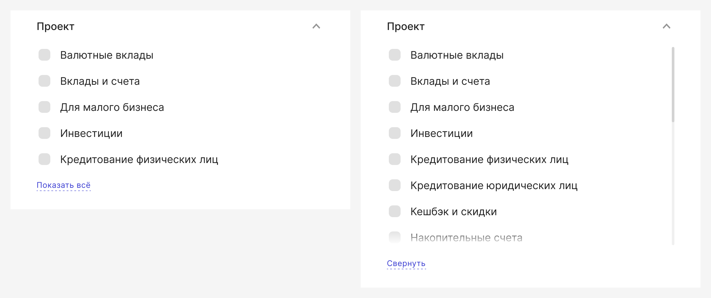
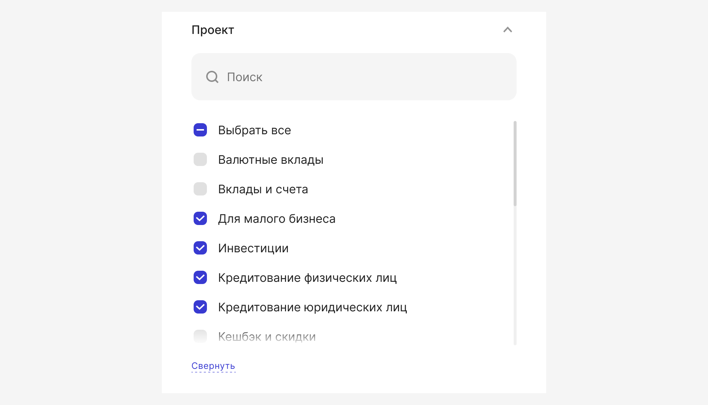
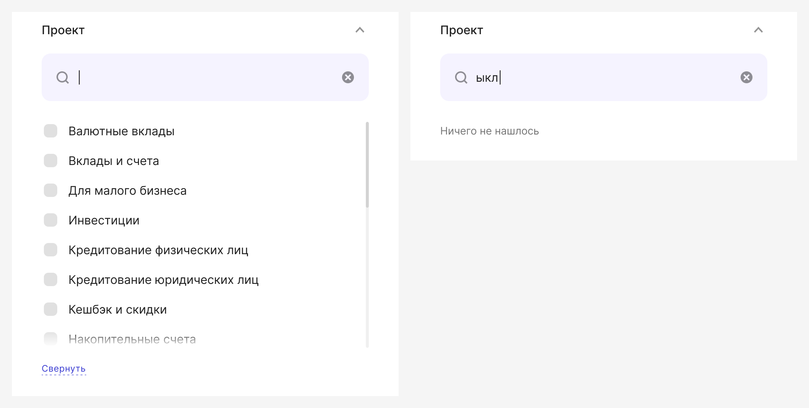
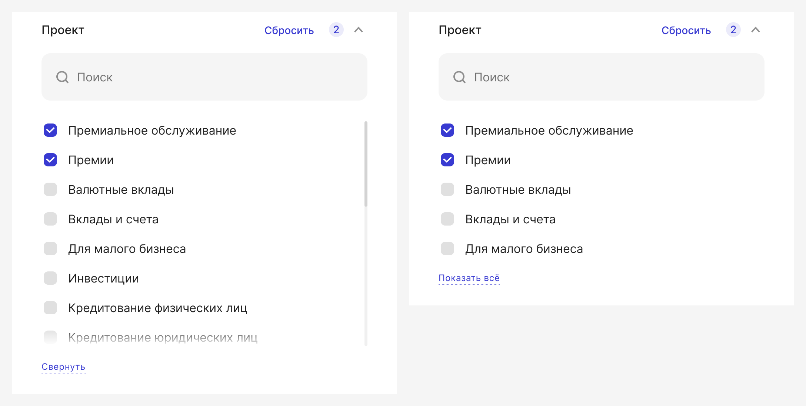
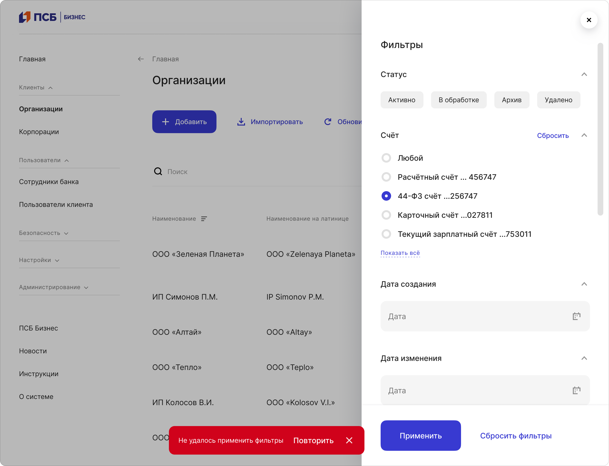
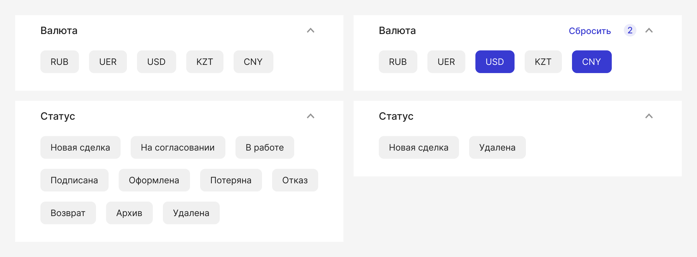

# Фильтры в сайдбаре

## Анатомия

## Общие принципы

### Заголовок

«Фильтры» — используется, когда фильтров несколько:

«Название фильтра» — используется, когда фильтр один:

### Название фильтров

Используйте именительный падеж без предлогов.
Пример: «Счёт» вместо «По счёту»

### Структура и порядок

1. Самые популярные и часто используемые фильтры располагаются сверху.
2. Самые релевантные значения внутри фильтров располагаются сверху.
3. Используйте [динамическую фильтрацию](#динамические-фильтры), если это не ограничено техническими требованиями. Скрывайте недоступные значения и фильтры, на которые пользователь не может повлиять.

### Пункт «Все»

Не используйте пункт «Все» или «Любой» в выпадающих списках.
Отсутствие выбора = показ всех данных без применения фильтра.

#### Исключение

Радиобаттоны должны иметь выбранное значение по умолчанию:

### Взаимодействие

#### Сброс фильтров

Используйте кнопку [«Сбросить фильтры»](#заголовки-фильтров) для отмены выбранных значений.

#### Закрытие сайдбара

Сайдбар можно закрыть тремя способами:

1. По крестику в хедере.
2. Кликом по зоне вне сайдбара.
3. Нажатием клавиши Esc.

## Наполнение

### Одиночный выбор

#### Чипсы

Когда используем: выбор 1 элемента среди маленького количества значений с коротким текстом.  

1. В состоянии по умолчанию:

   – Может быть не выбран ни один чипс.  
   – Можно задавать самый популярный.

2. Максимум 3 строки.
3. Текст в чипсе должен влезать в 1 строку в мобильном представлении. Если не влезает, используем радиобаттоны.
4. Не используем чипс с тремя точками, показываем сразу все. Если не влезают в 3 строки, используем радиобаттоны (до 5 пунктов), если пунктов больше — выпадающий список или автокомплит.

#### Радиобаттоны

Если значения длинные, используем радиобаттоны (до 5 пунктов).

#### Выпадающий список

Используется для списка из 6-25 пунктов.

#### Автокомплит

Используется для списка из 25+ пунктов.

#### Дата

#### Период

#### Период с чипсами

#### Диапазон значений

### Множественный выбор

#### Чипсы

Когда используем: выбор нескольких элементов среди маленького количества значений с коротким текстом.

#### Чекбоксы

* До 15 пунктов. Подходит для пунктов с длинным текстом.
* По умолчанию не выбран ни один пункт.
* Если пунктов больше 5, по кнопке «Показать всё» раскрываем список всех значений.

#### Чекбоксы с поиском

* Для 15+ пунктов. Подходит для пунктов с длинным текстом.
* По умолчанию не выбран ни один пункт.
* По кнопке «Показать всё» раскрываем список до 8 значений со скроллом и по необходимости используем поиск:

**Без поиска:**

Возможно использование пункта «Выбрать все» в начале списка:

Механика работы фильтра «Чекбоксы + поиск»:

1. Нажали на «Показать всё».

   

2. Начали вводить символы в поиск, но ничего не нашлось.

   

3. Ввели символы, увидели совпадения и выбрали нужное. При выборе значений в каунтере отображается количество выбранных значений, а также кнопка «Сбросить»

   

4. Стёрли поиск, выбранные значения будут первыми в списке, свернули список:

   

#### Выпадающий список с множественным выбором

* Для 30–40+ пунктов.
* Список значений динамический и заранее неизвестен — данные подгружаются с сервера, поэтому нельзя отобразить все значения сразу.

## Поведение и взаимодействие с сайдбаром

При скролле контента header и footer зафиксированы.
Экран под сайдбаром не скроллится, накладывается overlay.

Если пользователь кликнул вне сайдбара, то сайдбар закрывается, а уже настроенные в нём данные сохраняются до перезагрузки страницы пользователем.

## Динамические фильтры

Динамические фильтры — это фильтры, которые обновляют доступные значения и количество результатов сразу после изменения одного из параметров. Используйте динамическую фильтрацию, если это не ограничено техническими требованиями.

Принципы работы:

1. При выборе значений во время загрузки данных и процесса подсчёта доступных значений показываем лоадер в кнопке «Применить»:

   

   При появлении лоадера ширина кнопки остаётся фиксированной.

2. Если не удалось подсчитать доступные значения, показываем ошибку в компоненте toast:

   

3. Показываем в кнопке «Применить» количество значений, доступных при выставленных фильтрах:

   

4. Применяем динамическую фильтрацию: недоступные значения и фильтры, на которые пользователь не может повлиять, следует скрывать:

   

5. Количество результатов в кнопке:

   * До тысячи без округления: 1–999.  
   * Начиная с тысячи — округляем до тысяч и пишем в формате «X тыс.».

   

6. Данные на странице под сайдбаром обновляем только после клика на кнопку «Применить».

7. Ошибки:

   * Если ничего не найдено — показываем пустое состояние.  
   * Если не удалось применить фильтр — показываем toast с ошибкой.

## Структура

### Заголовки фильтров

Используем компонент List Accordion:

* По умолчанию все аккордеоны раскрыты:

* При настройке фильтра появляется кнопка «Сбросить»:

* Если в фильтре мультиселект, при выборе появляется счётчик:

### Футер

* Футер с кнопками закреплен внизу экрана и всегда виден. Сделан по аналогии с Floating action bar.
* По умолчанию показываем кнопку «Применить». Если применён хотя бы один из фильтров, показываем рядом кнопку «Сбросить фильтры».
* Рекомендуется делать фильтры динамическими и показывать количество найденных результатов в кнопке.
