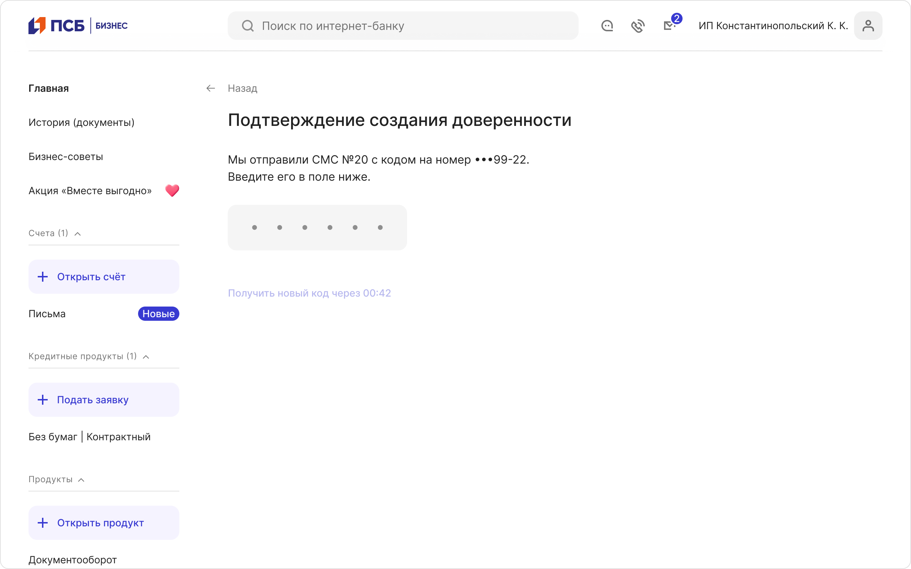
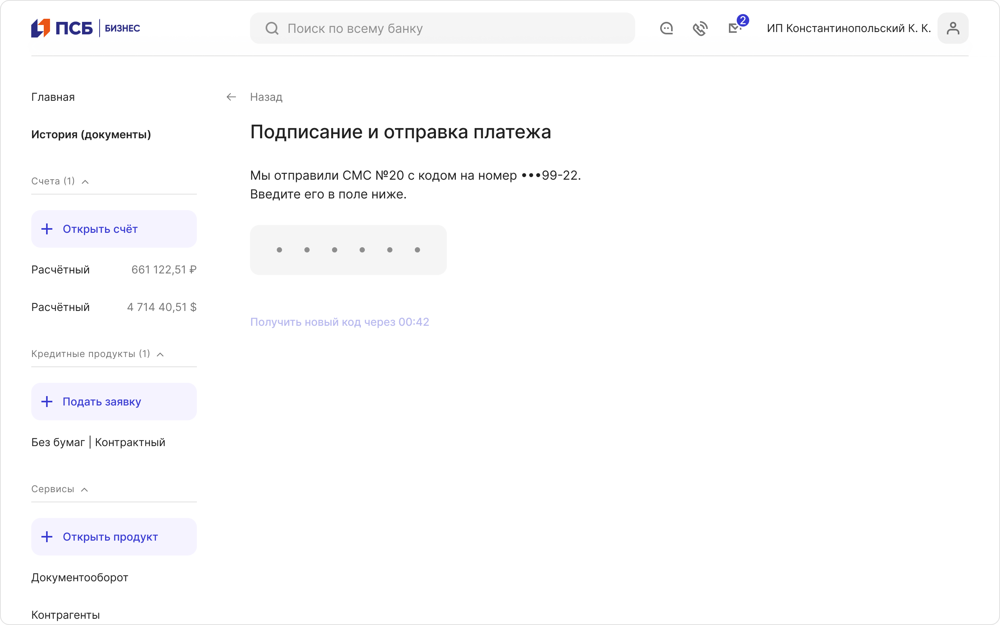
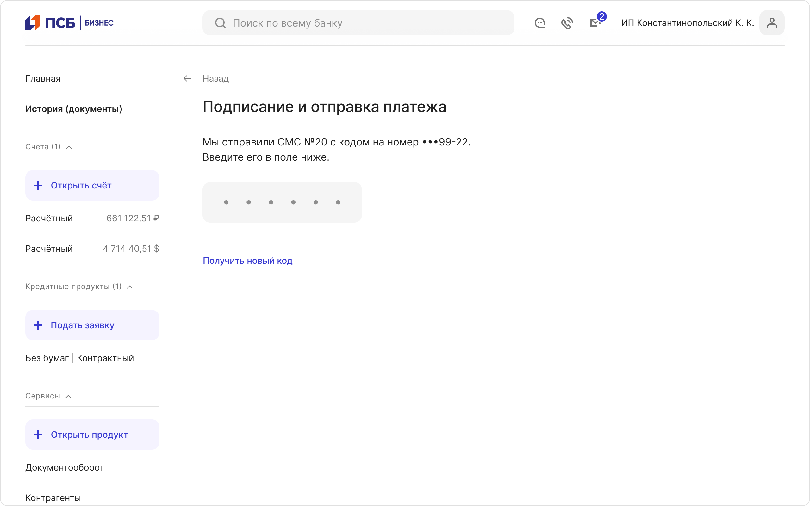
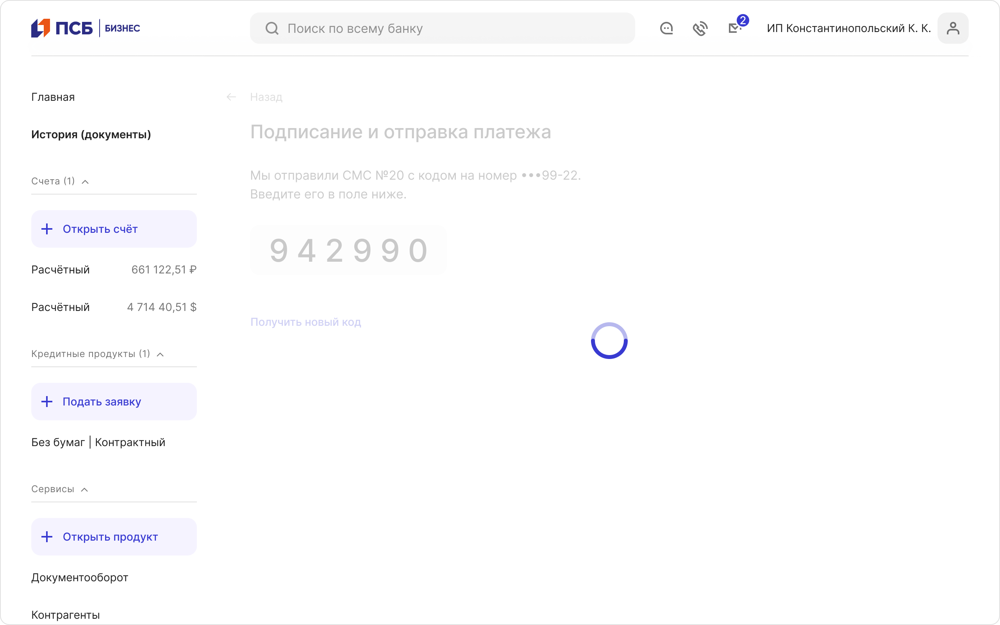
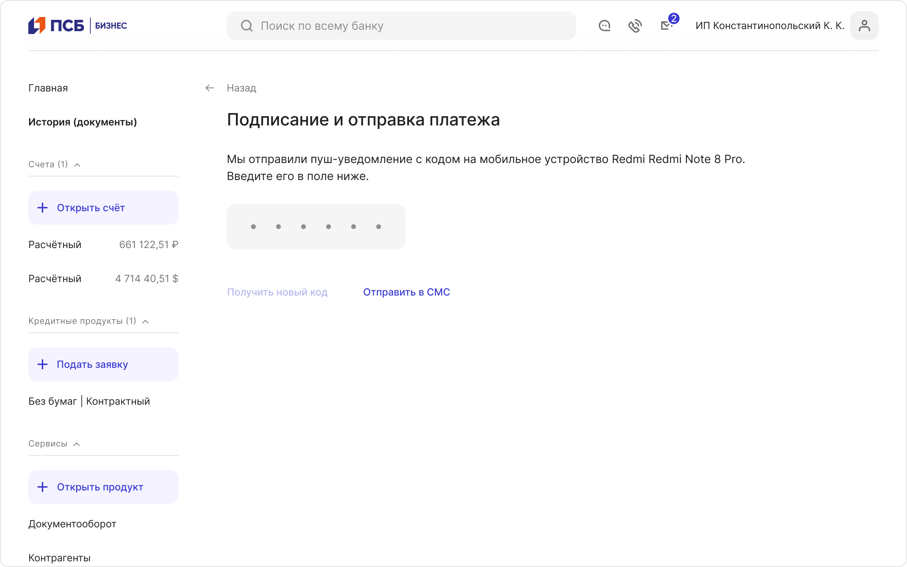
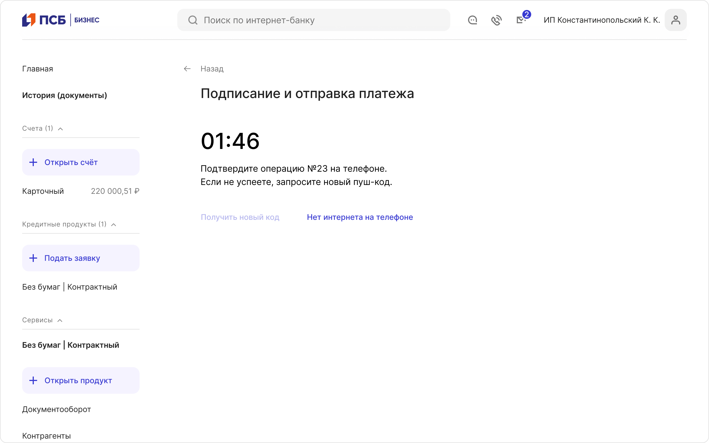
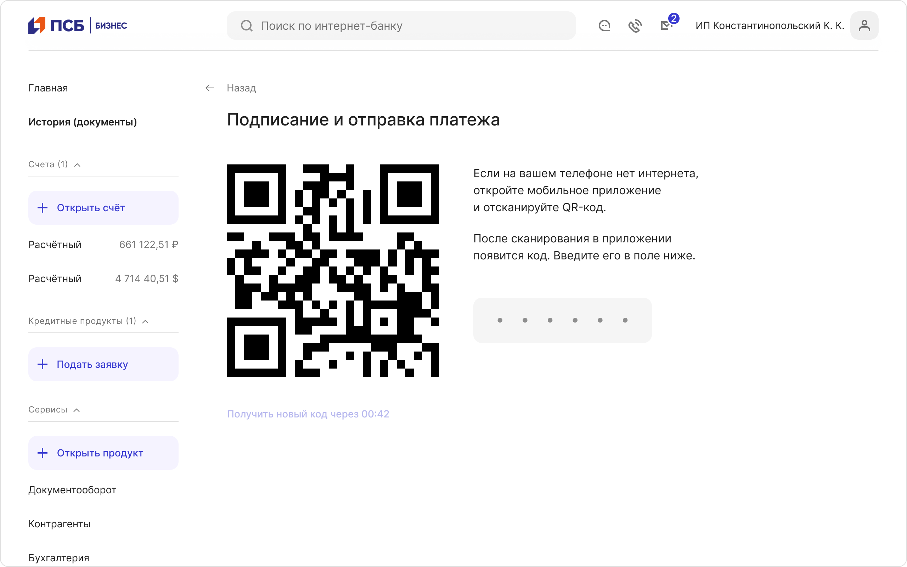
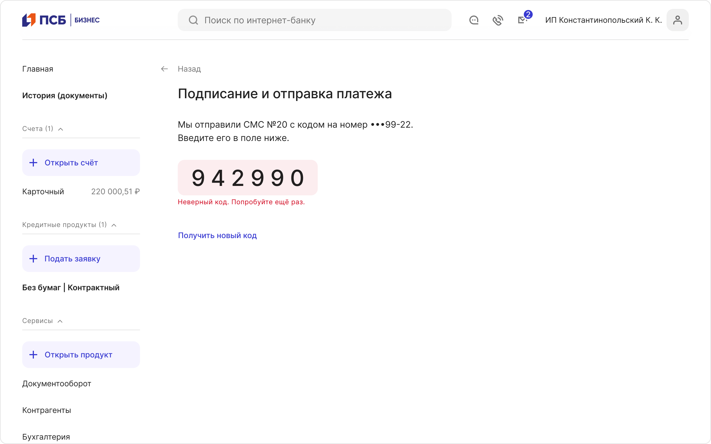
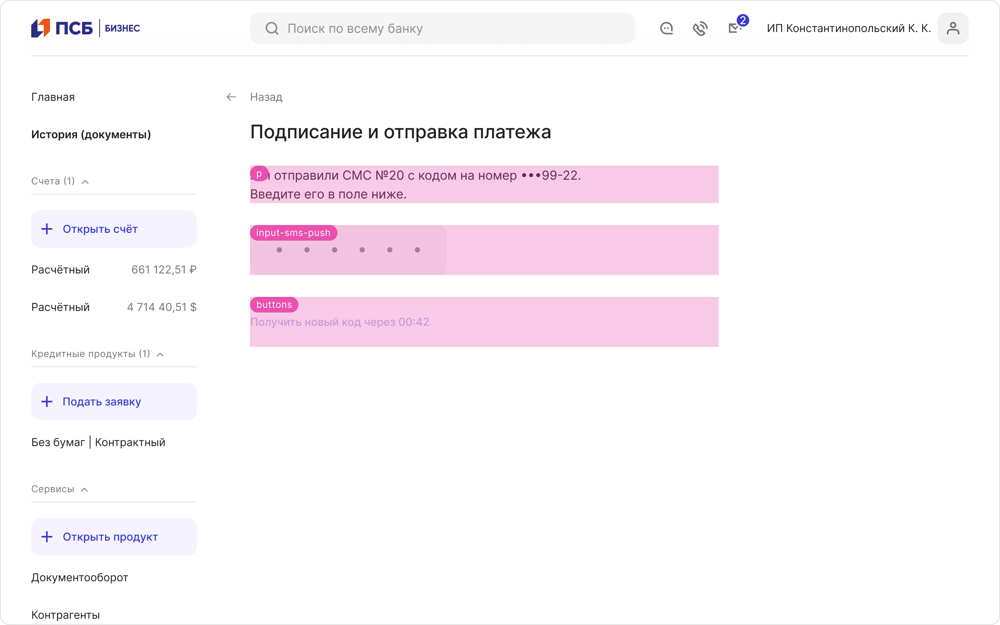
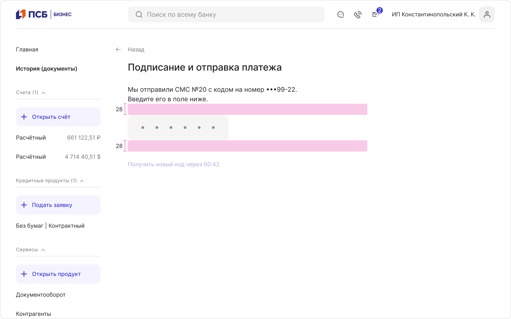

# Подписание документов

[Фигма](https://www.figma.com/design/gdcl3Qu6QMrwHdtIr33IuU/%D0%9F%D0%BE%D0%B4%D0%BF%D0%B8%D1%81%D0%B0%D0%BD%D0%B8%D0%B5-%D0%B4%D0%BE%D0%BA%D1%83%D0%BC%D0%B5%D0%BD%D1%82%D0%BE%D0%B2?node-id=5768-5755&t=BeFgTRkye7ry5qmZ-11)

## Общие правила и принципы

Обеспечивает цифровую аутентификацию и подтверждение пользователем выполнения операции или отправки документа.
Экран предназначен только для быстрого ввода одноразового кода, поэтому на нём не размещаются документы и дополнительная информация. Наиболее распространённая реализация — ввод одноразового кода, полученного по СМС.

### Когда использовать

- Для подтверждения финансовых операций
- Для подписания и отправки документов
- Для повышения безопасности пользовательских действий

### Когда требуется подтверждение?

Подтверждение подписи вторым фактором требуется только для облачных сертификатов —
их используют клиенты, авторизующиеся в интернет-банке по логину, QR-коду или номеру телефона.
При работе с файловым сертификатом или USB-ключом экрана подтверждения не будет,
поскольку приватный ключ хранится у пользователя (в файле или токене).

## Синтаксис заголовка

Заголовок должен удерживать пользователя в контексте и сразу говорить о текущем действии:

## Способы подтверждения

Существует несколько способов подтверждения операций.

### СМС

Способ подтверждения по умолчанию.

Код отправлен, новый код запросить пока нельзя:

Можно запросить новый код:

Система принимает введённый код, проверяет его и завершает подтверждение операции:

### Пуш-уведомление

Альтернативой СМС служит пуш-уведомление (опция выбирается в мобильном приложении):

При получении пуш-уведомления таймер не отображается, поскольку ожидание кода занимается всего 5 секунд.

### MyDSS

MyDSS — технология подтверждения и отправки платежей любой суммы мобильным приложением. В том числе используется для подтверждения авторизации в интернет-банке. Подключается в настройках. При желании можете переключиться на альтернативный способ подтверждения — СМС или пуш-уведомления (до 3 000 000 ₽).

MyDSS без интернета:

## Ошибка валидации кода

При проектировании ошибки отправки документов и экрана успеха ориентируйтесь [на соответствующий паттерн](../result/index.md).

## Структура и размеры

У страницы есть:

- p
- input-sms-push
- buttons

Отступы на странице статичны:

## Ссылки

[Исследование](https://plump-argument-8c8.notion.site/212228ebca854113b98a59886a194f68)
