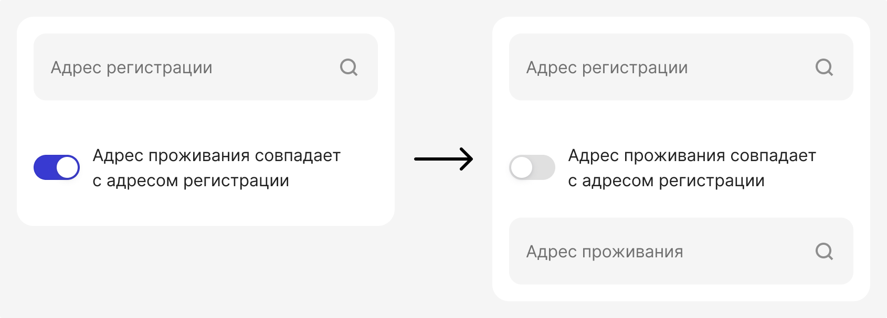
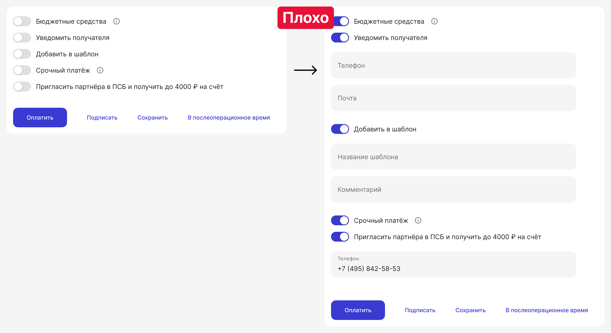
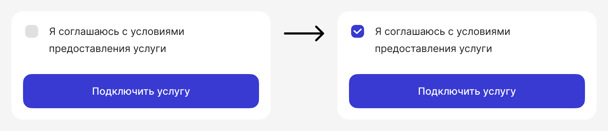

# Свитчер или одиночный чекбокс

Свитчеры и одиночные чекбоксы имеют схожее бинарное значение («включено» / «выключено», «да» / «нет»), но их использование в интерфейсе различается в пользовательском опыте и ожиданиях.

## Подпись

Подпись свитчеров и чекбоксов должна ясно обозначать, что включается в положении «включено» (или «да»). Используйте глагол — он превращает подпись в команду или понятное действие, убирая двусмысленность.

## Правило для свитчера

Переключение свитчера должно вызывать мгновенное, заметное изменение в системе или интерфейсе.

Принцип работы свитчера похож на выключатель света в комнате. Когда вы щёлкаете им, вы ожидаете, что лампочка загорится мгновенно, а не через несколько секунд. Интерфейсный свитчер должен давать такую же мгновенную визуальную реакцию, создавая ощущение прямого физического воздействия.

### Пример плохого решения

В интерфейсах можно встретить неудачные решения. Например, ряд свитчеров в платежах:

- «Бюджетные средства» и «Срочный платёж» — это нейтральные двусмысленные формулировки без глагола.  
- «Добавить в шаблон» — хорошая формулировка. Но на практике это действие чаще используется на экране успеха в виде кнопки.
- «Пригласить партнёра в ПСБ и получить до 4000 ₽ на счёт» — реферальное предложение, которое не является моментальным действием. Свитчер перегружен двумя разными вещами «пригласить партнёра» и «получить до 4000 ₽». Клиент не получит деньги сразу.

Надо избегать подобных ситуаций в интерфейсе и искать другие варианты решения.

## Правило одиночного чекбокса

В отличие от свитчера, который действует мгновенно, чекбокс требует подтверждения кнопкой. То есть чекбокс можно выбирать и снимать, но соответствующее действие активируется только после нажатия кнопки сохранения (например, «Подключить», «Отправить», «Применить»).

## Итог: как выбрать свитчер или одиночный чекбокс

|                                                                          | Свитчер | Чекбокс                                    |
| ------------------------------------------------------------------------ | ------- | -------------------------------------------|
| Действие происходит сразу после переключения?                            | Да      | Нет                                        |
| Требуется подтверждение кнопкой («Сохранить», «Применить», «Отправить»)? | Нет     | Да                                         |
| Влечет за собой изменение в системе или интерфейсе?                      | Да      | Нет, это выбор опции перед отправкой формы |

:::tip[Важно]

Правила применимы для всех платформ: web, IOS и Android

:::

## Ссылки

- [Material Design 3](https://m3.material.io/components/switch/guidelines#4f51b236-583e-4caa-9ae6-c8079325ef6b)
- [HIG.Toggles](https://developer.apple.com/design/human-interface-guidelines/toggles)
- [Руководство по использованию тогла. NN/g](https://www.nngroup.com/articles/toggle-switch-guidelines/)
- [Checkboxes vs. Switches in Forms](https://www.youtube.com/watch?v=EoEeRWHJ8xs)
- [UXtweak](https://blog.uxtweak.com/checkbox-vs-toggle-switch/)
- [DMC](https://www.dmcinfo.com/blog/22434/user-interface-design-tips-checkboxes-vs-toggle-switches/)
- [infyom](https://infyom.com/blog/user-interface-design-tips-checkbox-vs-toggle-switch/)
- [Бенчи](https://www.figma.com/design/JMCs26ymVvBrHBQ7LvfUsc/%D0%A1%D0%B2%D0%B8%D1%82%D1%87%D0%B5%D1%80%D1%8B-%D0%B8-%D1%82%D0%BE%D0%B3%D0%BB%D1%8B?node-id=4-83&t=VByaliHE8npiXdxr-1)
