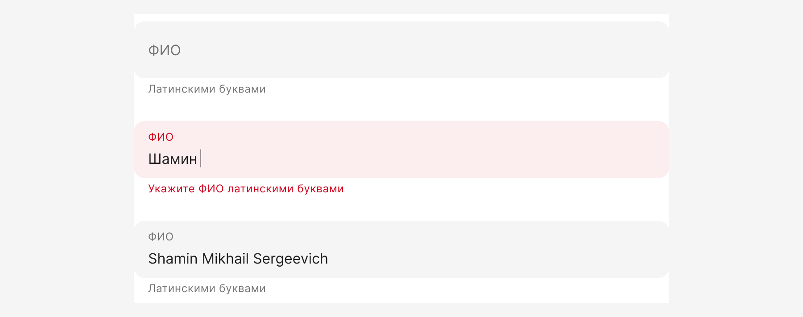
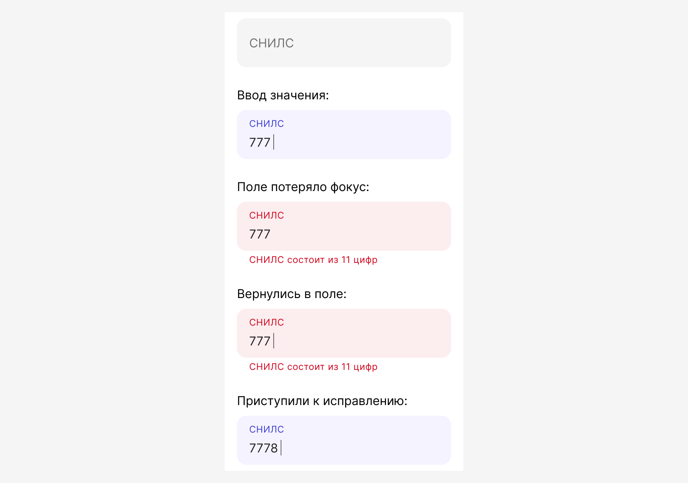

# Валидация форм

Валидация форм нужна для проверки корректности вводимых пользователем данных.

Подсветка некорректных данных в форме осуществляется путем окрашивания поля и отображения ошибки под ним.

## Принципы

Спроектировать правильную и приятную валидацию — сложная задача, поэтому мы предлагаем руководствоваться базовыми принципами.

### Ограничь неверное

Ограничьте выбор заведомо неверных значений: блокируйте эти значения, например в календаре или не показывайте в списке.

Ограничьте ввод неподходящих символов. Если в поле нужно вводить только цифры, и это очевидно пользователю, игнорируйте ввод букв вместо того, чтобы показать ошибку и наоборот. Используйте маски в полях, где у значений известен формат.

### Подсказывай неочевидное

В неочевидных и неоднозначных случаях пишите подсказки для заполнения формы. Выводите подсказку в `Placeholder` или `Hint`. Подсказка должна быть полезной, уместной и своевременной.

### Предзаполни всё

Старайтесь предзаполнять поля наиболее вероятными значениями.

### Пустое поле — не ошибка

Не валидируйте поля на пустоту по потере фокуса — не показывайте ошибку если поле не заполнено, возможно пользователь вернется и заполнит поле чуть позже.

Но если пользователь начал ввод, затем все стер и вышел из поля — то валидируем мгновенно.

### Валидируй с умом

Валидация это крайний способ коммуникации с пользователем, минимизируйте его и не ругайтесь на пользователя преждевременно, но и берегите его время, если уже знаете, что значение невалидное.

## Виды валидации

### Мгновенная валидация

Это самый быстрый способ сообщить об ошибке, используйте его очень осторожно.

Чаще всего такой тип валидации пригодится, когда пользователь вводит нетиповые данные или данные, где ошибку можно обнаружить уже на первом символе.

Система снимет красную подсветку с поля и вернет хинт в состояние по умолчанию, как только значение в поле станет валидным.

Давайте посмотрим на примерах:

#### Пример №1

Рассмотрим заполнение поля ФИО на английском языке.

В таких случаях мы не рекомендуем накладывать маску и ограничивать ввод русских букв.

Это связано с тем, что пользователи обычно вводят ФИО на русском языке. Из-за этого могут возникать ошибки при наборе — человек может ошибиться с раскладкой или затупить по-человечески, и долго не понимать, почему символы не вводятся.

Разрешите ввод русских букв, но валидируйте мгновенно:

#### Пример №2

Номер счета получателя должен начинаться с 4 или 5. При вводе иной цифры, мы знаем, что дальше можно не продолжать и запускаем валидацию:

#### Пример №3

Если пользователь вставляет копипасту в многострочное поле и значение превышает допустимое количество символов, мы рекомендуем выполнять мгновенную валидацию не обрезая текст пользователя:

#### Пример №4

На счете 0 ₽, но пользователь продолжает ввод цифр:

Это не весь список примеров, могут быть и другие. Используйте мгновенную валидацию с умом.

### Валидация по потере фокуса

Валидация сработает сразу после потери фокуса, если значение в поле заполнено.

При обнаружении невалидного значения система подсветит поле и отобразил ошибку.

Фокус в это поле автоматически не возвращается.

Система снимет красную подсветку с поля и вернет хинт в состояние по умолчанию, как только пользователь начнет исправлять ошибочное значение.

#### Пример №1. СНИЛС

Если повесить на поле мгновенную валидацию, то как только пользователь приступит к заполнению, система отреагирует мгновенно и подсветит поле.

Это произойдет, потому что система считает сразу же посчитает такое значение некорректным, ведь оно не соответствует маске.

Поэтому тут подойдет валидация по потере фокуса. Мы считаем, что пользователь разбирается в типовых значениях и просто не закончил ввод:

#### Пример №2. Электронная почта

### Асинхронная валидация

:::warning[Этот раздел в работе]
Эта история требует отдельного подхода. Сейчас нет готового решения по индикации асинхронного запроса. Например, у нас есть инпут, данные из которого асинхронно отправляются на бэк и проходят валидацию. Если запрос, отработал мгновенно, то это одна история, но что если он задержался? Нужна индикация. И надо описать механику,
в теории триггером на запуск может быть ввод символа или потеря фокуса.
:::

## Как включить нужную валидацию

По умолчанию для всех полей установлена валидация по потере фокуса. Если в вашем кейсе нужно изменить вид валидации, просто напишите возле нужного поля: Вид валидации = `Мгновенная`.

## Отправка формы

Кнопка для отправки формы всегда доступна. Кроме исключения на форме авторизации.

По нажатию, система запускает процесс валидации обязательных полей. Все поля с ошибками и незаполненные обязательные поля на форме подсвечиваются, страница прокручивается к первому полю с ошибкой, но не фокусирует его.

:::warning[Раздел требует доработки]
Иногда может случиться так, что при отправке формы, бэку что-то не понравится и он вернет ошибку, но не для конкретного поля, а в общем. Надо спроектировать способ отображения таких ошибок.
:::

## Индикация необходимости заполнения полей

:::warning[Это раздел в работе]
Как будем помечать необязательные поля?

А звездочку пишем вместе или через пробел?

Может ли существовать одновременно маркировка обязательных и необязательных полей на одном экране?
:::

Минимизируйте количество необязательных полей в форме. Если информация не является критически важной, лучше не запрашивать ее вообще.

- NNg рекомендует явно обозначать обязательные поля, чтобы пользователи могли быстро и легко понять, какую информацию необходимо предоставить. Несмотря на желание дизайнеров избежать избыточного визуального шума, обязательно следует помечать все обязательные поля.
- Отсутствие явных меток заставляет пользователей сканировать форму и принимать решения, что замедляет процесс и увеличивает вероятность ошибок.
- Явное обозначение обязательных полей снижает вероятность ошибок при заполнении и, как следствие, уменьшает количество ошибок при отправке.
- Предпочтительно использовать звездочку из-за её компактности и узнаваемости. При этом лучше располагать звездочку в начале названия поля для удобства сканирования.
- Необязательные поля можно помечать, но это не является обязательным.
- Для форм регистрации (более двух полей) обязательно помечать все обязательные поля.
- Хоть это и не обязательно, но маркировка необязательных полей снижает когнитивную нагрузку пользователя. Если такого обозначения нет, приходится ориентироваться на другие поля и делать вывод, что это поле необязательно, поскольку другие отмечены как обязательные.

## Валидация зависимых полей

Зависимые поля — это поля, значение которых зависит друг от друга или повлиять на сценарий можно исправлением в одном из полей.

Валидацию зависимых полей можно вызвать на фронте и на бэке. Но иногда фронт не может выполнить такую валидацию из-за недостатка данных.

Например, пользователь заполняет форму, но расчет комиссии произойдет только на следующем шаге, соответственно, мы сможем провалидировать поля только после отправки данные на бэк.

Используйте валидацию зависимых полей на свое усмотрение, но руководствуйтесь принципом о том, что необходимо как можно раньше сообщить пользователю о некорректно заполненной форме.

При изменении значения в одном из зависимых полей, снимать валидацию с обоих.

## Синтаксис подсказок

### Пустые поля

- При валидации пустых текстовых полей подсказка начинается с глагола `Укажите` + `Label поля`. При вводе СМС, пуш-кода или пароля мы пишем `Введите` + `Label поля`.
- Ошибки при валидации пустых автокомплитов, селектов и дейтпикеров с пропсом на выбор из календаря начинаются со слова `Выберите` + `Label поля`.

### Заполненные поля

#### Типовая ситуация

Под типовые ситуации подходят поля, у которых уже есть четкое предназначение, например: [СНИЛС](https://www.figma.com/design/sklOa7L8pvWQ1QzD8HZIYw/03-%E2%9C%85-Input?node-id=3447-64386&t=E2rxEdMz2x7hy2ii-1),
[ИНН](https://www.figma.com/design/sklOa7L8pvWQ1QzD8HZIYw/03-%E2%9C%85-Input?node-id=535-56486&t=GwPU4kKRWvhp1z2T-1),
[телефон](https://www.figma.com/design/sklOa7L8pvWQ1QzD8HZIYw/03-%E2%9C%85-Input?node-id=190-45463&t=GwPU4kKRWvhp1z2T-1),
[номер счета](https://www.figma.com/design/sklOa7L8pvWQ1QzD8HZIYw/03-%E2%9C%85-Input?node-id=535-56486&t=GwPU4kKRWvhp1z2T-1),
[дата](https://www.figma.com/design/sklOa7L8pvWQ1QzD8HZIYw/03-%E2%9C%85-Input?node-id=132-5658&t=GwPU4kKRWvhp1z2T-1),
[сумма](https://www.figma.com/design/sklOa7L8pvWQ1QzD8HZIYw/03-%E2%9C%85-Input?node-id=193-46934&t=GwPU4kKRWvhp1z2T-1), а также
[пароль](https://www.figma.com/design/sklOa7L8pvWQ1QzD8HZIYw/03-%E2%9C%85-Input?node-id=126-3912&t=GwPU4kKRWvhp1z2T-1),
[СМС-код](https://www.figma.com/design/sklOa7L8pvWQ1QzD8HZIYw/03-%E2%9C%85-Input?node-id=3447-64664&t=GwPU4kKRWvhp1z2T-1) и
[СМС-push](https://www.figma.com/design/sklOa7L8pvWQ1QzD8HZIYw/03-%E2%9C%85-Input?node-id=3447-64691&t=GwPU4kKRWvhp1z2T-1). Для таких полей будет разработан набор типовых ошибок, которые следует использовать без изменений.

:::warning[Типовые поля в работе]
Совсем скоро в ДС будут стейты ошибок
:::

#### Нетиповая ситуация

Это все остальные ситуации, которые не подошли под предыдущие условия. В таких случаях дизайнер должен руководствоваться требования [редполитики](/rdpk/).

Если попробовать обобщить, то принципы написания подсказок будут следующими:

- Подсказка должна быть полезной, помогать исправить проблему.
- Нейтральной, без извинений или обвинений;
- Лаконичной;
- Без КАПСА (только первая буква будет заглавной);

Примеры подсказок:

- *Нельзя создавать доверенность на самого себя*
- *Выберите другой банк. Получатель платежа не является резидентом РФ.*
- *Возраст не менее 18 лет*
- *Такой шаблон уже существует. Придумайте другое название.*

При некорректном значении текстовых полей:

- *[Label поля] не может содержать символ «[символ, который ввел пользователь]»*
- *Укажите [Label поля] на кириллице*

## Примечания

[Большое исследование от исследователей по сложным моментам валидации](https://plump-argument-8c8.notion.site/Pattern-197e41d2e83180599c21cebe8e14407d)

[Исследования. Синтаксис в подсказках к полям ввода](https://plump-argument-8c8.notion.site/1f4e41d2e83180b2b9c4db26a20cae4d)
