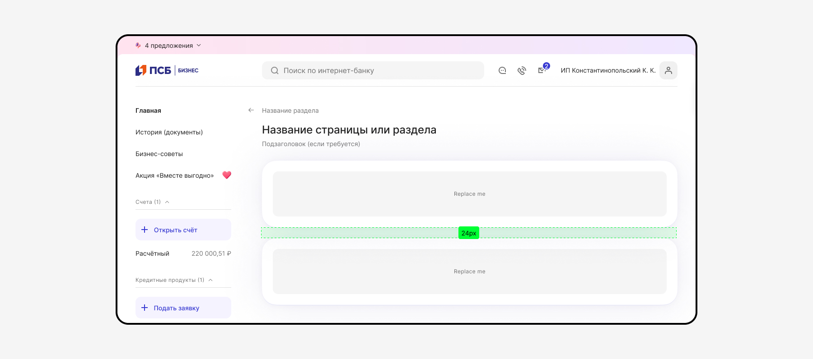
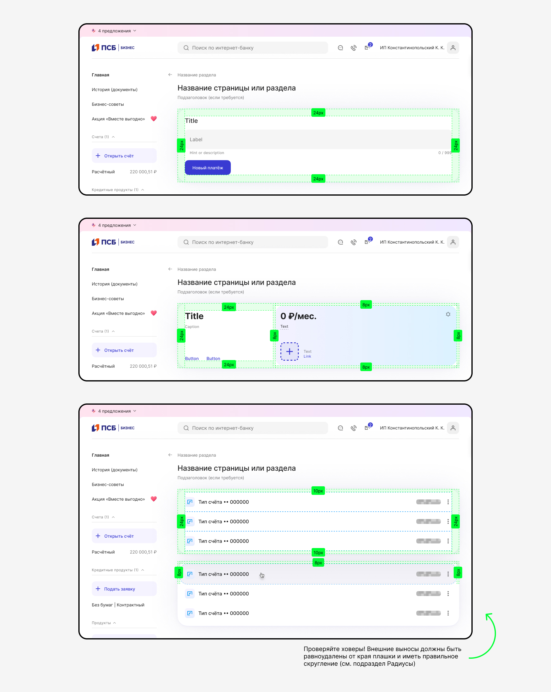
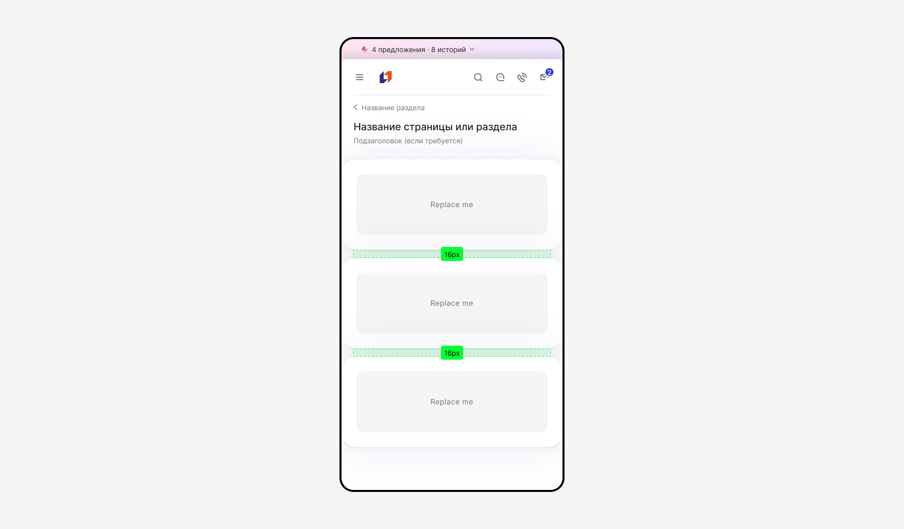
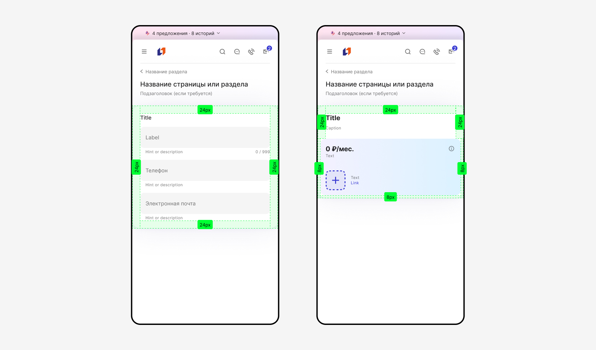
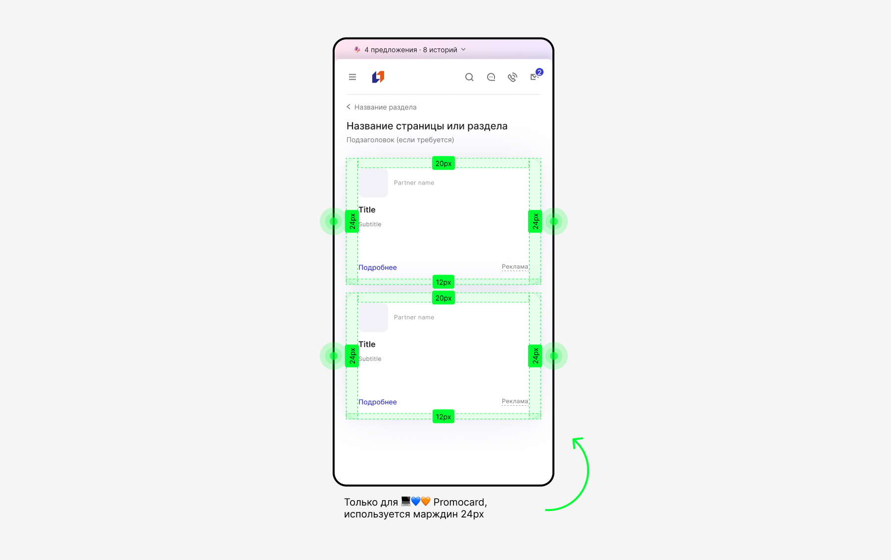
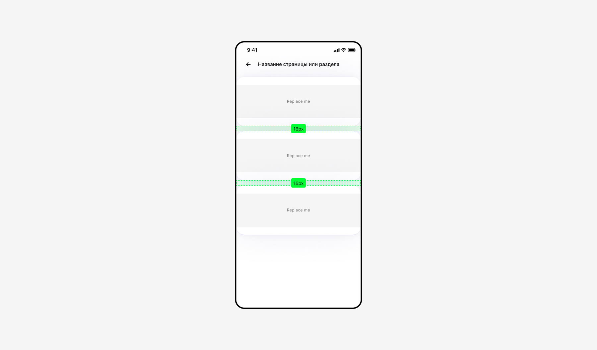
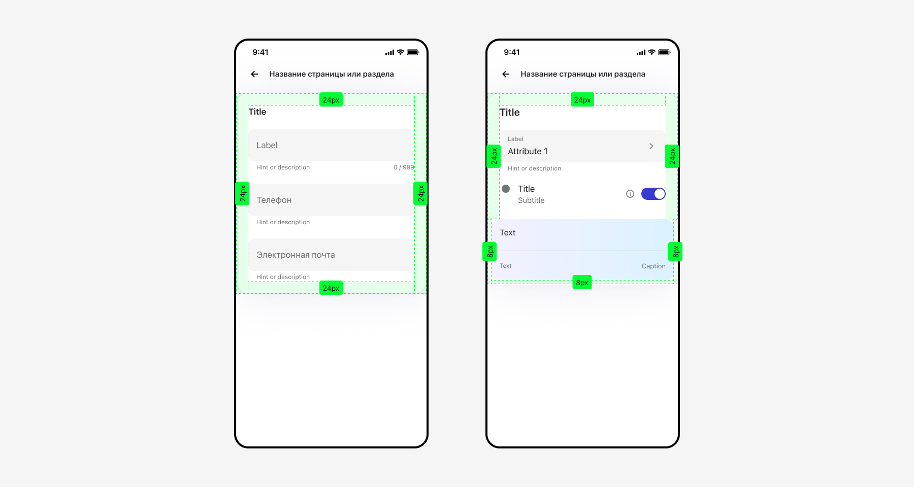
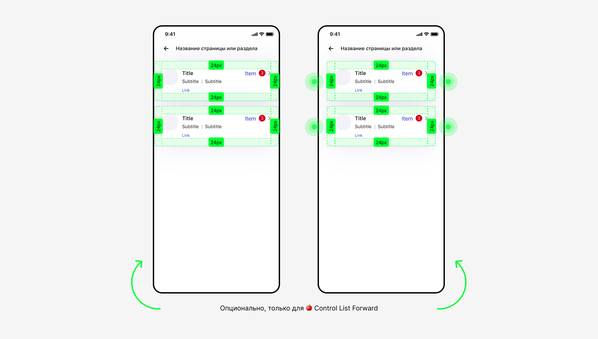

# Анатомия плашек

[Плашки нужны](../index.md) для группировки и структурирования, визуальной передышки/воздуха, создания иерархии и акцентов. При разработке композиций с вложенными элементами критически важно проверять согласованность [внешних и внутренних радиусов](../rounding/).

## Desktop・1280-768рх, outer radius 32px

- Используем компонент [Container-box](https://www.figma.com/design/gkvm2ZhN87pJWZcD7OLkR0/07-%E2%9C%85-Tools--Carousels--Cards?node-id=33272-94884&t=VXBB2mcQoUQznVsA-1) prop=shadow box.
- Вертикальные отступы между компонентами 24px.

Внутренние вертикальные отступы подбираются в зависимости от анатомии компонента, выноса ховера и т.д. (по границе верхнего атома в компоненте), но не менее 8рх.

Внутренние горизонтальные отступы:

- слева и справа 24px (контролы, инпуты, тексты и пр.),
- слева и справа не менее 8px (встроенные внутренние контейнеры, ховеры).

## Adaptive・767-360рх, outer radius 24px

- Используем компонент [Container-box](https://www.figma.com/design/gkvm2ZhN87pJWZcD7OLkR0/07-%E2%9C%85-Tools--Carousels--Cards?node-id=33272-94884&t=VXBB2mcQoUQznVsA-1) prop=shadow box.
- Вертикальные отступы между компонентами 16px.

Внутренние вертикальные отступы подбираются в зависимости от анатомии компонента (по границе верхнего атома в компоненте), но не менее 8рх.

Внутренние горизонтальные отступы:

- слева и справа 24px (контролы, инпуты, тексты и пр.),
- слева и справа не менее 8px (встроенные внутренние контейнеры).

При использовании компонента [Promocard](https://www.figma.com/design/gkvm2ZhN87pJWZcD7OLkR0/07-%E2%9C%85-Tools--Carousels--Cards?node-id=49889-152348&t=FnxYxVzrD1iBLjL9-1), который стилистически повторяет плашку, слева и справа до краев экрана используются марджины 24рх. В данном случае карточка выполняет функцию вложенного элемента на странице, но равного по массе — условного оффера и предложения, а не выполняет функцию островка или подложки для групп элементов, как [Container-box shadow](https://www.figma.com/design/gID5xdjlCmAQvvRSfTZKbz/%D0%9F%D1%80%D0%BE%D0%BC%D0%BE%D0%BA%D0%BE%D0%B4%D1%8B?node-id=3128-39004&t=5eKXHBevOXI8BONM-1).

## Mobile, outer radius 24px

- Используем компонент [Container-box-shadow](https://www.figma.com/design/gkvm2ZhN87pJWZcD7OLkR0/07-%E2%9C%85-Tools--Carousels--Cards?node-id=40036-236878&t=xi3yvcBHK8D9ADT7-1).
- Вертикальные отступы между компонентами 16px.

Внутренние вертикальные отступы от 0px до 32px.

Внутренние горизонтальные отступы от 0px до 24рх.

При использовании компонента [Control List Forward](https://www.figma.com/design/gID5xdjlCmAQvvRSfTZKbz/%D0%9F%D1%80%D0%BE%D0%BC%D0%BE%D0%BA%D0%BE%D0%B4%D1%8B?node-id=5782-8698&t=5eKXHBevOXI8BONM-1) с подложкой, который стилистически повторяет плашку, допускается использование на всю ширину экрана или с марджинами 24 px.

Для разных случаев:

1. Когда карточка выполняет функцию вложенного элемента на странице, но равного по массе — условного оффера и предложения — используем марджин 24рх.
2. Когда карточка выполняет функцию основного контента, аналогичную [Container-box-shadow](https://www.figma.com/design/gkvm2ZhN87pJWZcD7OLkR0/07-%E2%9C%85-Tools--Carousels--Cards?node-id=40036-236878&t=N8uxoW8U5xSVZEHh-1) — используем во всю ширину.

