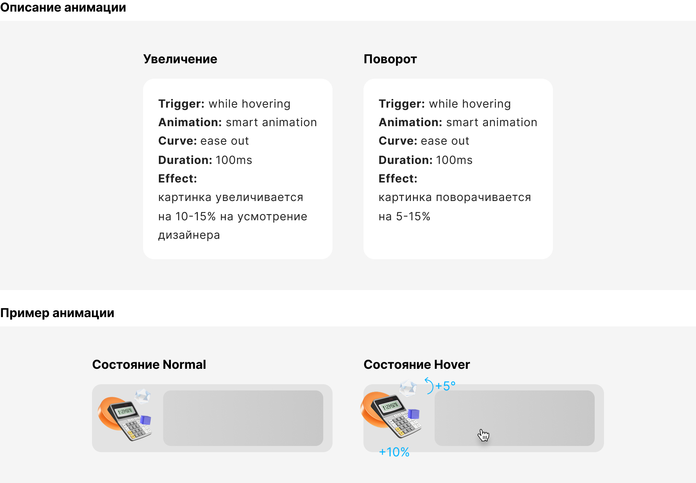
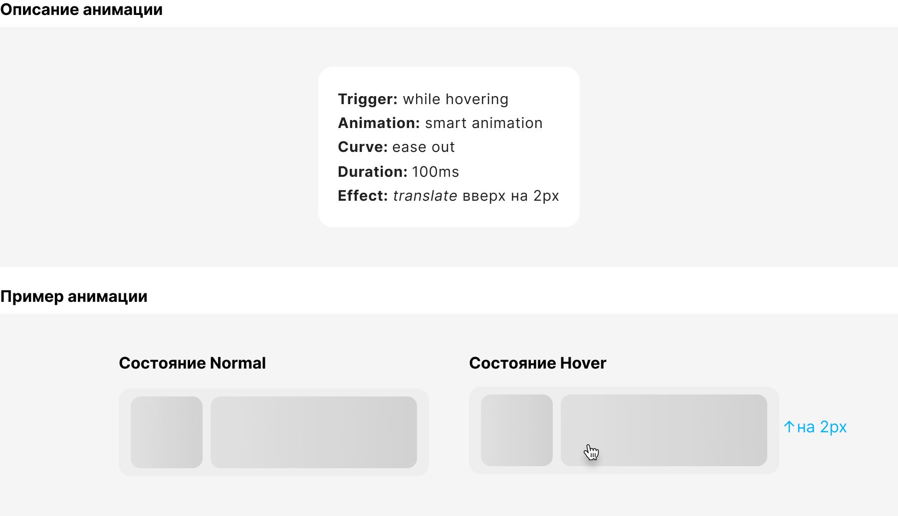
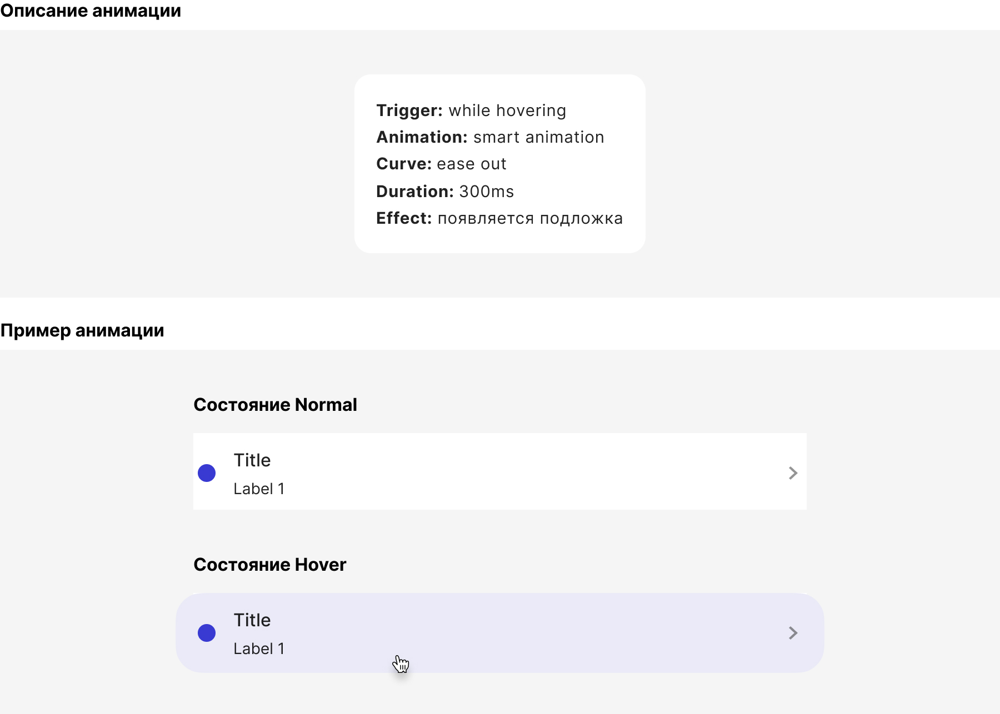

# Анимация

При создании анимации важно придерживаться единого паттерна анимации для целостности интерфейса, при этом допустимо комбинировать разные паттерны между собой.

## Эффект увеличения и поворота

Лёгкая интерактивная анимация при наведении, которая добавляет ощущение «живости» элементу.

### Когда и в каких элементах использовать

Используется для кликабельных карточек, баннеров и визуальных элементов, где важно подчеркнуть интерактивность.

### Что важно

Анимация должна быть ненавязчивой и не ломать композицию. Не использовать для мелких элементов или плотных списков.

## Эффект парения

Элемент визуально «приподнимается» над поверхностью, создавая ощущение глубины.

### Когда и в каких элементах использовать

Используется для карточек, списков с кликабельными элементами, интерактивных блоков, где важно подчеркнуть наведение или фокус.

### Что важно

Не усиливать эффект слишком сильно — это микро-движение.

## Эффект заливки

При наведении появляется подложка или изменяется фон элемента, усиливая его интерактивность.

### Когда и в каких элементах использовать

Используется для карточек, списков, строк, навигационных элементов, иконки.

### Что важно

Фокус на читаемости: текст не должен теряться при смене фона.

## Примеры

В прототипе реализовано несколько примеров анимаций. Для просмотра переключайте сценарии в левой боковой панели.

[Прототип в Figma](https://www.figma.com/proto/0tqu3SeCBZuxmlNsvznEMl/%D0%90%D0%BD%D0%B8%D0%BC%D0%B0%D1%86%D0%B8%D1%8F?page-id=&node-id=1910-28711&p=f&viewport=367%2C-1203%2C0.03&t=H2du4ii6oCOoQk5N-1&scaling=min-zoom&content-scaling=fixed&starting-point-node-id=1910%3A28711&show-proto-sidebar=1)