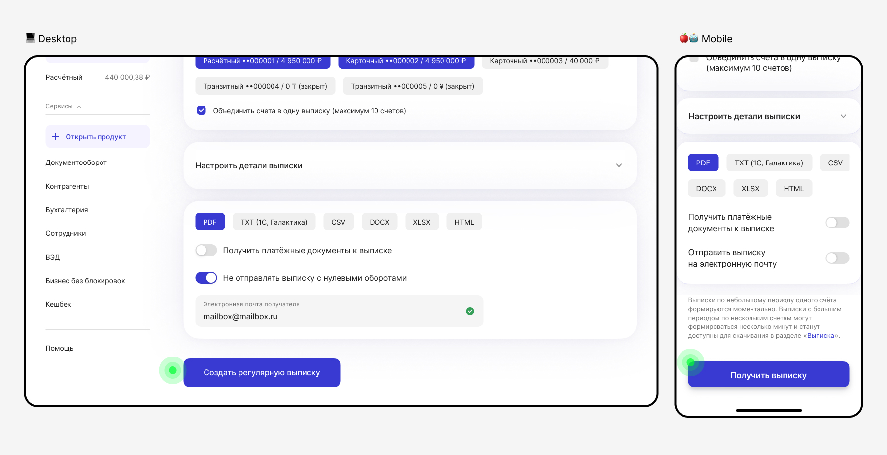
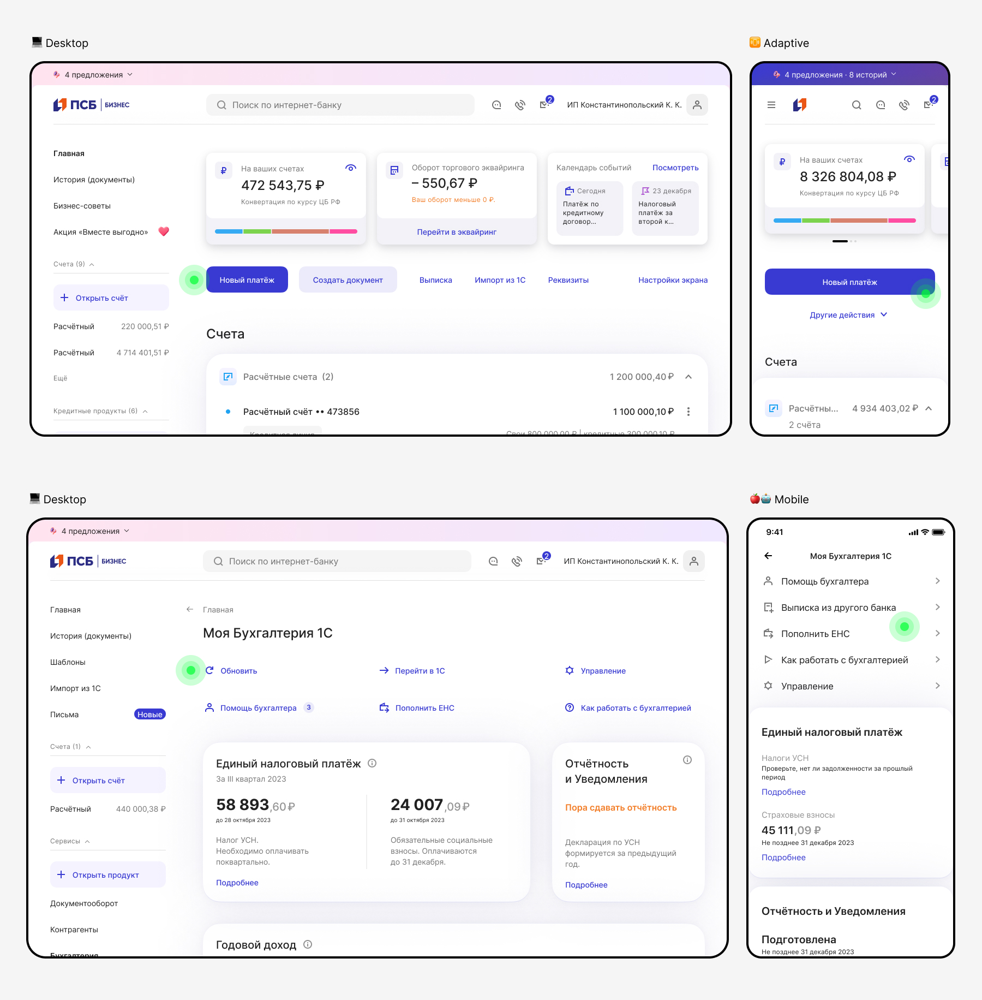
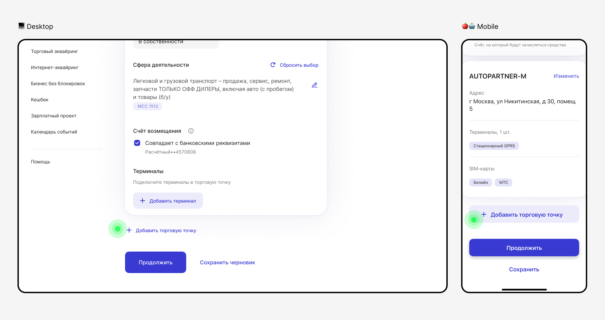
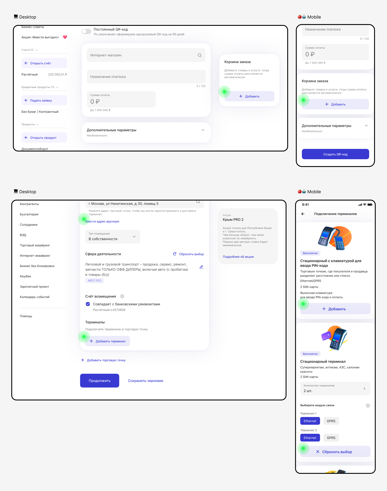
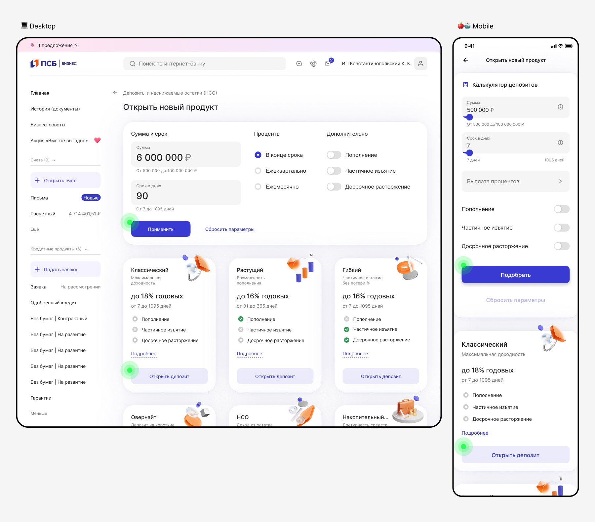

# Кнопки

[Исходники](https://www.figma.com/design/Zs4hLDHP5arbNkmDWbGpxe/%F0%9F%96%A4-%D0%92%D0%B0%D1%83-%D0%B1%D0%B0%D0%BD%D0%BA-%7C-%D0%9E%D1%81%D0%BD%D0%BE%D0%B2%D0%BD%D1%8B%D0%B5-%D0%BF%D1%80%D0%B8%D0%BD%D1%86%D0%B8%D0%BF%D1%8B?node-id=16923-64537)

## Снаружи плашки

Выполняют роль глобальных действий на странице или влияют на весь сценарий. Если мы выносим главное действие (например, «Подписать и отправить») за пределы блоков на плашках, мы показываем, что эта кнопка завершит сценарий, платёж отправится и деньги спишутся со счёта. Для Desktop, Adaptive и Mobile логика единая. Примеры:

Относятся ко всей форме, состоящей из групп элементов.

Относятся ко всей странице:

Добавляют новую группу элементов внутри страницы:

## Внутри плашки

Выполняют действие, принадлежащее к группе сущностей на плашке. Если кнопка находится внутри блока, пользователь понимает: «Это часть истории про этот блок». Для Desktop, Adaptive и Mobile логика единая. Примеры:

- Меняют контент внутри группы на плашке.
- Добавляют/удаляют элементы внутри группы на плашке.

Подтверждают или валидируют действие внутри плашки.

