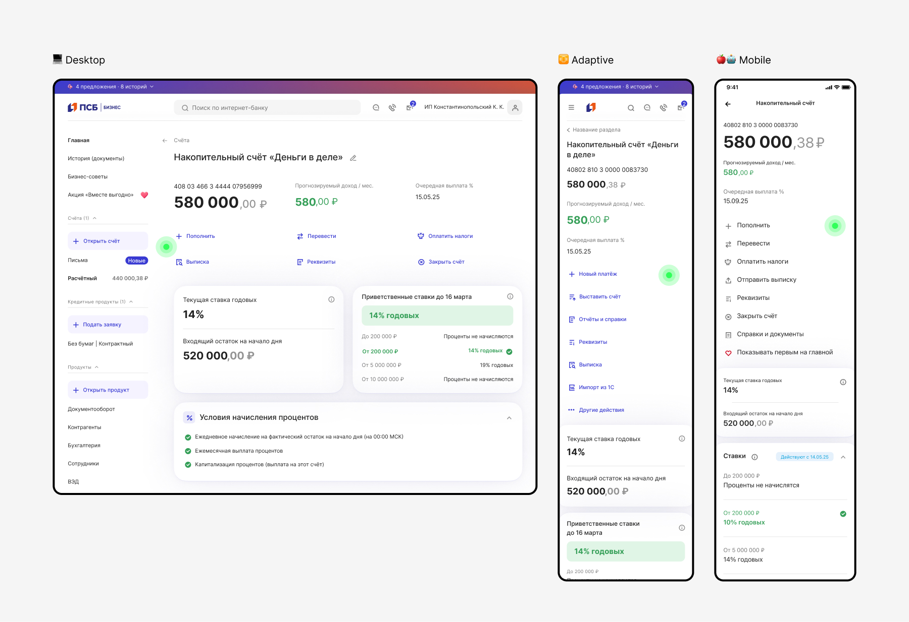
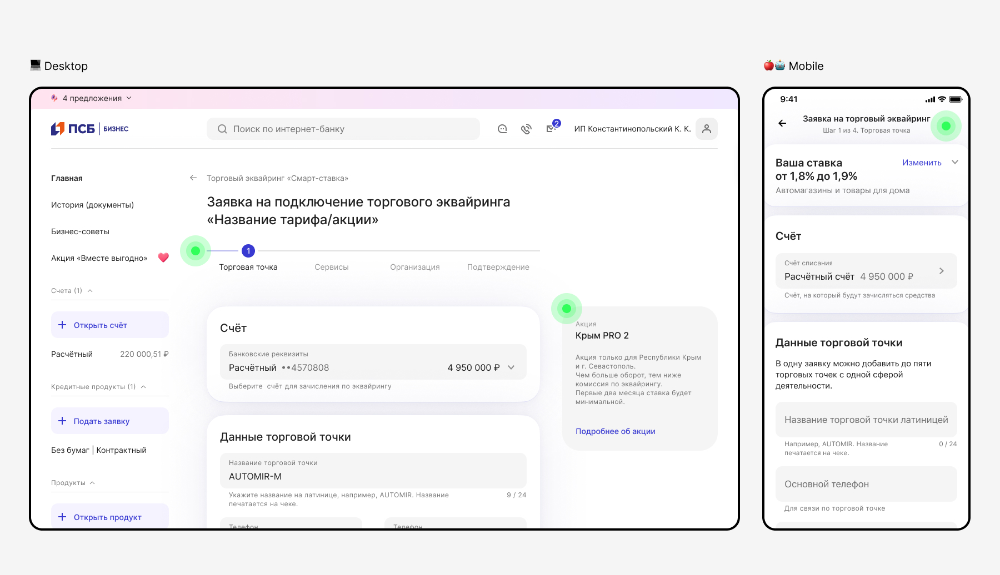
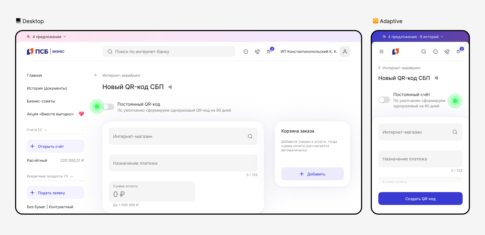
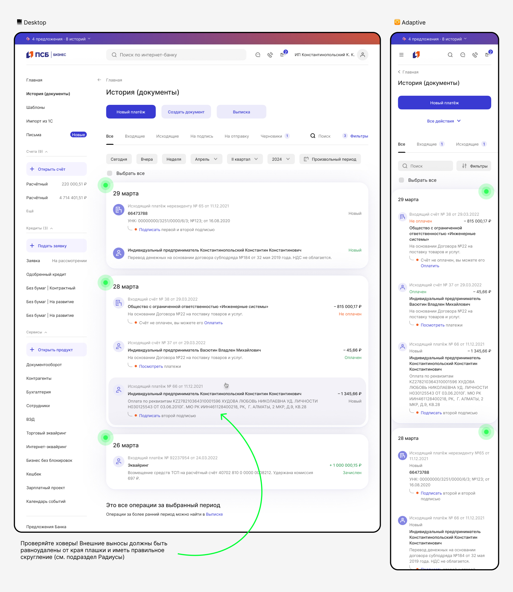
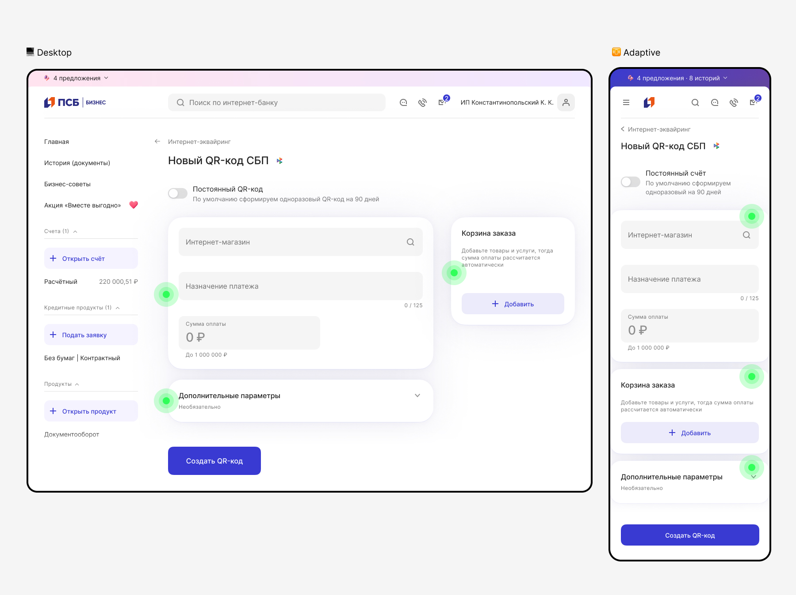

# Контент

[Исходники](https://www.figma.com/design/Zs4hLDHP5arbNkmDWbGpxe/%F0%9F%96%A4-%D0%92%D0%B0%D1%83-%D0%B1%D0%B0%D0%BD%D0%BA-%7C-%D0%9E%D1%81%D0%BD%D0%BE%D0%B2%D0%BD%D1%8B%D0%B5-%D0%BF%D1%80%D0%B8%D0%BD%D1%86%D0%B8%D0%BF%D1%8B?node-id=16923-64526&t=IB2aPTBQekSDh7pp-1)

## Снаружи плашки

Сущности без плашек выполняют общие функции всей страницы или обладают второстепенной информацией. Например:

Экшн-бары (для Desktop, Adaptive и Mobile логика единая).

Навигационные элементы (для Desktop и Adaptive логика единая, для Mobile навигация или прогресс обычно расположены в Navbar).

Второстепенные информационные блоки (для Desktop, Adaptive и Mobile логика единая).

Элементы, которые меняют контент на плашках ниже (для Desktop, Adaptive и Mobile логика единая).

## Внутри плашки

Сущности на плашках — это группировка элементов и главные акценты на странице. Их может быть несколько — это значит, что они равнозначно-важные. Для Desktop, Adaptive и Mobile логика единая. Например:

Фокусная информация и контент, с которым взаимодействуем.

Формы и смысловые группы элементов.

