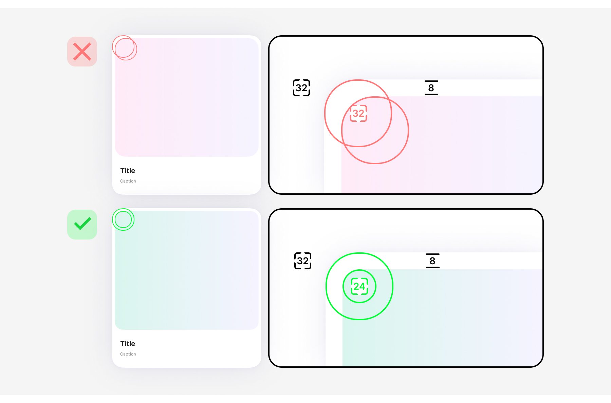
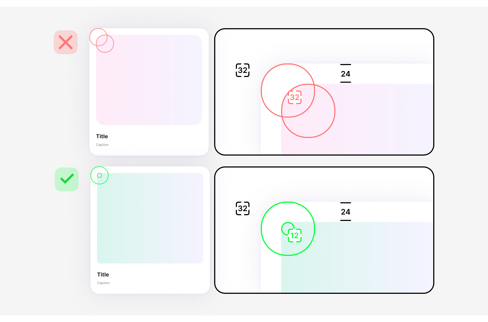
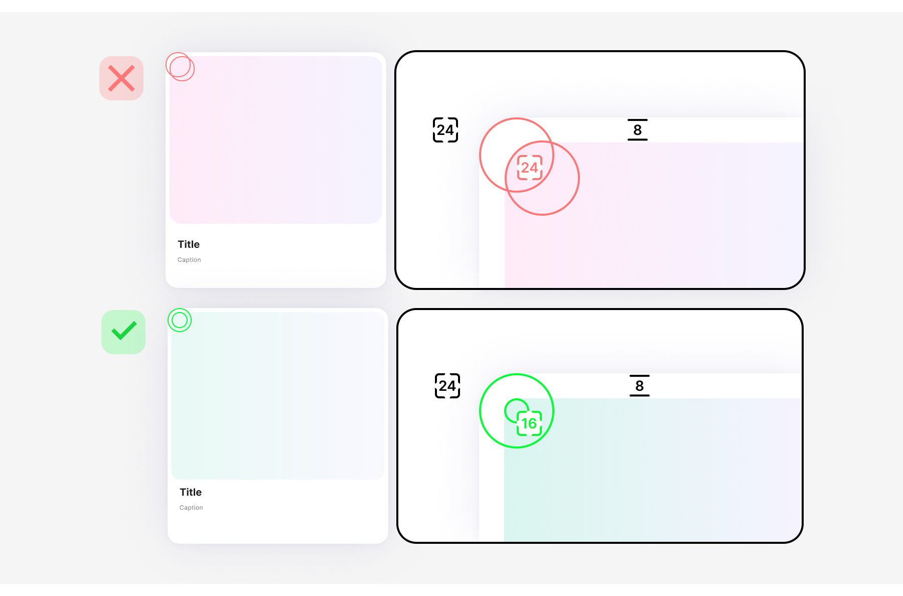
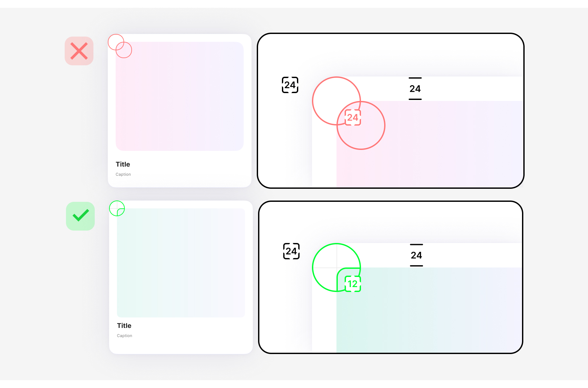

# Радиусы

При разработке композиций с вложенными элементами критически важно проверять согласованность внешних и внутренних радиусов. На скругления напрямую влияет иерархия элемента на странице.

Элементы первого уровня = **Outer radius**: это основные разделы или крупные карточки. Они задают тон, к ним применяются самые большие радиусы скругления, чтобы визуально «смягчить» блок и отделить его от фона.

Элементы второго уровня = **Inner radius**: компоненты, лежащие поверх первого уровня (например, инпуты, листы). Их радиусы должны быть меньше, чтобы создавать эффект «встроенности». Ховер, если есть, не должен вылезать за границы плашки первого уровня, его радиусы должны поддерживать правильную геометрию.

## Outer radius 32рх

### Inner radius 24рх, Padding 8рх

### Inner radius 12рх, Padding 24рх

## Outer radius 24рх

### Inner radius 16рх, Padding 8рх

### Inner radius 12рх, Padding 24рх

