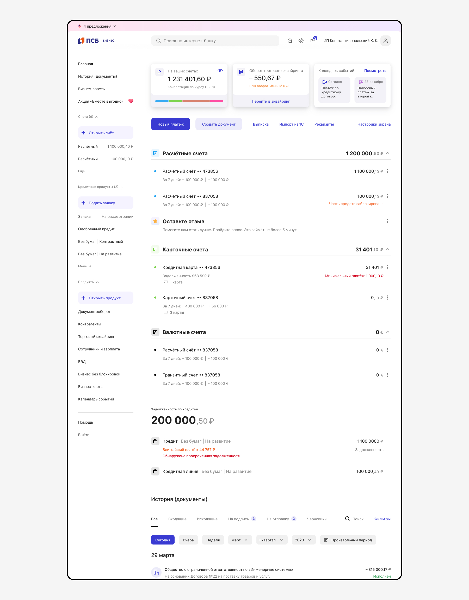
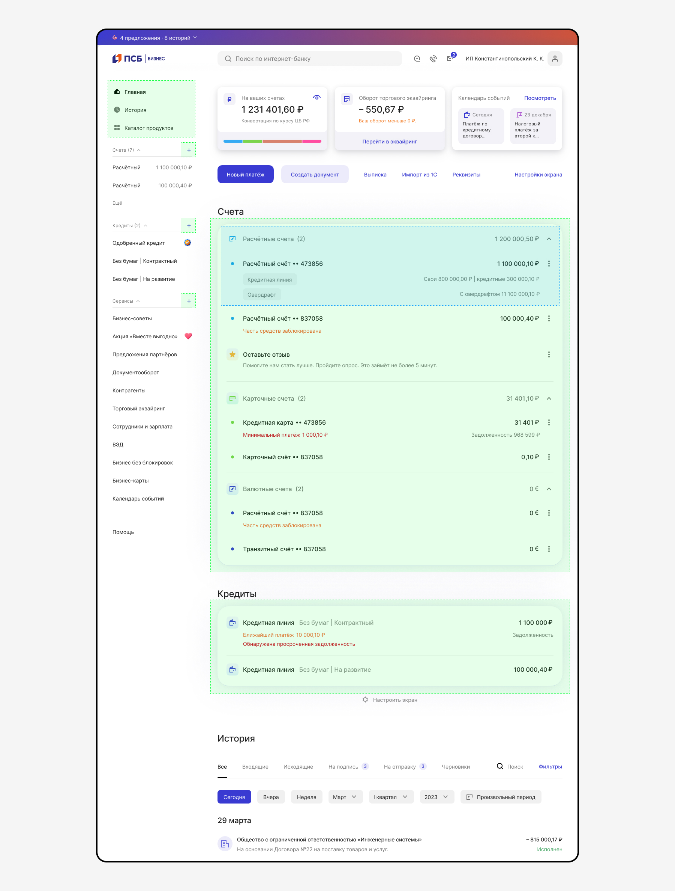
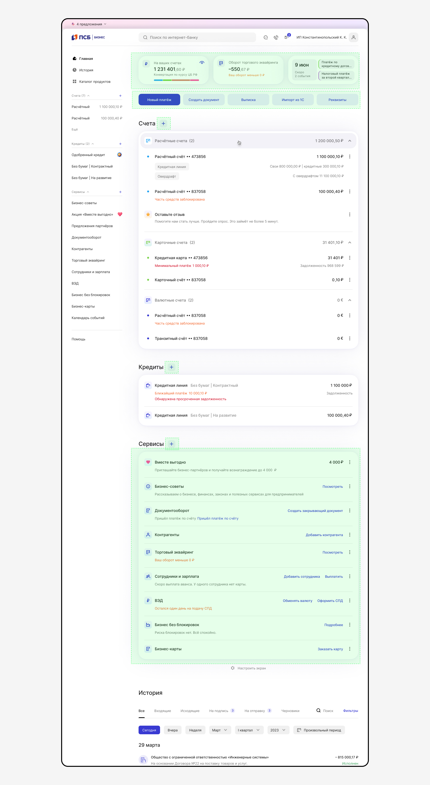
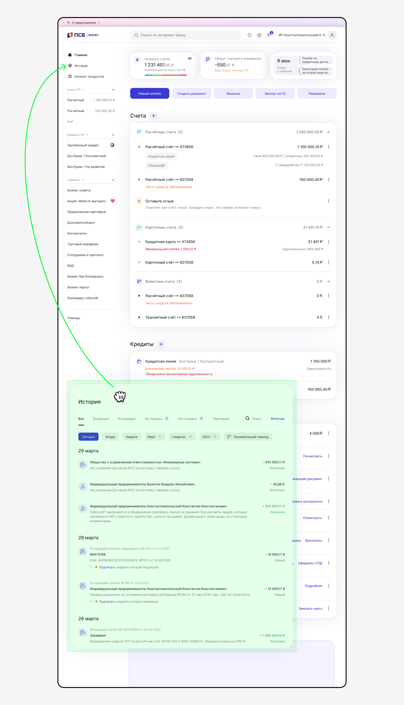
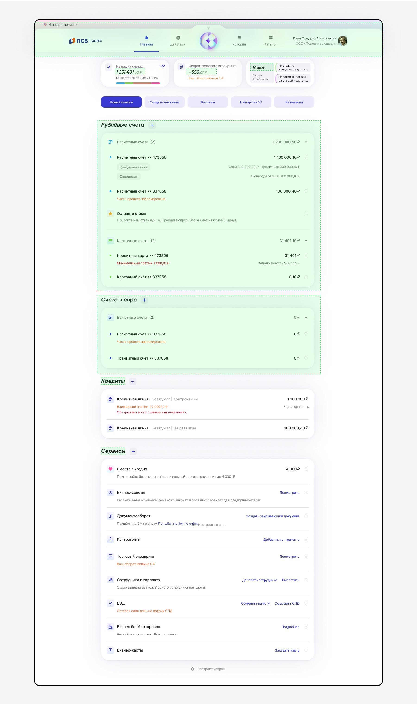

# Этапы перехода

[Исходники](https://www.figma.com/design/Zs4hLDHP5arbNkmDWbGpxe/%F0%9F%96%A4-%D0%92%D0%B0%D1%83-%D0%B1%D0%B0%D0%BD%D0%BA-%7C-%D0%9E%D1%81%D0%BD%D0%BE%D0%B2%D0%BD%D1%8B%D0%B5-%D0%BF%D1%80%D0%B8%D0%BD%D1%86%D0%B8%D0%BF%D1%8B?node-id=16923-64558)

## As is

- Всё без плашек.
- Перегруженное боковое меню.

## 1 этап — MVP

- Контент на плашках (см. подраздел [Анатомия плашек](../anatomy/index.md)). Используем компонент [Container-box](https://www.figma.com/design/gkvm2ZhN87pJWZcD7OLkR0/07-%E2%9C%85-Tools--Carousels--Cards?node-id=33272-94884&t=VXBB2mcQoUQznVsA-1) type=shadow box
- Новый компонент счёта [Control List Account](https://www.figma.com/design/G4Y5zzmntFmcu9DQ0XbyGa/06-%E2%9C%85-Table-Controls?node-id=21018-183039&t=NGBGClcDOLEh910R-1)
- Оптимизация бокового меню — выделяем основные навигационные разделы, меняем кнопки открытия продуктов на «+». Используем компонент [Menu SideBar](https://www.figma.com/design/8H4Pg6gcbbTnRhUMhPiBnw/%E2%9C%85-%D0%92%D0%B0%D1%83-%D0%B1%D0%B0%D0%BD%D0%BA---%D0%92-%D1%81%D0%BF%D1%80%D0%B8%D0%BD%D1%82?node-id=189-83216&t=wr75upUaKsuQbyDp-1)

## 2 этап — MVP

- Редизайн виджетов.
- Редизайн быстрых действий.
- Вынос сервисов в контентную область с изменением логики (показываем только подключенные).
- Добавляется «+» к заголовкам разделов в контентной области.

## 3 этап — MVP

Перенос Истории в боковое меню.

## 4 этап — Целевое

- Навигация переезжает из бокового меню в шапку.
- Чат, контакты и письма схлопываются в Катюшу.
- Контент встаёт по центру.
- Делим счета на рублевые и валютные.
- Добавляем наклонный шрифт.

