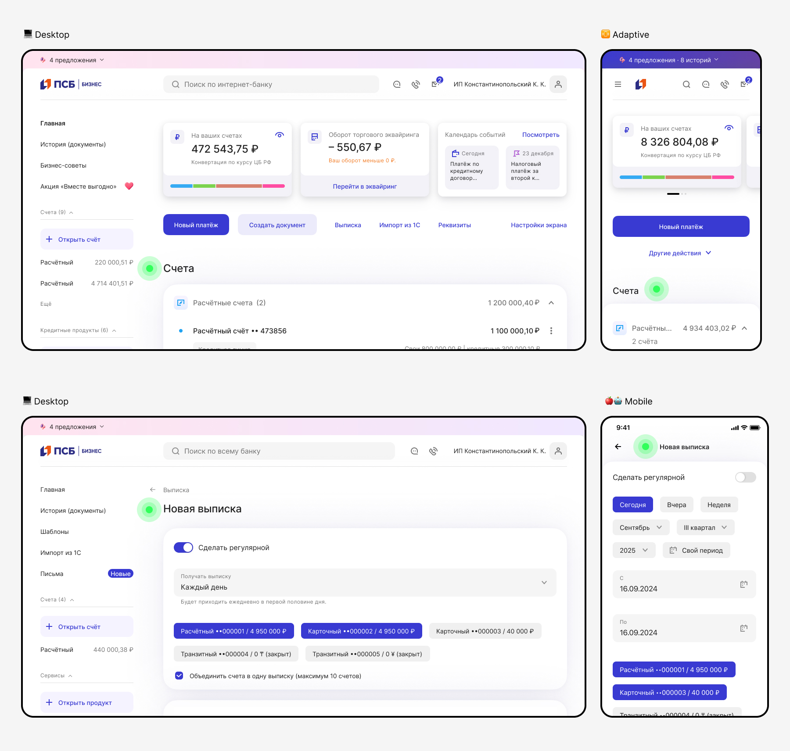
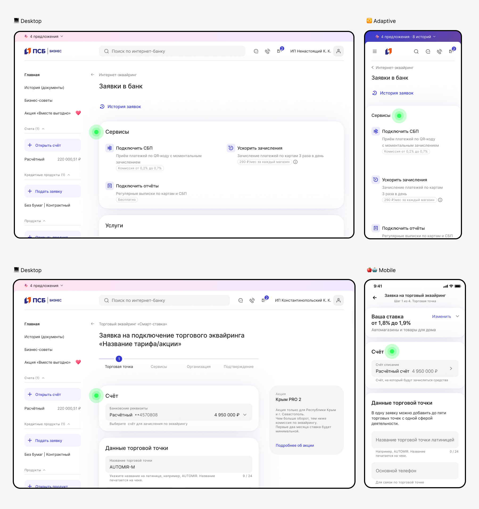
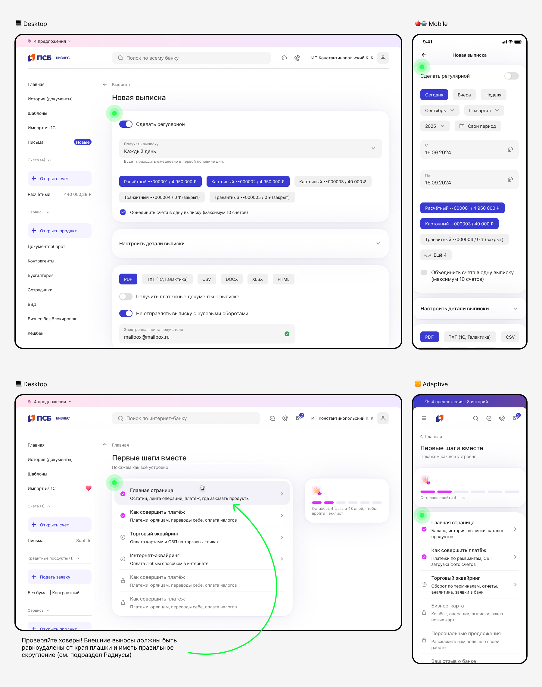

# Заголовки

[Исходники](https://www.figma.com/design/Zs4hLDHP5arbNkmDWbGpxe/%F0%9F%96%A4-%D0%92%D0%B0%D1%83-%D0%B1%D0%B0%D0%BD%D0%BA-%7C-%D0%9E%D1%81%D0%BD%D0%BE%D0%B2%D0%BD%D1%8B%D0%B5-%D0%BF%D1%80%D0%B8%D0%BD%D1%86%D0%B8%D0%BF%D1%8B?node-id=16923-64512)

:::info
Вдумчиво подходим к архитектуре страниц, разделов и всего приложения
:::

## Снаружи плашки

Выполняют роль основной навигации. Они всегда располагаются вне плашек, чтобы визуально выделять крупные разделы или блоки контента — проще говоря, это заголовки **первого уровня** на странице.

Для Desktop и Adaptive логика единая. Для Mobile заголовок первого уровня = заголовку в Navbar.

## Внутри плашки

Относятся к содержимому конкретного блока, поэтому они расположены прямо внутри плашек — это заголовки **второго, третьего уровня** на странице.

Для Desktop, Adaptive и Mobile логика единая.

## Выносим «за скобки»

Вместо заголовков второго и третьего уровня **можно использовать только плашки** — разделяем и ставим фокус. Используем подход для групп элементов, объединенных общим смыслом или последовательностью в рамках страницы одного сценария.

Для Desktop, Adaptive и Mobile логика единая.

