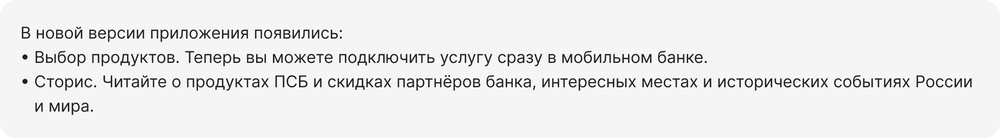

<!-- markdownlint-disable-next-line MD025 -->
# Редполитика

## Принципы

### Полезность

Полезность — главный критерий текста. Он должен помогать человеку решать задачу: отвечать на вопрос, подсказывать следующий шаг, давать конкретную выгоду.

Перед публикацией спрашиваем: какую пользу несёт этот текст? Если пользу найти сложно, текст нужно переписать или убрать.

### Краткость

Каждый текст должен содержать только суть, без повторов, вводных слов и пустых формулировок. Чем меньше слов, тем легче и быстрее читается текст. Длинные или сложноподчиненные предложения разбиваем на несколько коротких.

### Ясность

Текст должен быть понятен с первого прочтения. Без двусмысленностей, сложных конструкций и ненужных технических деталей. Человек должен сразу понять: о чём речь, что от него требуется и что произойдёт дальше.

### Убедительность

Люди доверяют не словам, а конкретике. Поэтому вместо «лучший», «удобный», «уникальный», «выгодный» — пишем, почему это так. Мы не уговариваем, а показываем.

## Кому мы доверяем

Используем эти источники, если в редполитике не указано иное.

При написании текстов руководствуемся [инфостилем](https://bureau.ru/projects/book-text/).\
Орфографию проверяем [в словаре Лопатина](https://www.slovorod.ru/orth-lopatin/index.html) и [на сайте «Орфограммка»](https://orfogrammka.ru/).\
Оформление сверяем со справочником Мильчина и Чельцовой.\
Пишем [по справочнику Главреда](https://glvrd.ru/) и [книге «Пиши, сокращай»](https://bureau.ru/projects/book-pishi/).\
Стиль проверяем на сайте [Главред](https://glvrd.ru/).\
Типографику — [в Типографе Лебедева](https://www.artlebedev.ru/typograf/).\
Грамматику и пунктуацию — [по «Правилам русского языка»](https://therules.ru/).

## Тон общения

### Персона

Чтобы выдерживать нужный стиль текста, представьте, кто говорит от имени бренда. Это помогает выбрать нужные слова и настроить правильный тон.

Мы говорим от имени зрелого, уверенного профессионала (35+). Он основателен, спокоен, умён, говорит по делу и вызывает доверие. Общается уважительно, на равных — без панибратства и канцелярита. Объясняет просто, не поучая. Мы — как Хабенский, Безруков или Машков: сильные, внимательные и честные.

### Архетип

ПСБ призван структурировать мир — заботиться о своих клиентах, контролировать сферу государственных оборонных заказов. При этом у нас есть амбиции создавать инновационные продукты и сервисы. Забота о клиентах проявляется в первую очередь в безопасности и надёжности. Это человек, на которого можно положиться, готовый помочь советом, когда он нужен.

Правитель и контролёр проявляется в мудрости и взвешенности решений. Он спокойный и вдумчивый, не распыляющийся на ненужные действия, понимающий ценность каждого слова и необходимость каждой фразы. При этом наша персона молодая, но уже зрелая, имеющая свои амбиции, ум и желание познавать мир. Вместе эти качества создают желание творить новое и улучшать старое, не мирясь с компромиссами.

### Тональность

Тональность зависит от ситуации, но всегда остаётся в рамках нашего голоса. Главное — говорить по‑человечески и по делу. Мы не придумываем за пользователя, что он должен чувствовать. Важно сообщить суть спокойно, ясно и с уважением к его контексту.

#### Нейтральные сообщения

Говорим спокойно и профессионально. Без личных местоимений, без лишних эмоций. Иногда можно обратиться на «вы», но только когда это диалог. По возможности избегаем жаргона.

#### Позитивные сообщения

В позитивных сообщениях используем меньше официоза и непринуждённую тональность.

#### Проблемные сообщения

Если пользователь сталкивается с трудностью, главное — не эмоции, а чёткое решение. В этот момент он ждёт от нас спокойствия, ясности и профессионализма.

### Банк сильных людей

Мы помогаем уверенным, ответственным людям принимать решения и двигаться вперёд. Говорим на равных, поддерживаем в важных моментах, не навязываемся — просто делаем свою работу надёжно и точно.
Банк и наши клиенты — бизнес-партнёры, между которыми должны быть доверительные отношения. В интерфейсе мы говорим от имени команды банка и берём на себя действие и ответственность. Пишем в настоящем времени и сразу показываем пользу: мы делаем → вам доступно.

Но если текст связан с негативным сообщением, его надо обезличивать.

### Обращаемся на «вы»

В интерфейсе всегда пишем «вы» с маленькой буквы. С большой — только в начале предложения или в деловых письмах.

## Синтаксис

### Сначала суть

У каждого предложения должно быть подлежащее и сказуемое — кто делает и что именно. Эти части должны стоять рядом. Начинаем с главного, не прячем смысл в конец.

### Без страдательного залога

Пишем так, чтобы было понятно, кто делает действие. Не «что-то было сделано», а кто это сделал. Если в предложении есть страдательный залог — находим, кто действовал, и ставим его в начало.

Но если после удаления страдательного залога предложение выглядит неестественно или слишком сложно, то следует вернуть как было.

[Ильяхов про нормальный страдательный залог](https://bureau.ru/bb/soviet/20160515/)

### Без модальных глаголов

Модальные глаголы вроде «можно», «нужно», «необходимо», «следует» делают текст размытым и слабым. В большинстве случаев можно заменить их на активный глагол.

[Ильяхов про модальные глаголы](https://maximilyahov.ru/blog/all/modality/)

### Без отглагольных частей речи

Слова вроде «проведение», «осуществление», «передача» звучат тяжело и безлично. Они прячут действие и мешают быстро понять суть. Лучше заменить их на глаголы — так текст станет короче и живее.

[Ильяхов про отглагольное](https://maximilyahov.ru/participle/)

### Без формально-бюрократических конструкций

Фразы вроде «в рамках», «осуществляется», «производится», «на основании» перегружают текст. Такой язык — из официальных писем и договоров. Мы говорим проще и понятнее.

### Без скобок  

Скобки прячут важное. Они разрывают фразу и заставляют перечитывать. Если информация нужна — пишем её без скобок. Если не нужна — убираем.

[Ильяхов про скобки](https://maximilyahov.ru/blog/all/skobki/)

## Типографика

### Точки

Если текст состоит из одного предложения — точку не ставим.
Если предложений два или больше — ставим точку в каждом.

### Тире, минус и дефис

#### Длинное тире

Ставим между частями предложения. Оно помогает расставить акценты.

#### Среднее тире

Показывает диапазон. Ставим в датах, времени, суммах и процентах.

Если диапазон выражен словами, среднее тире отбивается неразрывными пробелами.

#### Минус

Пишется перед отрицательным числом. Без пробелов.

#### Неразрывный дефис

Дефис — часть слова. Он нужен, когда два слова образуют одно: в повторах, сложных прилагательных, географических названиях, словах с приставками вроде «по» или частицами вроде «то», «либо», «нибудь».

### Остальные знаки

#### Кавычки

Правильные кавычки — «кавычки-елочки» для первого уровня и „кавычки-лапки“ для второго уровня.
Названия продуктов, организаций, учреждений, предприятий, акционерных обществ, фирм заключаем в кавычки.
Не заключаем в кавычки названия разделов и кнопок. Чтобы отделить их от основного текста, пишем их названия с большой буквы.

#### Процент и номер от числа

Знак «№» и знак «%» пишем без пробела.
Ставки и другие процентные выражения пишутся через запятую, если это десятичное число.

### Неразрывный пробел

Если элементы должны оставаться вместе при переносе строки — используем неразрывный пробел.

### Буква Ё

Всегда ставим букву «ё», без неё слово может изменить смысл или выглядеть неграмотно.

### Суммы и валюты

#### Разрядность  

В суммах в интерфейсах отбиваем неразрывным пробелом каждый тысячный разряд. Суммы в текстах отделяем пробелами только числа от пяти знаков.

#### Копейки

Копейки пишем через запятую без пробелов. Если есть хотя бы одна копейка — в дробной части всегда две цифры. Если копеек в сумме нет — не показываем их.

Копейки могут отличаться от суммы по размеру и цвету. Для правильного написания используйте компоненты Amount (для веба) и List / AccountInfo (для мобилы).
Их можно найти в файле 01 ✅ Headers & Text, Tabel & List.

В таблицах и списках, где суммы нужно сравнивать по правому краю, показываем копейки везде — даже если это 50,00. Так данные легче сравнивать.

#### Валюта

Если сумма в рублях — используем знак ₽. Если в долларах — $. В обоих случаях знак ставим после суммы, через неразрывный пробел.

Если знак ₽ недоступен по техническим причинам — пишем руб. с точкой.

### Сумма в месяц

В таблицах, карточках тарифов и других повторяющихся блоках, где важна компактность, используем сокращение ₽/мес.

В тексте, если позволяет место, сокращений лучше избегать — пишем полностью ₽ в месяц.

### Номера и маскирование

#### Телефон

#### Счёт

Пишем с пробелами, без «№», точек и дефисов. Маска 40802 810 5 0000 0000000.

#### Маскирование карт и счёта

### Даты

Если событие было недавно или скоро случится — пишем словами: вчера, сегодня, завтра, позавчера, послезавтра. Так привычнее и живее.

Если речь о дате дальше, чем на два дня — указываем её полностью:
12 сентября 2025. Год указываем только когда без него можно ошибиться. Формат с месяцем проще для восприятия, чем набор цифр вроде 12.09.25.

#### Ссылки

По ссылке сразу должно быть понятно, куда она ведёт. Не пишем «здесь», «тут», «по ссылке». В ссылку включаем предлоги и союзы.

### Списки

#### Как обозначать

Короткие пункты до одного предложения — цифра со скобкой.
Развёрнутые пункты в несколько предложений — цифра с точкой.
Буллиты, если порядок не важен и без них трудно читать.

#### С какой буквы начинать

Если текст обозначен цифрой или буквой со скобкой, то короткие пункты со строчной. Если это продолжение вводной фразы, разделяем запятыми.
Если текст обозначен цифрой с точкой, то каждый пункт с прописной и точкой в конце.
Последний пункт всегда с точкой.

#### Знаки препинания

Если каждый из пунктов состоит из одного или нескольких слов, ставим запятую:

Если в пунктах уже есть запятые, разделяйте пункты точкой с запятой:

Если пункты состоят из нескольких предложений, ставим точку:

### Англицизмы

Иностранные слова и названия пишем по-русски и склоняем по правилам русского языка.

Если термина нет в редполитике, смотрим правильное написание в «Академосе» Института русского языка РАН.

### Название банка и написание

Слово «банк» пишем с маленькой буквы, если это не часть официального названия. Так мы общаемся на равных и не создаём дистанцию.  

Полное фирменное наименование банка на русском языке:
Публичное акционерное общество «Банк ПСБ».

Сокращённое фирменное наименование банка на русском языке:
ПАО «Банк ПСБ»

Полное фирменное наименование банка на английском языке:
Bank PSB Public Joint-Stock Company

Сокращённое фирменное наименование банка на английском языке:
Bank PSB PJSC

Если текст не носит юридический характер, то используйте маркетинговое название — ПСБ.
Маркетинговое название склоняется и пишется без кавычек:
...в банке ПСБ.
