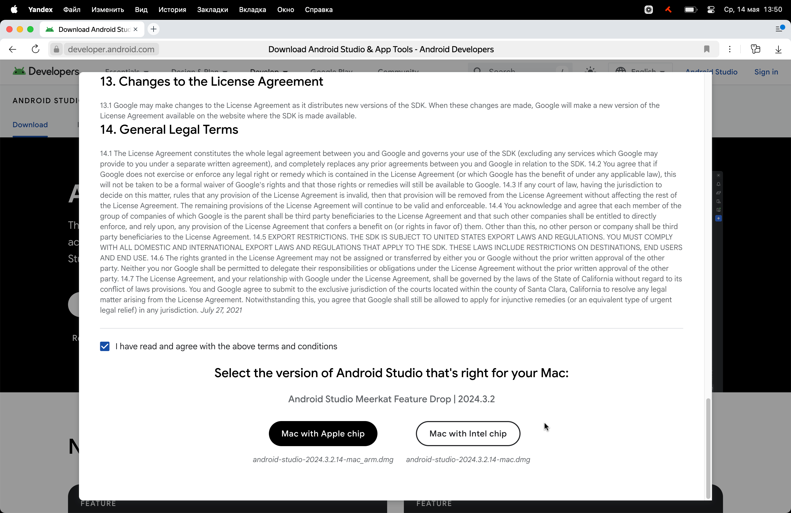
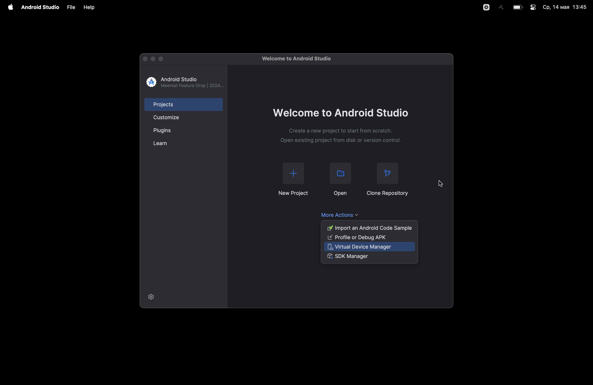
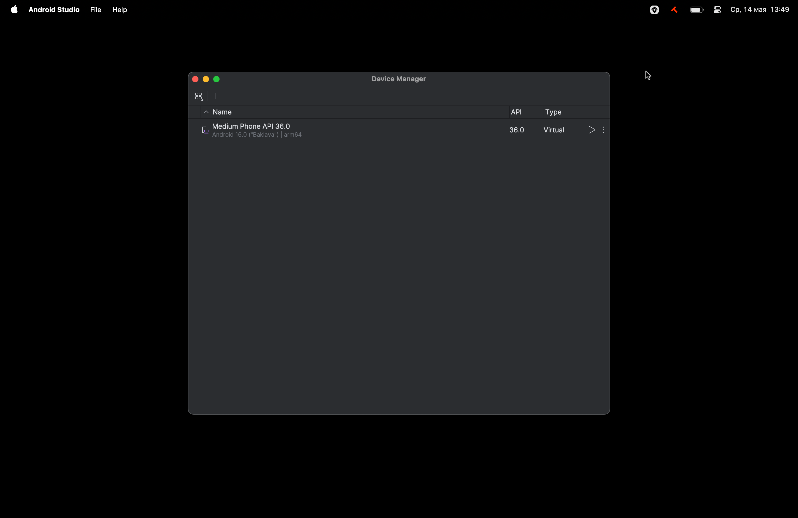
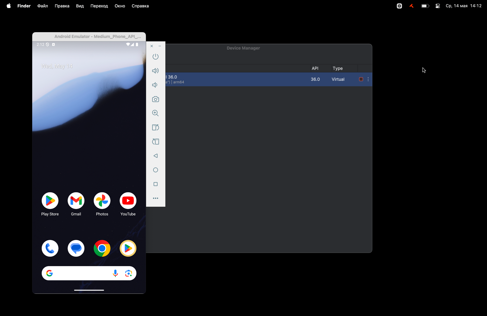
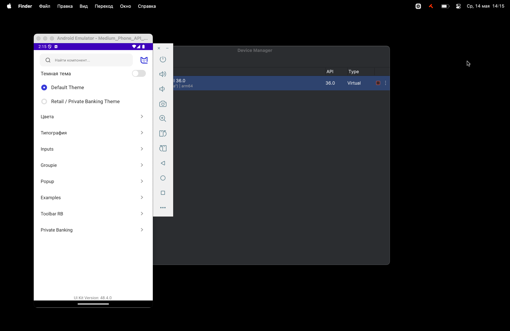
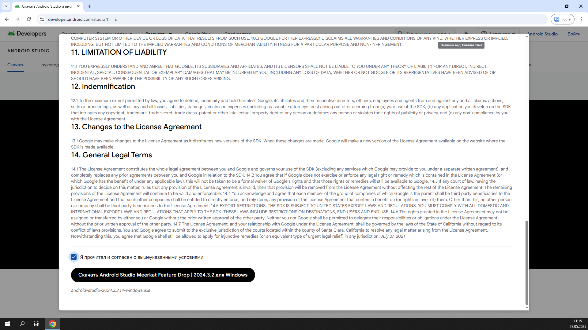
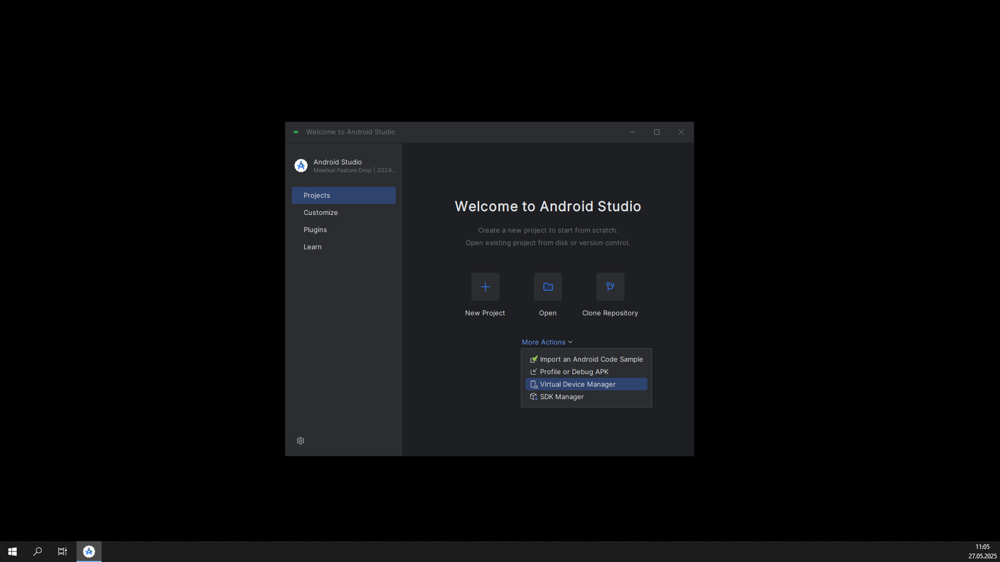
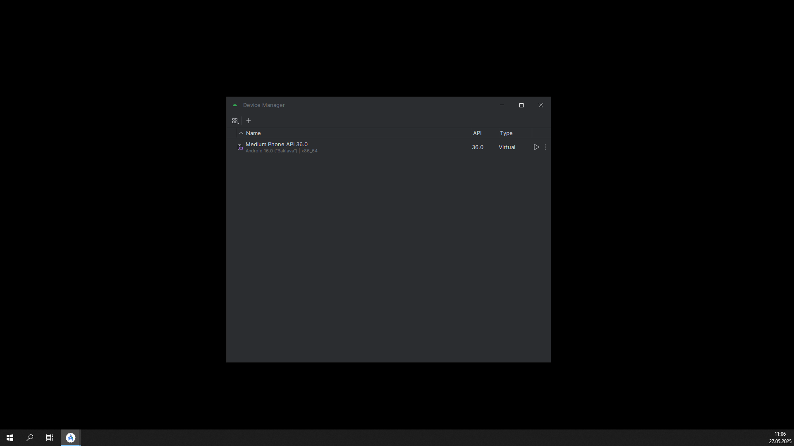
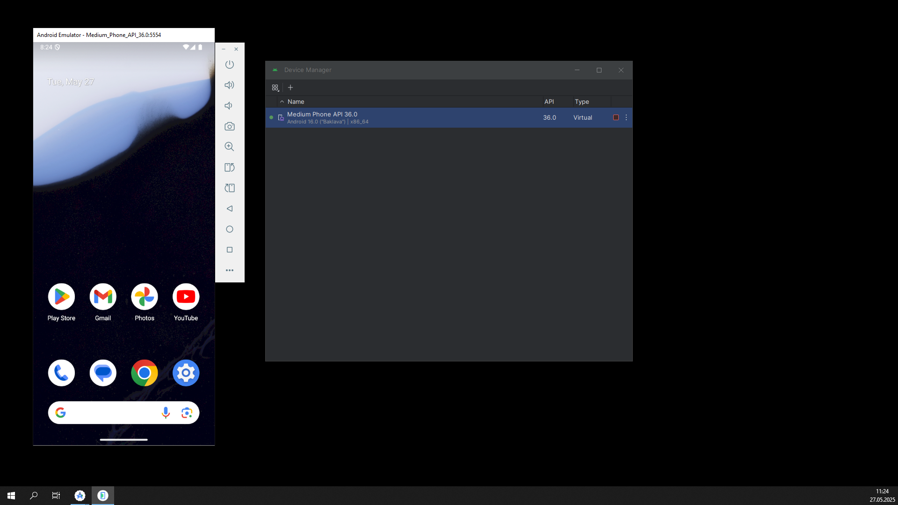
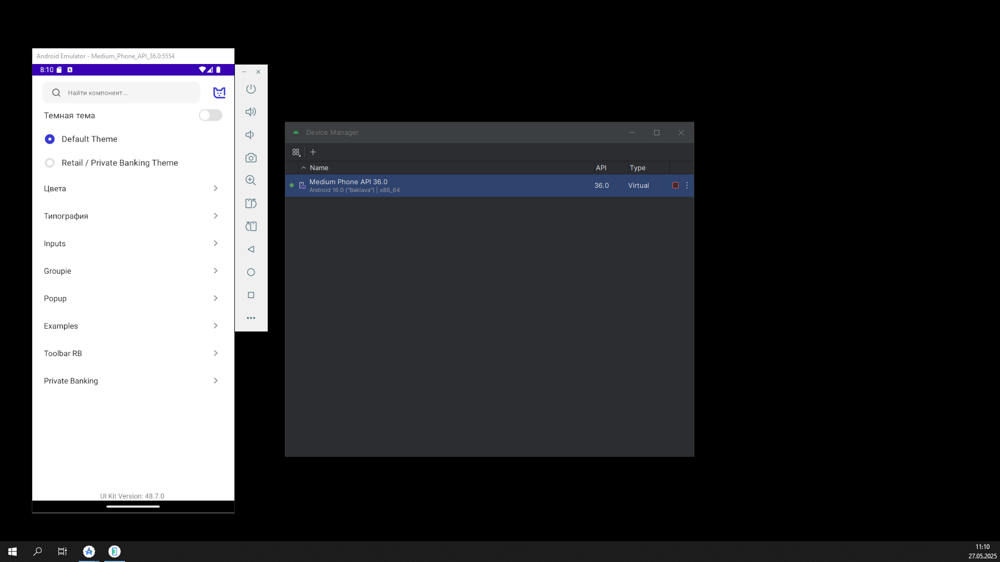

# Как развернуть витрину компонентов Android

## Mac OS

1. Скачайте [Android Studio](https://developer.android.com/studio). На выбор вам предложат выбрать подходящую версию программы: на чипе Apple и на чипе Intel. Посмотреть какой у вас чип можно в меню `Об этом Mac`.
   
2. Установите и запустите программу.
3. На стартовом экране выберите пункт Virtual Device Manager:
   
4. На экране выбора девайса нажмите на кнопку Start напротив подходящего девайса, по умолчанию там будет один девайс:
   
5. Система запустит эмулятор Android:
   
6. Скачайте последнюю версию приложение [из раздела «Витрины»](/resources/showcases/).
7. Перетащите apk-файл на экран телефона и после установки запустите приложение:
   

:::warning[Актуальность сборки]
Чтобы у вас была актуальная сборка витрины компонентов необходимо каждый раз скачивать новую версию
:::

## Windows

1. Скачайте [Android Studio](https://developer.android.com/studio).
   
2. Установите и запустите программу.
3. На стартовом экране выберите пункт Virtual Device Manager:
   
4. На экране выбора девайса нажмите на кнопку Start напротив подходящего девайса, по умолчанию там будет один девайс:
   
5. Система запустит эмулятор Android:
   
6. Скачайте последнюю версию приложение [из раздела «Витрины»](/resources/showcases/).
7. Перетащите apk-файл на экран телефона и после установки запустите приложение:
   

:::warning[Актуальность сборки]
Чтобы у вас была актуальная сборка витрины компонентов необходимо каждый раз скачивать новую версию
:::
