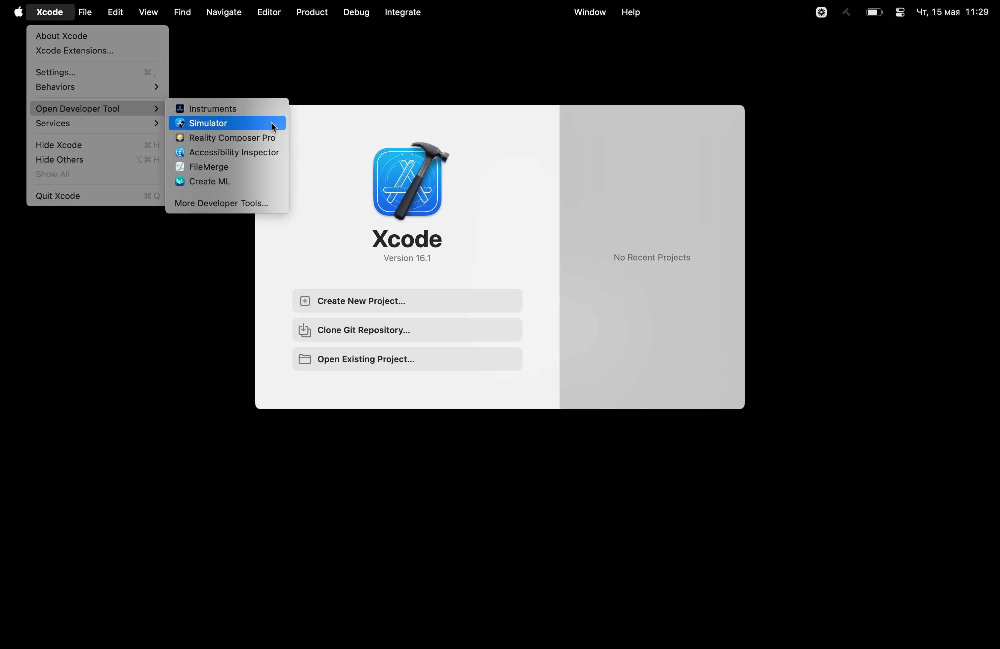
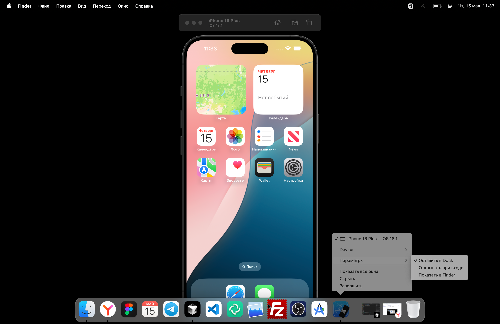

# Как развернуть витрину компонентов iOS

## Mac OS

1. Скачайте [Xcode](https://developer.apple.com/xcode/).
2. Скачайте последнюю версию приложение из телеграм-канала [iOS DSKit](https://t.me/+2x31KWUKHaJiNDUy) (сборки для РБ и СМБ разные, ориентируйтесь по меткам).
3. Разархивируйте архив.
4. Откройте Xcode и перейдите XCode → Open developer tool → Simulator:
   
5. Кликните ПКМ на иконке открытого симулятора и выберите `Оставить в Dock`. Теперь можно запускать только симулятор:
   
6. В окно симулятора перетащите приложение:
   

:::warning[Актуальность сборки]
Чтобы у вас была актуальная сборка витрины компонентов необходимо каждый раз скачивать новую версию из телеграм-канала. Подпишитесь на него.
:::

## Windows

Нет технической возможности. Ищем варианты.
