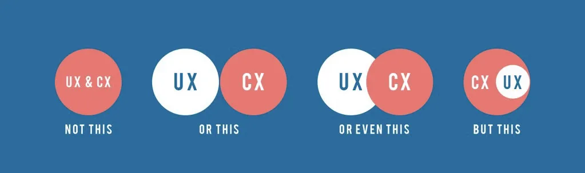
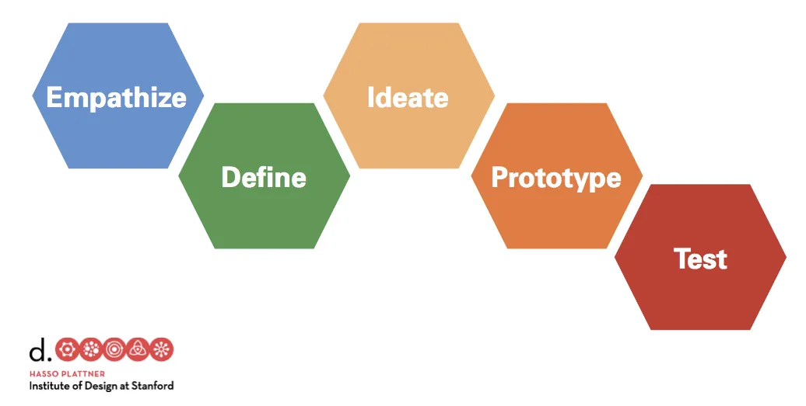
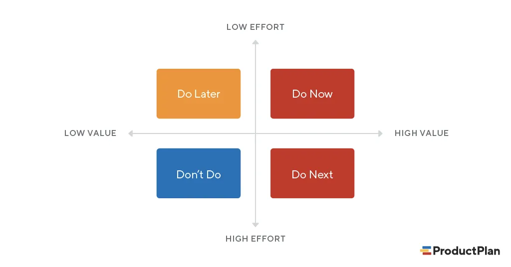

# Зачем UX Research в процессе разработки продукта

## Что это за исследования

### UX Research

User Experience Research или исследование пользовательского опыта направлено на то, чтобы понять пользователей, оценить удобство, простоту и лёгкость использования продукта. В рамках такого исследования проверяется, насколько эффективно продукт закрывает потребности пользователей и не создаются ли барьеры, которые могут помешать или заблокировать пользователя в процессе решения задачи.

`Это НЕ БАГИ 🙃`

### Тогда ЧТО?

- Неочевидная навигация: не понимает куда идти, нажимать, кликать.
- Непонятные формулировки: сложное описание продукта, избыточная терминология.
- Непрозрачные условия использования продукта.
- Заметность элементов интерфейса.
- Паттерны поведения: ментальная модель, ожидания, представления, привычки.
- Целевая аудитория: портрет, потребности, цели, боли.
- Контекст: что видит, слышит, делает, говорит, внешние факторы, среда, атмосфера.
- Избыток или недостаток информации.

### CX Research

Customer Experience Research — исследование клиентского пути.

Клиентский путь охватывает всё, с чем взаимодействует человек, включая физические, материальные предметы:

- Взаимодействие с людьми.
- Посещение отделения, офиса, звонки, курьер, банкомат, СМС, документы, встречи, приложение, сайт и тд.
- Любые физические и цифровые предметы, с которыми соприкасается клиент/пользователь на пути к своей цели.

### UX vs CX

## Как мы это делаем

- Интервью
- Задания
- Оценка по шкалам
- Дневники
- Наблюдение
- Погружение
- Изучение рынка, ЦА
- Эвристики
- Сбор обратной связи
- Опросы

## Этапы

Это ориентированная на пользователя методология проектирования. Её применяют для анализа сложных проблем и поиска инновационных решений.

Методы ДМ включают интервьюирование, создание профилей пользователей, изучение существующих решение, создание прототипов, карт эмпатий, CJM и т.д.

### Empathize

Самый первый шаг — это развитие эмпатии к нашим пользователям.

Есть три основных типа исследований, которые мы можем использовать, чтобы узнать больше о наших пользователях. Это техники, которые позволяют **наблюдать**, **вовлекаться** и **погружаться**.

Цель этапа:

- Истории людей, их поведение, действия, мотивация.
- Артефакты - фото, рисунки, цитаты, которые описывают людей, окружающую их среду, их путь.
- Идеи, основанные на этих историях и артефактах.

Именно этот набор данных в дальнейшем используется для генерации идей, выводов, решений и постановки новых задач.

### Define

На этом этапе мы начинаем упорядочивать полученную информацию таким образом, чтобы мы могли разобраться в ней.

Мы ищем смысл и закономерности. К концу этапа мы будем знать, кто наши пользователи, какие у них потребности, проблемы и что мы можем сделать для их решения.

Это также этап поиска интересных, неожиданных идей, которые могут решить проблемы пользователей. И также переосмыслить проблемы пользователей.

Например, вместо определения проблемы, такой как:

- Роберту нужен более быстрый Интернет, потому что он хочет смотреть телешоу на своем компьютере

Мы переводим в:

- Как мы можем позволить Роберту смотреть его любимые шоу, когда он возвращается домой с работы?

Первая постановка задачи уже определяет решение. Вторая создает пространство для поиска идей и решений (более быстрый интернет, фоновая загрузка, подключение антенны и т.д.).

Инструменты:

- Карты эмпатии
- Персоны
- CJM
- Storyboards
- Эвристический анализ
- Feature Matrix
- Benchmark

### Ideate

Мы генерируем идеи.

Берем все данные, что собрали.

Мы смотрим за пределы своего пространства в поисках вдохновения.

Собираемся всей командой и устанавливаем правила — каждый вносит свой вклад, никто не контролирует разговор, никаких суждений в ходе мозгового штурма.

Фиксируем наши действия по времени, чтобы быть уверенными, что делимся ими и получаем обратную связь.

Голосуем и оцениваем идеи, которые, по нашему мнению, заслуживают внимания.

### Prototype

Для сбора обратной связи мы используем прототипы.

### Test

На тестирование мы стараемся ответить на следующие вопросы:

- Правильно ли мы определили целевую аудиторию?
- Правильно ли мы сформулировали её проблемы и является ли решение этих проблем ценным?
- Решает ли предлагаемое нами решение проблемы наших пользователей?
- Могут ли пользователи использовать наши инструменты для решения своих проблем?

## Когда проводить исследование

На каком этапе разработки продукта? - На любом ☺️

- Идея создания продукта
- Разработка
- MVP
- Готовый продукт

## Что это дает

1. Экономия времени
2. Увеличение прибыли

## Исследования в процессах

- CX/UX-исследования являются неотъемлемой частью процесса разработки продукта.
- Это постоянные итерации исследований и постоянная проверка гипотез.
- Исследования необходимо проводить перед началом написания ТЗ или параллельно с написанием ТЗ и дизайном, то есть это самая 1-ая часть процесса работы над новой задачей.
- Исследователь относится к discovery team и всегда привлекается на встречи наравне с дизайнером.
- Исследователю важно знать по какой логике может и не может работать продукт, так как существующие технические ограничения необходимо иметь ввиду как дизайнеру, так и исследователю.
- Сессии — важная часть процесса. Каждый член команды за цикл исследования должен посетить сессию хотя бы раз. Product, project-менеджер и дизайнер должны посещать около 80% сессий, team lead желательно посетить хотя бы 50% сессий за цикл.
